+++
title = 'DayPing 개발기 1 - Windows에서 Android Studio와 Codex CLI로 앱 개발하기'
date = '2026-09-21T00:00:00+09:00'
draft = false
slug = 'dayping-android-studio-codex-setup'
description = 'Windows에 Android Studio와 Codex CLI를 설치하고, DayPing 리마인더 앱을 개발해 Android 에뮬레이터에서 일정 알림까지 확인한 과정을 정리한다.'
tags = ['android', 'android-studio', 'codex-cli', 'jetpack-compose', 'dayping']
categories = ['IT개발']
showTableOfContents = true
+++

이번 글부터 실제로 사용할 리마인더 앱 **DayPing**을 만들기 시작한다. DayPing은 날짜와 시간을 지정하면 잊지 않도록 알려주는 일정 알림 앱이다.

Android Studio와 Codex CLI를 준비하고 요구사항을 전달한 뒤, 약 17분 만에 초기 실행 버전이 만들어졌다. 이후 에뮬레이터에서 일정을 등록하고 지정한 시간에 알림이 나타나는 것까지 확인했다. 이번 1편은 그 과정을 기록한다.

## 1. DayPing 앱 소개

DayPing은 간단한 일정 관리와 알림 기능을 결합한 리마인더 앱이다.

첫 번째 구현에서는 다음 기능을 포함한다.

- 일정 추가
- 날짜와 시간 지정
- 반복 설정
- 정시·5분 전·10분 전·1시간 전·하루 전 알림 설정
- 일정 메모
- 로컬 데이터 저장
- Android 13 이상 알림 권한 처리
- 지정 시간 알림

처음부터 모든 기능을 직접 설계하고 구현하기보다는, 요구사항을 정리한 뒤 Codex CLI에게 구현을 요청하고 생성된 코드를 직접 검토하는 방식으로 진행했다. 이번 글에서는 캡처로 확인할 수 있는 기본 일정 등록과 알림 흐름에 집중한다.

## 2. 개발 환경

이번 글의 캡처는 WSL이 아닌 **Windows 환경**에서 진행했다.

| 항목 | 캡처 기준 |
| --- | --- |
| 운영체제 | Windows |
| Node.js | v24.19.0 |
| npm | 11.17.0 |
| Android Studio | Quail 4 (2026.1.4) |
| 앱 이름 | DayPing |
| 패키지명 | `com.jinosoft.dayping` |
| UI | Jetpack Compose |
| 개발 도구 | OpenAI Codex CLI |
| 테스트 기기 | Android Emulator Medium Phone |
| 시스템 이미지 | Android 16, API 36.1 |

버전과 화면은 캡처 시점의 값이다. Android Studio, Android SDK, Node.js와 Codex CLI는 계속 업데이트되므로 설치 시점에는 공식 문서의 최신 버전을 함께 확인한다.

## 3. Node.js 설치와 확인

Codex CLI를 npm으로 설치하기 위해 Node.js가 필요하다. Windows 터미널 또는 명령 프롬프트에서 다음 명령으로 Node.js LTS를 설치한다.

```powershell
winget install OpenJS.NodeJS.LTS
```

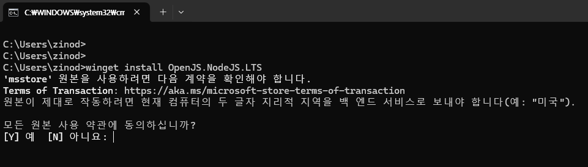

설치가 끝나면 새 터미널을 열고 Node.js와 npm 버전을 확인한다.

```powershell
node -v
npm -v
```

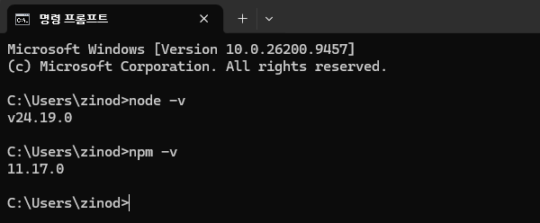

이 글의 캡처에서는 Node.js `v24.19.0`, npm `11.17.0`이 확인됐다. 버전이 출력되지 않으면 터미널을 다시 열거나 PATH 설정을 확인한다.

## 4. Codex CLI 설치

Codex CLI는 터미널에서 프로젝트 파일을 확인하고, 코드를 수정하고, 명령어를 실행할 수 있는 개발 도구다. 공식 문서에서는 프로젝트 디렉터리에서 `codex`를 실행해 작업을 시작하는 흐름을 안내한다. [Codex CLI 공식 문서](https://developers.openai.com/docs/codex/cli)

npm으로 Codex CLI를 설치한다.

```powershell
npm install -g @openai/codex
```

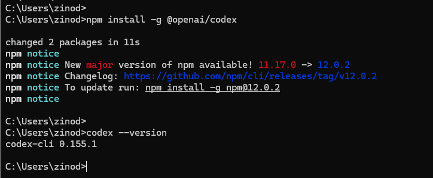

설치 결과를 확인한다.

```powershell
codex --version
```

캡처에서는 `codex-cli 0.155.1`이 출력됐다. 이후 Codex CLI는 프로젝트 디렉터리 안에서 실행해야 프로젝트 파일을 읽고 수정할 수 있다.

## 5. Android Studio 설치

Android Studio는 Android 앱을 개발하고 빌드하는 공식 통합 개발 환경이다. [Android Studio 공식 설치 페이지](https://developer.android.com/studio/install)에서 Windows용 설치 파일을 내려받는다.

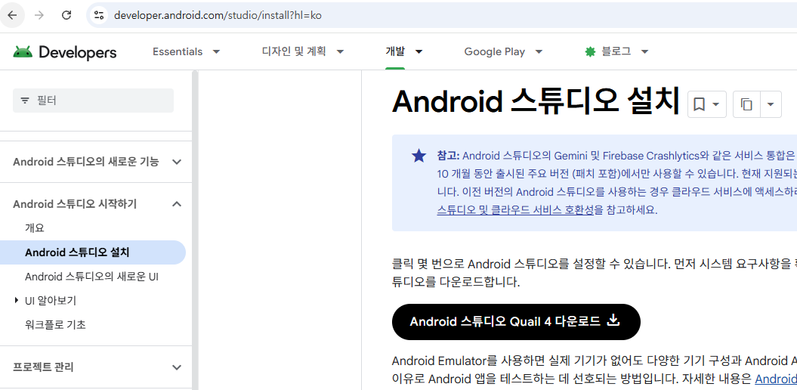

설치할 때 Android SDK, Android SDK Platform, Android Virtual Device 항목을 함께 선택한다. 설치가 끝나면 Android Studio를 실행해 프로젝트를 생성할 준비를 한다.

## 6. DayPing 프로젝트 생성

Android Studio를 처음 실행하면 Welcome 화면이 표시된다. `New Project`를 선택해 새 프로젝트를 만든다.

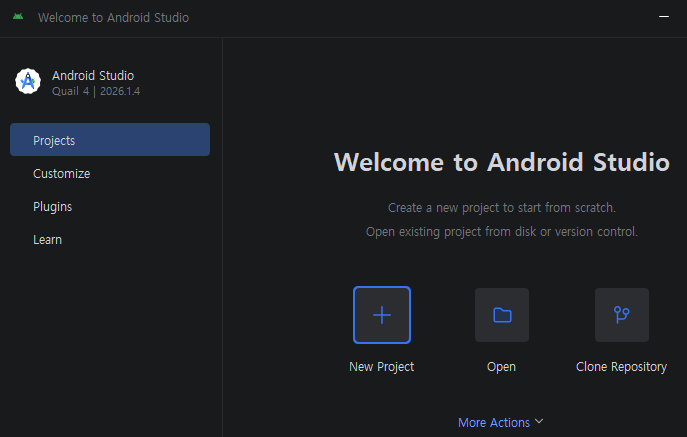

프로젝트 템플릿에서는 `Phone and Large Screens`의 `Empty Activity`를 선택한다. Empty Activity는 Jetpack Compose를 사용하는 가장 단순한 시작점이다.

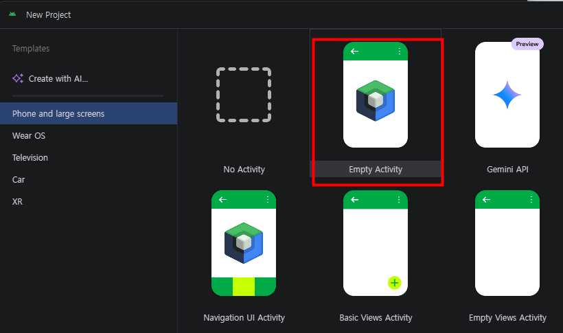

프로젝트 설정은 다음처럼 입력했다.

| 항목 | 값 |
| --- | --- |
| Name | `DayPing` |
| Package name | `com.jinosoft.dayping` |
| Minimum SDK | API 24 (Android 7.0) |
| Build configuration language | Kotlin DSL |
| UI toolkit | Jetpack Compose |

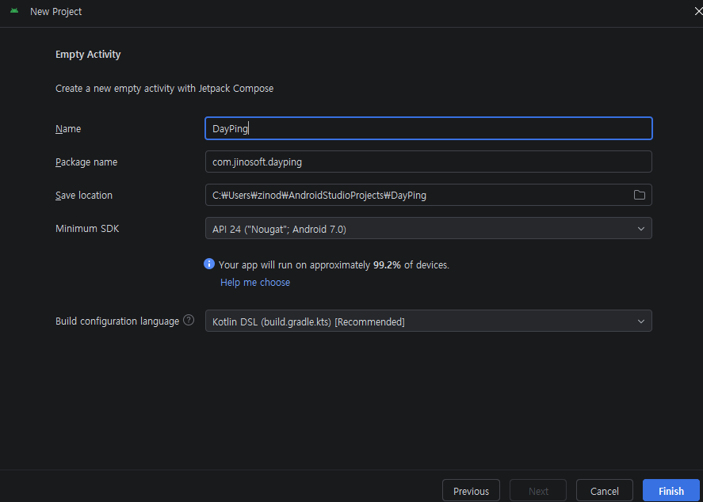

패키지명은 `jinosoft`를 사용해 `com.jinosoft.dayping`으로 정했다. 자신의 앱을 만들 때는 본인 도메인이나 조직 이름을 반영한 고유한 값을 사용한다. Google Play에 배포할 애플리케이션 ID도 확인해야 하므로 처음부터 신중하게 정하는 편이 좋다.

Minimum SDK는 지원할 최소 Android 버전이다. 이번에는 API 24를 선택했다.

프로젝트가 생성되면 Android Studio에서 Kotlin 코드와 Gradle 프로젝트 구조를 확인한다.

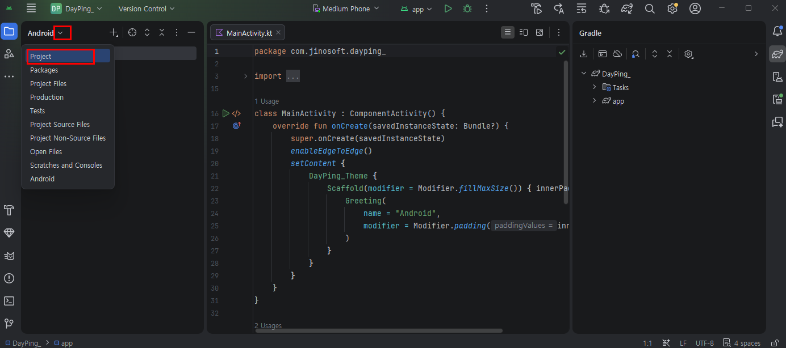

## 7. Android Emulator 만들기

실제 Android 기기 없이 앱을 실행하려면 Android Emulator가 필요하다. Android Studio의 Device Manager를 열고 가상 기기를 추가한다.

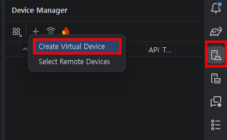

Phone을 선택한 뒤 사용할 기기 프로필을 고른다. 이번에는 `Medium Phone`을 선택했다.

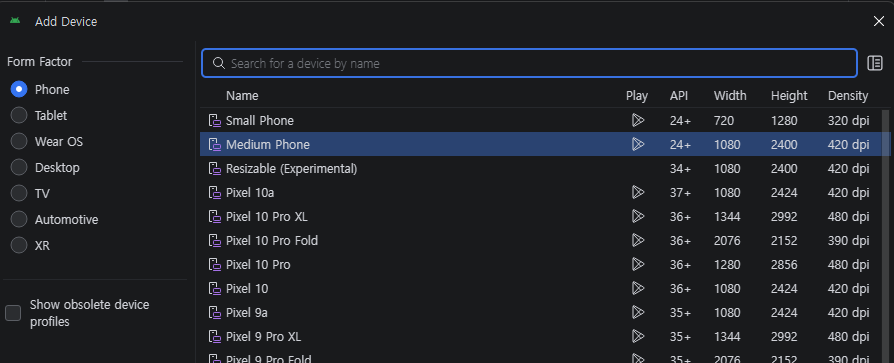

### 시스템 이미지 선택

시스템 이미지는 Android 16, API 36.1의 x86_64 이미지를 선택했다. 나중에 Play 관련 기능도 테스트할 수 있도록 Google Play가 포함된 이미지를 사용했다.

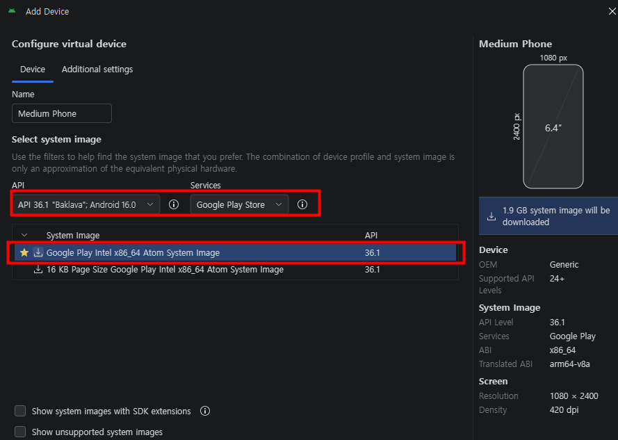

현재 Google Play에 새 앱과 업데이트를 제출하려면 일정 수준 이상의 target API가 필요하다. 이 요구사항은 변경될 수 있으므로 배포 시점에는 [Google Play 대상 API 수준 요구사항](https://developer.android.com/google/play/requirements/target-sdk)을 확인한다.

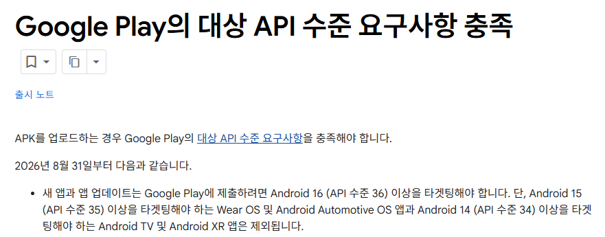

에뮬레이터의 OS 버전과 앱의 target API 설정은 별개다. 이번에는 API 36 계열 기기로 먼저 실행을 확인했으며, 배포 전에는 다른 지원 버전에서도 테스트해야 한다.

### 에뮬레이터 메모리 설정

Additional settings에서는 에뮬레이터의 저장 공간과 메모리를 조정할 수 있다. 캡처에서는 RAM을 4GB로 설정했다.

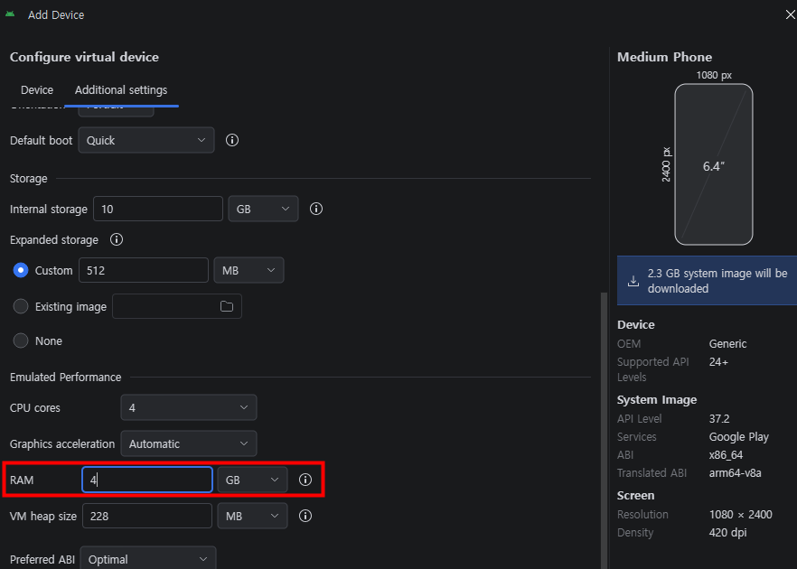

개발 PC의 메모리 여유를 고려한 값이지 모든 PC에 필요한 설정은 아니다. 에뮬레이터가 느리거나 실행되지 않으면 호스트의 메모리 여유, 그래픽 가속과 시스템 이미지 종류를 함께 확인한다.

## 8. Codex CLI로 DayPing 개발 시작하기

프로젝트가 생성된 디렉터리로 이동한 뒤 Codex CLI를 실행한다.

```powershell
cd C:\Users\zinod\AndroidStudioProjects\DayPing
codex
```

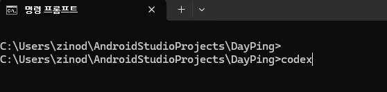

처음 실행하면 현재 디렉터리의 파일을 신뢰할 것인지 묻는다. 경로가 내가 만든 DayPing 프로젝트인지 확인한 뒤 계속 진행한다.

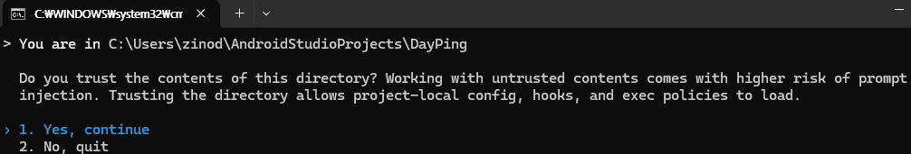

신뢰할 수 없는 폴더에서 실행하면 프로젝트 설정이나 스크립트가 의도하지 않게 실행될 수 있으므로, 경로를 확인하지 않고 승인하지 않는다.

### 모델 선택

Codex CLI에서 `/model` 명령으로 모델과 추론 수준을 선택할 수 있다.

```text
/model
```

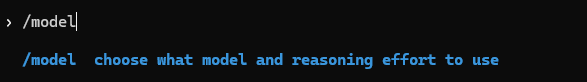

이번 작업에는 `gpt-5.6-luna`를 선택했다. 모델과 추론 수준, 사용량 한도는 계정과 시점에 따라 달라지므로 같은 이름을 찾기보다 현재 선택 화면의 모델과 사용량 안내를 확인한다.

## 9. Codex에 앱 요구사항 전달하기

Codex에게 먼저 앱의 이름, 패키지명, 목적과 핵심 기능을 전달했다.

```text
android app을 개발하려고 해.
앱 이름 : DayPing
패키지명: com.jinosoft.dayping
앱 설명: 날짜와 시간을 지정하고 일정을 입력하면, 잊지 않도록 알려주는 리마인더 앱

기능과 UI를 추천해줘.
```

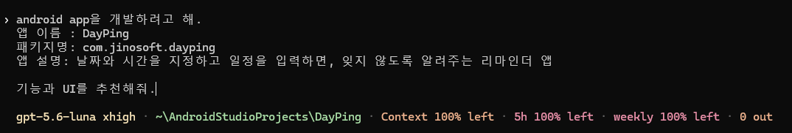

Codex는 초기 기능 후보로 일정 추가·수정·삭제, 날짜와 시간 지정, 반복 일정, 알림, 로컬 저장, 재부팅 후 알림 복원 등을 제안했다.

초기 버전에서 너무 많은 기능을 한꺼번에 넣으면 검토와 테스트가 어려워진다. 이번 구현에서는 일정 추가, 날짜·시간 선택, 목록 표시, 로컬 저장, 알림 동작 확인을 우선 목표로 삼았다.

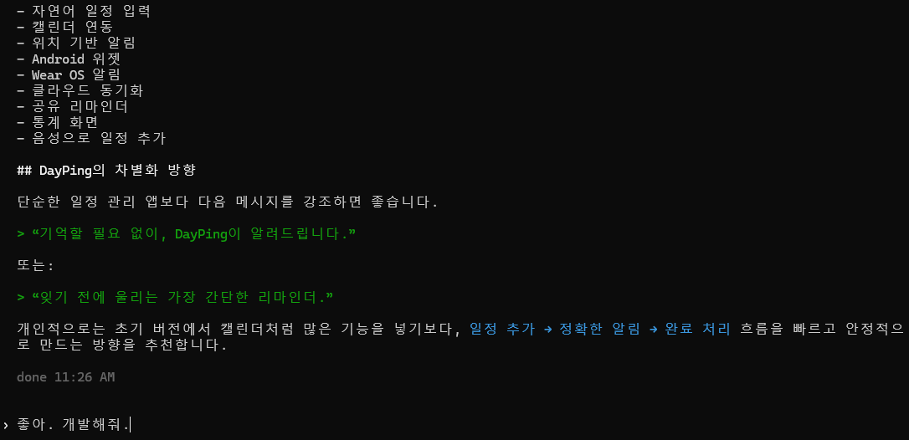

요구사항을 확인한 뒤 개발을 요청했다.

```text
좋아. 개발해줘.
```

Codex가 파일을 수정하거나 Gradle 명령을 실행하려고 할 때는 실행할 명령과 이유를 확인한 뒤 승인한다. 캡처에서는 Java 경로와 Gradle 프로젝트 경로를 지정해 `assembleDebug`를 실행하려는 내용을 확인할 수 있다.

> **Codex 명령 승인**
> 
> Codex가 명령 실행을 물어보면 먼저 명령과 실행 경로를 확인한다. 내용이 안전하고 이번 작업에 필요한 명령이라면 `1. Yes, proceed`를 선택하고, 같은 유형의 명령을 계속 허용해도 되는 상황이면 `2. Yes, and don't ask again...`을 선택할 수 있다. 명령이 이해되지 않거나 예상과 다르면 `3`을 선택해 중단하고 Codex에 수정 내용을 전달한다.

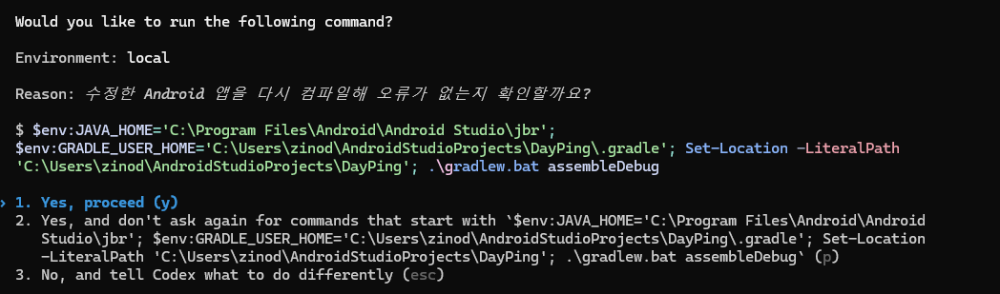

AI가 생성한 코드라도 그대로 배포하지 않고, 변경된 파일과 빌드 결과를 직접 확인하는 과정이 필요하다.

## 10. 빌드 결과 확인

Codex가 기능 구현을 마친 뒤 다음 결과를 확인했다.

- `assembleDebug` 성공
- 테스트 성공
- 디버그 APK 생성
- 주요 Kotlin 파일과 알림 관련 파일 확인

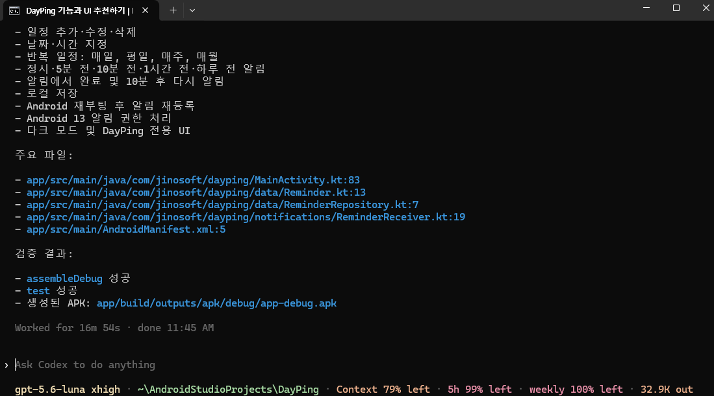

캡처의 작업 시간에는 Codex CLI가 요구사항을 확인하고 코드를 작성한 뒤, Gradle 빌드와 테스트를 실행한 시간이 포함되어 있다. 전체 작업에는 약 17분(16분 54초)이 걸렸고, 이 과정에서 DayPing의 초기 실행 버전이 만들어졌다.

**약 17분 만에 만들어진 것은 배포용 완성본이 아니라, 실행하고 테스트할 수 있는 초기 버전이다.** 코드 검토와 실제 기기·지원 Android 버전별 테스트는 별도로 필요하다.

캡처에 표시된 주요 파일은 다음과 같다.

```text
app/src/main/java/com/jinosoft/dayping/MainActivity.kt
app/src/main/java/com/jinosoft/dayping/data/Reminder.kt
app/src/main/java/com/jinosoft/dayping/data/ReminderRepository.kt
app/src/main/java/com/jinosoft/dayping/notifications/ReminderReceiver.kt
app/src/main/AndroidManifest.xml
```

파일 목록만으로 구현이 올바르다고 판단하지 말고, 실제 앱을 실행해 화면과 알림을 확인한다.

## 11. Android Studio에서 앱 실행

Android Studio 상단의 실행 기기에서 `Medium Phone` 에뮬레이터를 선택하고 `Run 'app'`을 클릭한다.

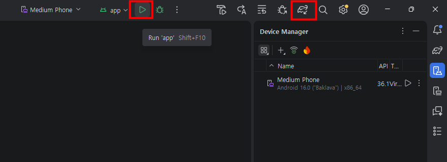

> **Run 버튼이 비활성화된 경우**
> 
> `Run 'app'` 버튼이 비활성화되어 있다면 Gradle 동기화가 끝났는지 확인한다. Android Studio 상단의 `Sync Project with Gradle Files` 버튼을 클릭해 프로젝트를 다시 동기화한 뒤 실행한다. 동기화 오류가 표시되면 JDK, Android SDK, 네트워크 연결과 Gradle 오류 메시지를 순서대로 확인한다.

Android 13 이상에서는 알림을 보내기 전에 사용자 권한을 요청해야 한다. DayPing을 처음 실행하면 알림 권한 요청이 표시된다.

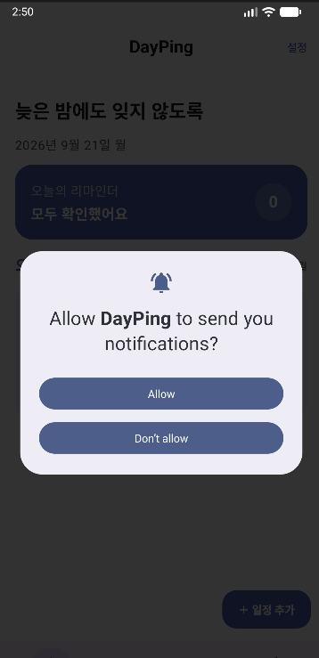

알림을 확인하려면 `Allow`를 선택한다. 권한을 거부한 경우에는 Android 설정에서 앱의 알림 권한을 다시 허용해야 할 수 있다.

## 12. DayPing 화면 확인

앱이 실행되면 오늘의 리마인더와 일정 추가 버튼이 표시된다.

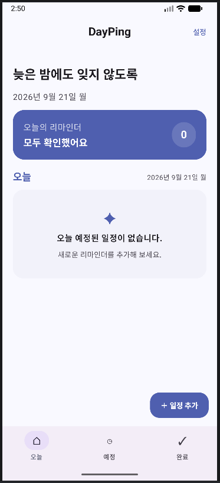

`일정 추가`를 누르면 제목, 날짜, 시간, 반복 주기, 알림 시점, 메모를 입력할 수 있다.

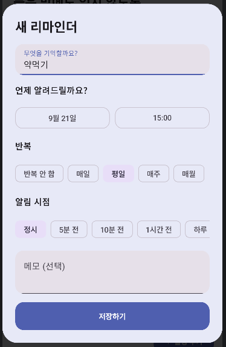

예제에서는 `약먹기`라는 일정을 입력하고 평일 오후 3시에 알림이 오도록 설정했다.

저장한 일정은 오늘의 목록에 표시된다.

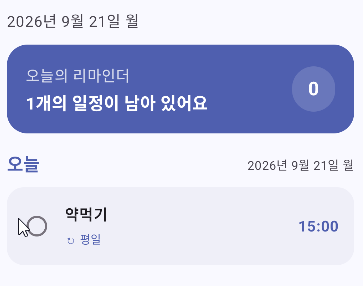

## 13. 지정 시간 알림 확인

테스트를 위해 알림 시점을 가까운 시간으로 설정한 뒤 에뮬레이터를 기다렸다. 지정한 시간이 되자 Android 알림 영역에 DayPing 알림이 표시됐다.

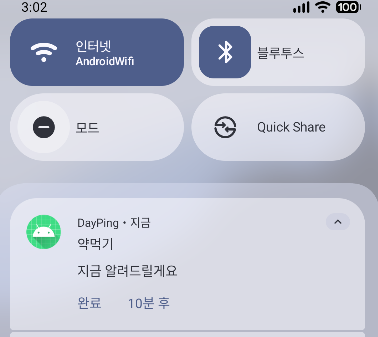

이 과정을 통해 단순히 화면이 표시되는 것뿐 아니라 다음 흐름이 실제로 동작하는 것을 확인했다.

```text
리마인더 입력
  ↓
로컬 저장
  ↓
알람 예약
  ↓
지정 시간 도달
  ↓
Android 알림 표시
```

## 14. 확인한 내용과 남은 과제

이번 글에서는 다음을 완료했다.

- Windows에 Node.js와 npm 설치
- Codex CLI 설치와 실행
- Android Studio 설치
- DayPing Compose 프로젝트 생성
- Android Emulator 생성
- Codex CLI로 앱 기능 구현
- Gradle debug 빌드 성공
- 에뮬레이터에서 DayPing 실행
- 알림 권한 허용
- 지정 시간 알림 확인

아직 배포 전 단계이므로 다음 작업이 남아 있다.

- 기능별 오류 처리 보완
- 다양한 Android 버전에서 테스트
- 앱 아이콘 제작
- 릴리스 서명 키 생성
- Android App Bundle 생성
- 개인정보처리방침과 데이터 보안 정보 정리
- Google Play Console 등록과 심사 제출

## 마무리

앱 이름과 핵심 요구사항을 전달하는 것으로 시작해, 에뮬레이터에 실제 알림이 뜨는 것까지 확인했다. 빌드 완료 메시지만 보는 것과 직접 일정을 등록하고 알림을 받는 것은 다르므로, 생성된 앱은 실행해서 확인하는 과정이 필요하다.

Google Play 배포 과정은 DayPing의 기능과 테스트를 더 보완한 뒤 별도 글로 다룰 예정이다.
