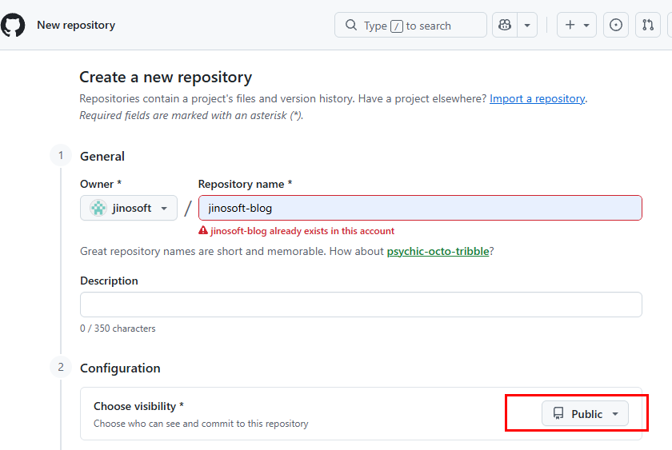
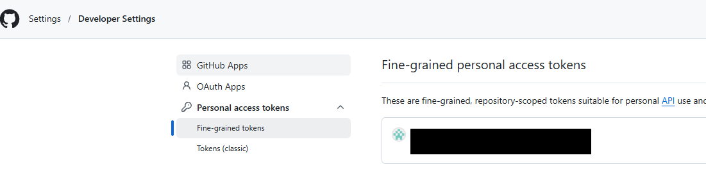
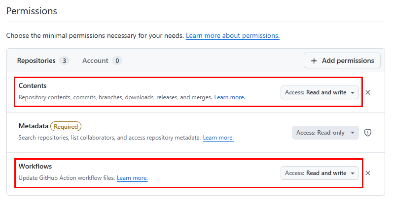
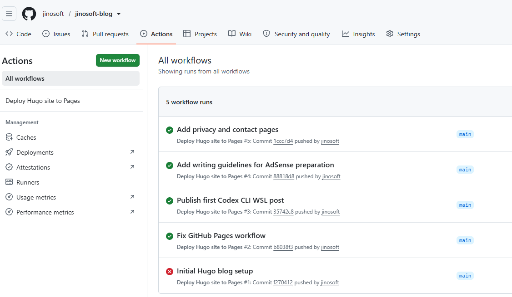
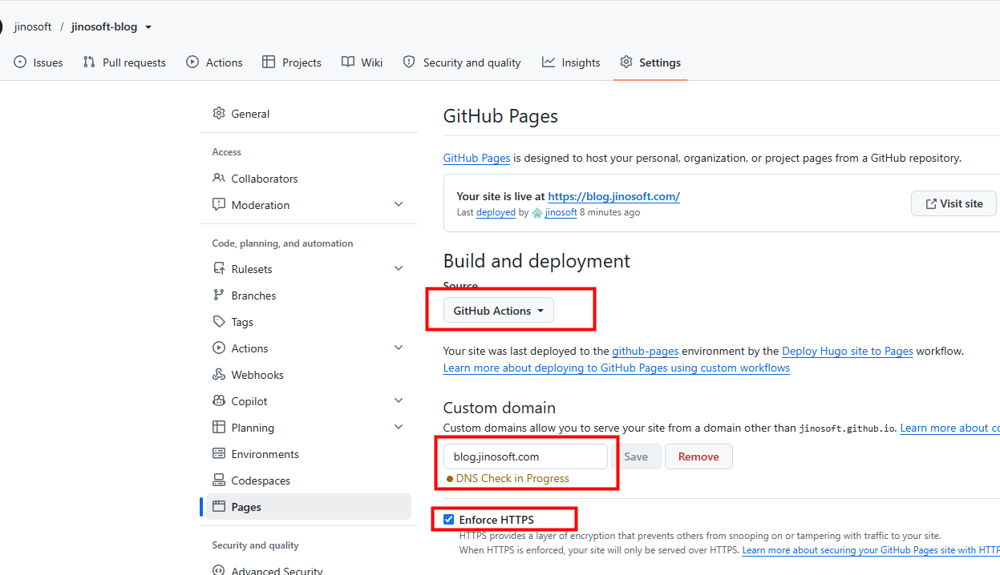
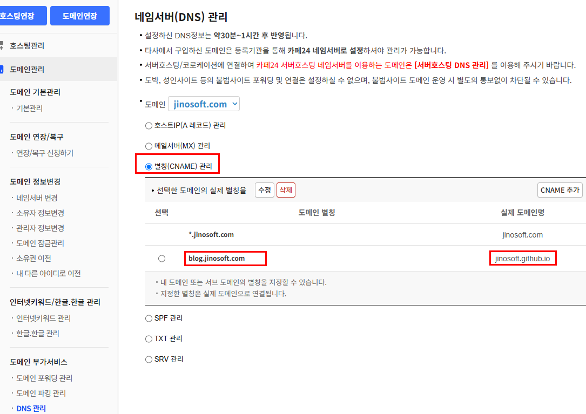

+++
title = 'GitHub Pages에 Hugo 블로그 배포하고 커스텀 도메인 연결하기'
date = '2026-09-18T00:00:00+09:00'
draft = false
slug = 'deploy-hugo-github-pages'
description = 'Hugo와 Blowfish로 만든 블로그를 GitHub Pages에 배포하고, GitHub Actions와 커스텀 도메인까지 연결한 과정을 정리한다.'
tags = ['hugo', 'github-pages', 'github-actions', 'dns', 'github']
categories = ['IT개발']
showTableOfContents = true
+++

Hugo로 만든 블로그를 GitHub Pages에 배포하고 `https://blog.jinosoft.com` 커스텀 도메인으로 연결한 과정을 정리한다.

이 글에서는 GitHub 저장소 준비부터 GitHub Actions 자동 배포, Cafe24 DNS 설정, HTTPS 활성화까지 실제 진행 순서에 맞춰 설명한다.

## 1. 사용 환경과 최종 결과

이번에 사용한 환경은 다음과 같다.

| 항목 | 내용 |
| --- | --- |
| 정적 사이트 생성기 | Hugo 0.165.0 Extended |
| 테마 | Blowfish |
| 저장소 | GitHub `jinosoft/jinosoft-blog` |
| 배포 방식 | GitHub Actions |
| 도메인 | `blog.jinosoft.com` |
| DNS 관리 | Cafe24 |

최종적으로 GitHub 저장소의 `main` 브랜치에 변경 사항을 push하면 GitHub Actions가 Hugo 사이트를 빌드하고 GitHub Pages에 배포하도록 구성했다.

## 2. GitHub 저장소 준비

### 저장소 이름 정하기

기존 Android 앱 저장소와 구분하기 위해 블로그 저장소 이름을 `jinosoft-blog`로 정했다.

개인 GitHub Pages 저장소의 이름을 반드시 `jinosoft.github.io`로 만들 필요는 없다. 프로젝트 저장소를 사용하면 기본 주소는 저장소 이름을 포함한 형태가 되지만, 커스텀 도메인을 연결하면 외부에 노출되는 주소는 별도로 사용할 수 있다.

### 저장소 공개 범위

GitHub Free 개인 계정에서는 GitHub Pages를 **Public 저장소에서만** 사용할 수 있다. GitHub 공식 문서 기준으로 GitHub Pro, Team, Enterprise에서는 Public 및 Private 저장소에서 GitHub Pages를 사용할 수 있다.

| GitHub 요금제 | GitHub Pages 저장소 |
| --- | --- |
| GitHub Free | Public만 가능 |
| GitHub Pro / Team / Enterprise | Public 및 Private 가능 |



따라서 GitHub Free를 사용한다면 이 블로그 저장소는 Public으로 유지해야 한다. 저장소가 공개되어도 실제 블로그 사이트의 운영에는 문제가 없다. 다만 Personal Access Token, API 키, 비밀번호, 서버 접속 정보와 같은 비밀 값은 저장소에 넣으면 안 된다.

## 3. 로컬 프로젝트를 GitHub에 올리기

아직 Git 저장소로 관리하지 않는 Hugo 프로젝트라면 프로젝트 디렉터리에서 Git 저장소를 초기화하고 GitHub 원격 저장소를 연결한다.

```bash
git init
git branch -M main
git remote add origin https://github.com/jinosoft/jinosoft-blog.git
git add .
git commit -m "Initial Hugo blog setup"
git push -u origin main
```

이미 `git init`과 원격 저장소 연결을 완료한 프로젝트라면 초기화 명령을 다시 실행할 필요 없이 다음처럼 변경 사항만 commit하고 push한다.

```bash
git add .
git commit -m "Initial Hugo blog setup"
git push -u origin main
```

HTTPS 방식으로 push하면 GitHub 사용자 이름과 Personal Access Token을 입력한다. GitHub는 일반 계정 비밀번호를 Git 작업의 비밀번호로 사용하지 않으므로, 비밀번호 입력란에 발급한 토큰을 붙여 넣어야 한다.



### Personal Access Token 권한

Fine-grained token을 만들 때는 저장소 접근 범위를 블로그 저장소로 제한하는 것이 좋다. 일반적인 소스 push에는 저장소의 Contents 권한이 필요하다. 아래 권한은 이 글에서처럼 소스와 GitHub Actions 워크플로 파일을 함께 처음 push하는 상황을 기준으로 한다.

저장소 선택 후 Permissions에서는 `Contents`를 `Read and write`로 설정한다. `.github/workflows/` 아래의 워크플로 파일을 push하거나 수정하려면 `Workflows`도 `Read and write`로 설정해야 한다. 계정 권한은 이 작업에 필요하지 않으므로 최소 권한 원칙에 따라 추가하지 않는다.



GitHub Actions 워크플로 파일을 함께 push할 때 다음 오류가 발생할 수 있다.

```text
refusing to allow a Personal Access Token to create or update workflow
without workflow scope
```

이 경우 토큰에 Actions 워크플로 파일을 수정할 수 있는 권한을 추가하거나, 워크플로 파일을 별도 방식으로 반영해야 한다. 토큰은 발급 직후 안전한 곳에 보관하고, 저장소나 글의 코드 블록에 기록하지 않는다.

## 4. GitHub Actions로 자동 배포 구성

GitHub Pages는 저장소의 소스 파일을 그대로 보여주는 방식이 아니라, Hugo가 생성한 정적 파일을 배포하도록 구성한다. 프로젝트에는 `.github/workflows/pages.yml` 파일을 만들고 `main` 브랜치 push를 배포 트리거로 설정한다.

일반적인 흐름은 다음과 같다.

1. `main` 브랜치에 push한다.
2. GitHub Actions가 실행된다.
3. Hugo 프로젝트를 빌드한다.
4. 생성된 `public` 결과물을 GitHub Pages에 배포한다.



워크플로 파일에는 Hugo Extended 버전을 사용하도록 지정해야 한다. Blowfish 테마와 사용자 정의 CSS를 사용하는 경우 Extended 버전이 필요할 수 있다.

배포가 실패하면 Actions의 실행 결과에서 `build` 단계와 `deploy` 단계를 확인한다. 처음 설정할 때는 Pages가 아직 활성화되지 않아 `configure-pages` 단계에서 Pages site를 찾지 못하는 오류가 발생할 수 있다. 이 경우 저장소 설정에서 Pages의 빌드 소스를 GitHub Actions로 지정한 뒤 다시 실행한다.

## 5. GitHub Pages 활성화

GitHub 저장소에서 다음 메뉴로 이동한다.

```text
Settings > Pages
```

Build and deployment의 Source를 `GitHub Actions`로 선택한다.



Actions 실행이 성공하면 기본 GitHub Pages 주소에서 사이트를 확인할 수 있다. 프로젝트 저장소를 사용하는 경우 기본 주소는 다음과 같은 형태다.

```text
https://jinosoft.github.io/jinosoft-blog/
```

이 주소가 열리지 않는다면 Actions 성공 여부, Pages 활성화 여부, `baseURL` 설정을 순서대로 확인한다.

## 6. 커스텀 도메인 연결

GitHub Pages 설정 화면의 Custom domain에 사용할 도메인을 입력한다.

```text
blog.jinosoft.com
```

저장하면 GitHub Pages 설정과 배포 방식에 따라 저장소의 `CNAME` 파일이 생성되거나, 배포 결과에 커스텀 도메인이 반영된다. 이미 `CNAME` 파일이 있다면 내용이 해당 도메인과 일치하는지 확인한다. Hugo 설정의 `baseURL`도 실제 주소와 일치하도록 지정한다.

```toml
baseURL = "https://blog.jinosoft.com/"
```

### DNS에 CNAME 레코드 추가

도메인을 구입한 등록기관의 DNS 관리 화면에서 다음 CNAME 레코드를 추가한다.

| 항목 | 값 |
| --- | --- |
| 호스트 | `blog` |
| 레코드 종류 | `CNAME` |
| 대상 | `jinosoft.github.io` |



DNS 설정 후 바로 반영되지 않을 수 있다. 등록기관 안내처럼 수십 분에서 몇 시간 정도 기다린 뒤 GitHub Pages 설정 화면에서 `DNS check successful` 표시를 확인한다.

## 7. HTTPS 활성화

도메인 연결이 확인되면 GitHub Pages 설정 화면에서 `Enforce HTTPS`를 활성화한다.

인증서 발급이 완료되기 전에는 해당 옵션이 바로 활성화되지 않을 수 있다. 잠시 기다린 뒤 다시 확인하고, 최종적으로 다음 주소가 HTTPS로 열리는지 확인한다.

```text
https://blog.jinosoft.com
https://blog.jinosoft.com/posts/install-codexcli-with-wsl/
```

## 8. 자주 발생한 문제와 해결 방법

### GitHub Pages 주소가 404인 경우

- GitHub Actions가 성공했는지 확인한다.
- Settings > Pages에서 Source가 GitHub Actions인지 확인한다.
- 커스텀 도메인과 `baseURL`이 일치하는지 확인한다.
- 배포가 완료된 뒤 브라우저 캐시와 DNS 반영 시간을 고려한다.

### Actions에서 Pages site를 찾지 못하는 경우

저장소의 Pages 설정이 아직 활성화되지 않았거나, 배포 방식이 GitHub Actions로 선택되지 않은 상태일 수 있다. Pages 설정을 먼저 저장하고 워크플로를 다시 실행한다.

### PAT 권한 오류가 발생하는 경우

워크플로 파일을 push할 때 토큰에 필요한 Actions 관련 권한이 없으면 거부될 수 있다. 토큰 권한을 확인하고, 토큰 자체를 코드나 로그에 남기지 않도록 주의한다.

### DNS 설정 후에도 접속되지 않는 경우

DNS 전파가 끝나지 않았을 수 있다. CNAME의 호스트가 `blog`인지, 대상이 `jinosoft.github.io`인지, 다른 충돌 레코드가 없는지 확인한다.

## 9. 글 URL을 안정적으로 유지하기

블로그 글은 글마다 디렉터리를 만들고 그 안에 `index.md`와 이미지를 함께 저장한다.

```text
content/posts/deploy-hugo-github-pages/
  index.md
  create_repository_public.PNG
  github_action.PNG
```

Hugo 설정에서는 글 URL을 다음과 같이 고정했다.

```toml
[permalinks]
  posts = "/posts/:slug/"
```

따라서 이 글의 주소는 다음과 같다.

```text
/posts/deploy-hugo-github-pages/
```

향후 GitHub Pages에서 자체 서버로 이전하더라도 같은 도메인과 permalink 설정을 유지하면 기존 글 주소를 계속 사용할 수 있다.

## 10. 로컬에서 확인하고 배포하기

글을 작성한 뒤에는 먼저 로컬 서버로 결과를 확인한다.

```bash
hugo server -D
```

배포 전 정식 빌드도 확인한다.

```bash
hugo --minify
```

문제가 없다면 변경 사항을 커밋하고 push한다.

```bash
git add .
git commit -m "Add Hugo GitHub Pages deployment guide"
git push origin main
```

이후 GitHub Actions 실행이 성공하면 몇 분 안에 사이트에 변경 사항이 반영된다.

## 마무리

Hugo 프로젝트를 GitHub 저장소에 올리고 GitHub Actions를 연결하면 글을 push하는 것만으로 자동 배포할 수 있다. 여기에 커스텀 도메인과 HTTPS를 추가하면 GitHub Pages의 기본 주소 대신 개인 블로그에 적합한 주소를 사용할 수 있다.

실제 설정에서는 GitHub Pages 활성화, Personal Access Token 권한, DNS 전파 시간에서 문제가 가장 많이 발생했다. 각 단계를 한 번에 진행하기보다 Actions 결과와 DNS 상태를 확인하면서 순서대로 진행하면 원인을 찾기 쉽다.
