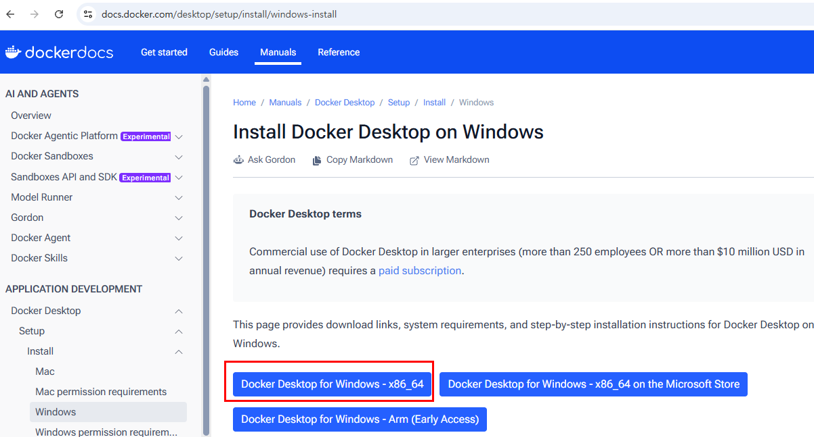
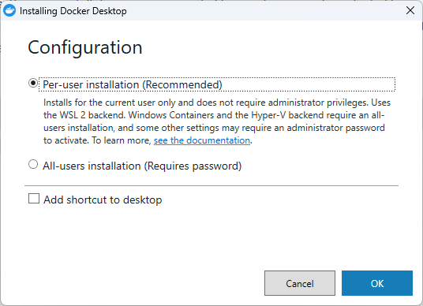
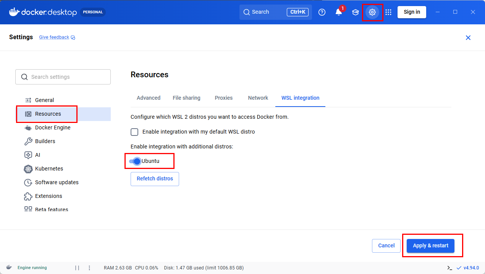
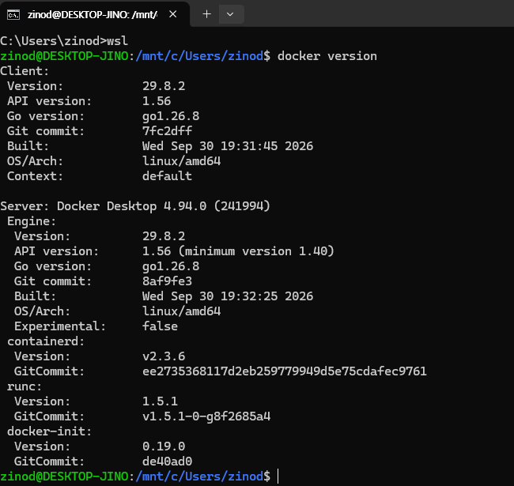
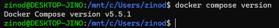
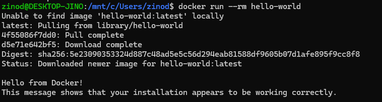
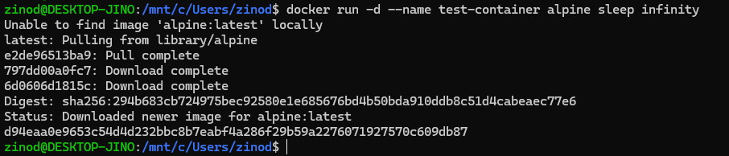
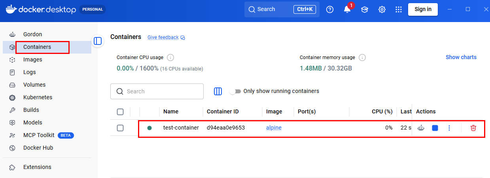
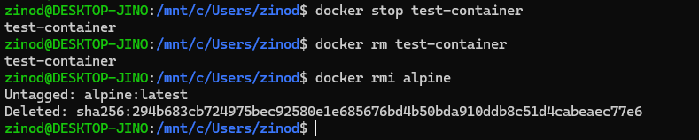

+++
title = 'Windows에서 Docker Desktop 설치하고 WSL과 연동하기'
date = '2026-10-07T00:00:00+09:00'
draft = false
slug = 'docker-desktop-wsl-setup'
description = 'Windows에 Docker Desktop을 설치하고 WSL Ubuntu와 연동하는 과정을 정리한다. hello-world 실행부터 Windows 화면에서 컨테이너 확인과 정리까지 직접 확인한다.'
tags = ['docker', 'docker-desktop', 'wsl', 'ubuntu', 'windows']
categories = ['IT개발']
showTableOfContents = true
+++

Kafka와 RabbitMQ를 실습해보려다, 먼저 로컬에 Docker를 설치하기로 했다. 서비스를 하나씩 직접 설치하는 대신 컨테이너로 실행하면 테스트 환경을 구성하고 정리하기 편하다.

이미 WSL Ubuntu를 사용하고 있어 Windows에 Docker Desktop을 설치하고 Ubuntu와 연동하는 방식으로 진행했다. WSL에서 컨테이너를 실행한 뒤 Windows의 Docker Desktop에서도 같은 컨테이너가 보이는지 확인했다. 설치부터 실행 확인과 정리까지의 과정을 정리한다.

## 1. Docker Desktop과 WSL의 역할

이 구성에서 Docker Desktop은 컨테이너 실행 엔진과 관리 화면을 제공하고, WSL Ubuntu는 Docker 명령을 입력하는 개발 환경으로 사용한다.

```text
WSL Ubuntu 터미널
  docker 명령 실행
        ↓
Docker Desktop의 WSL 2 기반 엔진
  Linux 컨테이너 실행
        ↓
Windows의 Docker Desktop 화면에서도 확인
```

Ubuntu에 별도의 Docker Engine을 추가 설치하는 방식이 아니다. 이미 Ubuntu에 Docker Engine이나 CLI를 직접 설치했다면 기존 구성과 데이터를 확인하고 설치 방식을 정리한 뒤 진행한다. Docker 공식 문서도 두 설치 방식의 충돌을 주의하도록 안내한다. [Docker WSL 2 연동 문서](https://docs.docker.com/desktop/features/wsl/)

## 2. 설치 전 환경 확인

WSL과 Ubuntu는 이미 설치되어 있었으므로 다시 설치하지 않았다. Docker 설치 전에는 Ubuntu가 WSL 2로 실행되는지만 먼저 확인했다.

| 항목 | 사용 환경 |
| --- | --- |
| 운영체제 | Windows 11 Home, x86_64 |
| WSL | 2.7.14.0, Ubuntu는 WSL 2로 실행 |
| Linux 배포판 | Ubuntu 26.04.1 LTS |
| Docker Desktop | 4.94.0 |
| Docker Engine | 29.8.2 |
| Docker Compose | 5.5.1 |
| 확인 날짜 | 2026년 10월 7일 |

Docker 관련 버전은 설치 후 실행 화면에서 확인한 값이다. 이후 버전에서는 설치 화면이나 메뉴가 달라질 수 있다.

> WSL과 Ubuntu가 아직 설치되어 있지 않다면, [WSL 환경에서 Codex CLI 설치하기](/posts/install-codexcli-with-wsl/#1-wsl과-ubuntu-설치)의 **'1. WSL과 Ubuntu 설치'**를 먼저 진행한다. Docker 실습에는 해당 절의 WSL·Ubuntu 설치 과정만 필요하며, Codex CLI는 설치하지 않아도 된다.

Windows PowerShell 또는 명령 프롬프트에서 WSL 상태를 확인한다.

```powershell
wsl --version
wsl --list --verbose
```

Ubuntu 행의 `VERSION`이 `2`인지 확인한다. `wsl --version`에 표시되는 WSL 프로그램 버전과 배포판의 실행 방식인 `VERSION 2`는 서로 다른 정보다.

Docker Desktop의 WSL 2 구성은 WSL 2.1.5 이상, 시스템 메모리 8GB, 하드웨어 가상화 활성화 등을 요구한다. Windows Home에서도 이 글처럼 Linux 컨테이너를 사용할 수 있다. 지원하는 Windows 버전과 설치 조건은 [Windows 설치 문서](https://docs.docker.com/desktop/setup/install/windows-install/)에서 확인한다.

## 3. Docker Desktop 설치

### 설치 파일 다운로드

[Docker Desktop Windows 설치 페이지](https://docs.docker.com/desktop/setup/install/windows-install/)에서 PC의 CPU 아키텍처에 맞는 설치 파일을 받는다. 이번 환경은 x86_64이므로 **Docker Desktop for Windows - x86_64**를 선택했다.



> Docker Desktop은 개인 사용에 무료로 제공되지만, 회사에서 사용하는 경우 조직 규모와 이용 조건에 따라 유료 구독이 필요할 수 있다. 설치 전에 [Docker Desktop 이용 조건](https://docs.docker.com/desktop/setup/install/windows-install/#start-docker-desktop)을 확인한다.

### 설치 옵션 선택

다운로드한 설치 파일을 실행하고 **Per-user installation (Recommended)**을 선택한다.



이번 설치 화면에는 **Per-user**와 **All-users** 두 가지 선택지가 있었다. WSL 2로 Linux 컨테이너를 실행할 목적이라 현재 사용자에게 설치하는 Per-user를 선택했다. 별도로 WSL 2 백엔드를 선택하는 체크박스는 이 화면에 없었다.

설치가 끝나면 Windows 시작 메뉴에서 Docker Desktop을 실행한다. 처음 표시되는 이용 약관을 확인하고 동의한 뒤 엔진이 시작될 때까지 기다린다.

## 4. WSL Ubuntu 연동

Docker Desktop에서 **Settings → Resources → WSL integration**으로 이동한다.

사용할 배포판인 **Ubuntu**를 활성화하고 **Apply & restart**를 클릭한다.



여기서는 **Enable integration with my default WSL distro** 체크를 꺼둔 채 Ubuntu만 개별적으로 활성화했다. 이후 Ubuntu 터미널에서 Docker 명령이 정상적으로 실행됐다. 기본 배포판 연동 체크가 꺼져 있어도 사용할 배포판을 직접 활성화하면 된다.

General 메뉴에 **Use WSL 2 based engine** 옵션이 표시된다면 활성화되어 있는지 확인한다. WSL 2 사용 환경에서는 기본 적용되어 이 옵션이 보이지 않을 수도 있다. [WSL 2 백엔드 설정](https://docs.docker.com/desktop/features/wsl/)

## 5. WSL 터미널에서 실행 확인

이제 Windows 터미널에서 Ubuntu로 들어간다. 배포판을 명시하면 기본 배포판 설정과 관계없이 Ubuntu가 열린다.

```powershell
wsl -d Ubuntu
```

이후 명령은 모두 **WSL Ubuntu 터미널**에서 실행한다.

### Docker 클라이언트와 엔진 확인

```bash
docker version
```



**Client와 Server 정보가 모두 출력되는지** 확인한다. Client만 표시되고 Server 연결 오류가 나오면 명령줄 도구는 있지만 실행 엔진에 연결되지 않은 상태다.

이번 환경에서는 Client와 Server의 Engine 버전이 모두 `29.8.2`로 표시되었다. Server 항목에는 `Docker Desktop 4.94.0`도 나타난다.

### Docker Compose 확인

```bash
docker compose version
```



나중에 여러 컨테이너를 함께 실행할 때 사용할 Compose도 확인했다. 별도로 설치하지 않아도 `Docker Compose version v5.5.1`이 출력되었다.

### hello-world 실행

```bash
docker run --rm hello-world
```



첫 실행에서는 로컬에 이미지가 없어 다운로드가 먼저 진행됐다. 이어서 **Hello from Docker!** 메시지가 출력됐다. 버전 정보만 확인하는 것에서 한 단계 더 나아가, 실제 이미지 다운로드와 컨테이너 실행까지 성공한 것이다.

`--rm`은 실행이 끝난 컨테이너를 자동으로 삭제하는 옵션이다. 다운로드한 이미지는 남는다. [docker container run 명령](https://docs.docker.com/reference/cli/docker/container/run/)

## 6. Windows 화면에서 같은 컨테이너 확인

`hello-world`는 실행 후 바로 종료된다. Docker Desktop에서 실행 중인 컨테이너를 확인하기 위해 Alpine 컨테이너를 하나 더 만든다.

```bash
docker run -d --name test-container alpine sleep infinity
```



각 옵션의 의미는 다음과 같다.

| 옵션 또는 인수 | 의미 |
| --- | --- |
| `-d` | 백그라운드에서 실행 |
| `--name test-container` | 컨테이너 이름 지정 |
| `alpine` | 사용할 이미지. 태그를 생략해 `latest` 사용 |
| `sleep infinity` | 테스트용 컨테이너가 바로 종료되지 않도록 대기 |

명령이 성공하면 컨테이너 ID가 출력된다. 실행 상태는 다음 명령으로도 확인할 수 있다.

```bash
docker ps
```

Windows의 Docker Desktop에서 **Containers**를 열면 같은 `test-container`가 실행 중으로 표시된다.



WSL에서 실행한 `test-container`가 Windows 화면에도 그대로 나타났다. 컨테이너 ID의 앞부분도 일치했다. **Ubuntu 안에 따로 Docker 서버를 설치한 것이 아니라, WSL 터미널과 Docker Desktop이 같은 엔진을 사용하고 있음을 확인했다.**

명령은 WSL에서 실행하고, 실행 상태는 Windows 화면에서 확인하는 식으로 사용할 수 있다.

이 예제는 포트를 공개하지 않았으므로 브라우저로 접속하는 서비스는 없다. 이후 웹 서버나 메시지 브로커를 실행할 때는 필요한 포트와 데이터 저장 설정을 별도로 구성한다.

## 7. 테스트 컨테이너 정리

확인이 끝나면 테스트 컨테이너를 중지하고 삭제한다.

```bash
docker stop test-container
docker rm test-container
docker rmi alpine
```



`stop`은 실행 중지, `rm`은 컨테이너 삭제, `rmi`는 이미지 삭제다. 다른 컨테이너가 Alpine 이미지를 사용하고 있다면 이미지 삭제가 거부될 수 있으므로 사용 여부를 먼저 확인한다.

앞서 다운로드한 `hello-world` 이미지도 필요 없다면 별도로 삭제한다.

```bash
docker rmi hello-world
```

이 명령들은 테스트 컨테이너와 이미지를 정리하는 것이며, Docker 전체 데이터나 볼륨을 삭제하는 명령은 아니다.

## 8. 자주 겪는 문제

### Ubuntu에서 docker 명령을 찾지 못하는 경우

Docker Desktop이 실행 중인지 확인하고, **Settings → Resources → WSL integration**에서 현재 사용하는 배포판이 활성화되어 있는지 확인한다. 설정 적용 후 Ubuntu 터미널을 다시 열어 실행한다.

곧바로 Ubuntu에 `docker.io`를 추가 설치하면 다른 Docker 구성과 섞일 수 있으므로, 먼저 Desktop 연동 설정을 확인한다.

### Server 연결 오류가 발생하는 경우

Docker Desktop 화면에서 엔진이 실행 중인지 확인한다. Desktop을 종료한 상태에서는 이 구성의 컨테이너를 실행할 수 없다.

기존 Docker 설정이 있다면 다음 명령으로 다른 엔진을 가리키고 있지 않은지도 확인한다.

```bash
docker context ls
printenv DOCKER_HOST DOCKER_CONTEXT
```

설정을 무조건 삭제하지 말고 기존 프로젝트에서 사용하던 연결인지 먼저 확인한다.

### WSL integration 메뉴가 보이지 않는 경우

Windows 컨테이너 모드가 아닌 Linux 컨테이너 모드인지 확인한다. 모드 전환 메뉴가 있는 설치 환경에서는 Docker 메뉴의 **Switch to Linux containers**를 선택한다. [WSL 배포판 연동 안내](https://docs.docker.com/desktop/features/wsl/#enable-docker-in-a-wsl-2-distribution)

### 컨테이너 이름이 이미 사용 중인 경우

같은 명령을 다시 실행하면 `test-container`라는 이름이 이미 존재한다는 오류가 발생할 수 있다.

```bash
docker ps -a
```

기존 컨테이너가 테스트용인지 확인하고, 필요 없다면 중지와 삭제를 거친 뒤 다시 실행한다. 보관할 컨테이너라면 새 이름을 사용한다.

## 마무리

이번 구성에서는 Ubuntu에 Docker Engine을 따로 설치하지 않고 Desktop 연동만으로 컨테이너를 실행할 수 있었다. `hello-world`로 실제 동작을 확인하고, 계속 실행되는 Alpine 컨테이너로 Windows 관리 화면과의 연결까지 확인했다.

테스트 컨테이너는 정리했고 Docker Desktop과 WSL 연동은 그대로 남겨두었다. 이제 이 환경에서 Kafka와 RabbitMQ 실습을 이어가려 한다.
