+++
title = 'Google Cloud HA VPN과 AWS Site-to-Site VPN 연결하기'
date = '2026-09-23T00:00:00+09:00'
draft = false
slug = 'gcp-aws-ha-vpn'
description = 'Google Cloud HA VPN과 AWS Virtual Private Gateway 기반 Site-to-Site VPN을 연결하고, 네 개의 VPN 터널과 BGP 라우팅을 구성한 과정을 정리한다.'
tags = ['google-cloud', 'gcp', 'aws', 'ha-vpn', 'site-to-site-vpn', 'bgp', 'networking']
categories = ['IT개발']
showTableOfContents = true
+++

Google Cloud의 HA VPN과 AWS의 Site-to-Site VPN을 연결해 두 클라우드 VPC 사이에 사설 네트워크 통신을 구성한 과정을 정리한다.

이번 글에서는 Google Cloud의 HA VPN Gateway와 Cloud Router, AWS의 Virtual Private Gateway(VGW), Customer Gateway, 두 개의 Site-to-Site VPN 연결을 사용한다. AWS VPN 연결 하나에는 두 개의 터널이 생성되므로, 최종적으로 네 개의 VPN 터널과 네 개의 BGP 세션을 구성한다.

## 1. 최종 구성

이번 예제의 구성은 다음과 같다.

| 항목 | Google Cloud | AWS |
| --- | --- | --- |
| 네트워크 | `gateway-vpc` | `test-vpc` |
| 네트워크 CIDR | `10.1.1.0/24` | `10.2.2.0/24` |
| 리전 | `asia-northeast3` | `us-east-1` |
| VPN Gateway | HA VPN Gateway | Virtual Private Gateway |
| 라우팅 | Cloud Router + BGP | 동적 라우팅 + BGP |
| ASN | `65001` | `65002` |
| VPN 연결 수 | - | 2개 |
| VPN 터널 수 | 4개 | 4개 |

두 VPC의 CIDR은 서로 겹치지 않아야 한다. 실제 환경에서는 기존 VPC, 서브넷, 온프레미스 네트워크의 주소 대역까지 함께 확인한다.

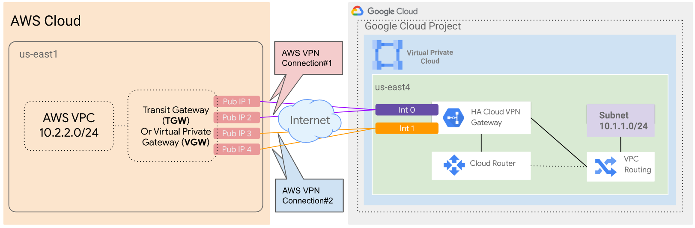

Google Cloud와 AWS의 공식 연동 방식에서도 AWS의 두 Site-to-Site VPN 연결에서 네 개의 외부 IP를 구성하고, Google Cloud의 HA VPN 인터페이스와 연결하는 구조를 사용한다. [Google Cloud의 AWS HA VPN 연결 가이드](https://docs.cloud.google.com/network-connectivity/docs/vpn/how-to/connect-ha-vpn-aws-peer-gateway)

### HA VPN을 사용하는 이유

Google Cloud HA VPN은 동적 라우팅(BGP)을 사용하는 고가용성 VPN 구성에 적합하다. Classic VPN은 현재 BGP 동적 라우팅을 사용하는 새 구성을 지원하지 않으므로, 이 글처럼 Cloud Router와 BGP를 사용하는 경우에는 HA VPN을 선택해야 한다. [Classic VPN 동적 라우팅 지원 중단 안내](https://docs.cloud.google.com/network-connectivity/docs/vpn/deprecations/classic-vpn-deprecation)

Google Cloud 측 HA VPN의 99.99% SLA를 충족하려면 두 인터페이스 모두에 터널이 구성되어야 한다. AWS와 연결할 때는 AWS의 두 VPN 연결에서 제공하는 네 개의 터널을 사용해 양쪽 인터페이스의 장애에 대비한다.

## 2. 사전에 확인할 내용

이 글의 캡처는 삭제된 테스트 환경에서 생성한 것이다. 캡처에 표시되는 프로젝트·VPC·VPN 리소스 정보와 IP 주소는 현재 사용 중인 구성이 아니며, 그대로 복사하지 않고 각자의 환경에서 새로 확인해야 한다.

캡처에 보이는 공인 IP는 Google Cloud와 AWS가 VPN 외부 터널에 할당한 테스트 시점의 주소다. 공인 IP 대역과 외부 터널 주소의 사용 방식은 각 클라우드의 공식 문서에도 공개되어 있지만, 실제 구성에서는 고정된 값으로 가정하지 말고 각 콘솔에서 현재 할당된 주소를 확인한다.

사전 공유 키도 테스트 구성에서 임시로 사용한 값이다. 실제 운영 환경에서는 다음 기준을 적용한다.

- 터널마다 서로 다른 강한 사전 공유 키를 사용한다.
- AWS가 자동 생성한 키를 사용하거나 안전한 비밀 저장소에 보관한다.
- 키를 소스 코드, 문서, 화면 캡처에 기록하지 않는다.

AWS Site-to-Site VPN은 PSK를 자동 생성할 수 있고, AWS Secrets Manager를 이용해 보관할 수도 있다. [AWS Site-to-Site VPN 터널 인증 방식](https://docs.aws.amazon.com/vpn/latest/s2svpn/vpn-tunnel-authentication-options.html)

또한 다음 항목을 준비한다.

- Google Cloud VPC와 AWS VPC
- 서로 겹치지 않는 양쪽 네트워크 CIDR
- Google Cloud에서 VPN을 생성할 권한
- AWS에서 VGW, Customer Gateway, Site-to-Site VPN을 생성할 권한
- 양쪽의 방화벽, Security Group, 네트워크 ACL 설정 계획
- 테스트할 Compute Engine VM과 EC2 인스턴스의 사설 IP

VPN 터널이 생성됐더라도 방화벽이나 라우팅 테이블이 올바르지 않으면 실제 애플리케이션 통신은 되지 않는다. VPN 생성과 통신 검증은 별도의 단계로 생각하는 것이 좋다.

## 3. Google Cloud Cloud Router 생성

Google Cloud 콘솔의 하이브리드 연결 메뉴에서 Cloud Router를 생성한다.

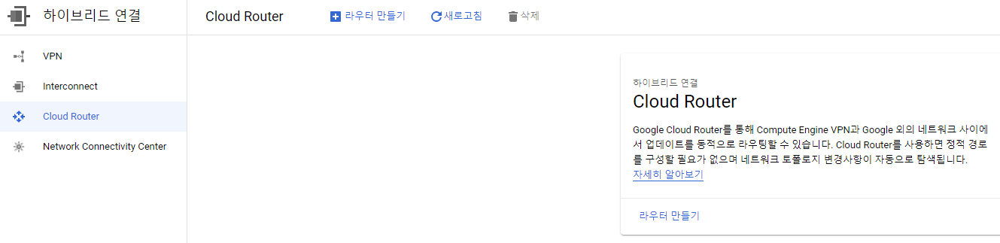

Cloud Router 생성 화면에서 이름, VPC 네트워크, 리전을 입력한다. 이 예제에서는 `gateway-vpc`, `asia-northeast3`, ASN `65001`을 사용했다.

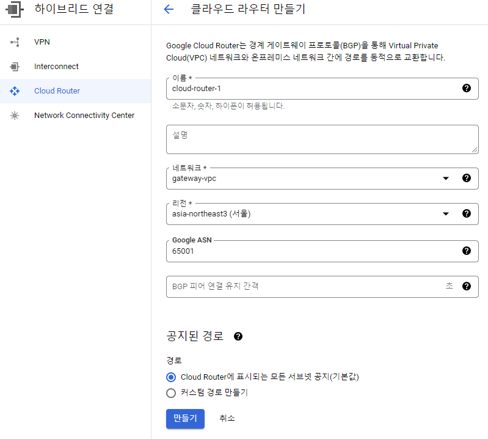

Cloud Router는 VPN 터널 자체가 아니라 BGP를 통해 네트워크 경로를 교환하는 역할을 한다. HA VPN 터널을 생성할 때 이 Cloud Router를 연결하게 된다.

## 4. Google Cloud HA VPN Gateway 생성

Google Cloud의 VPN 메뉴에서 VPN 연결 생성을 시작한다.

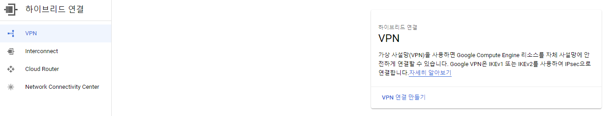

VPN 종류에서는 고가용성(HA) VPN을 선택한다.

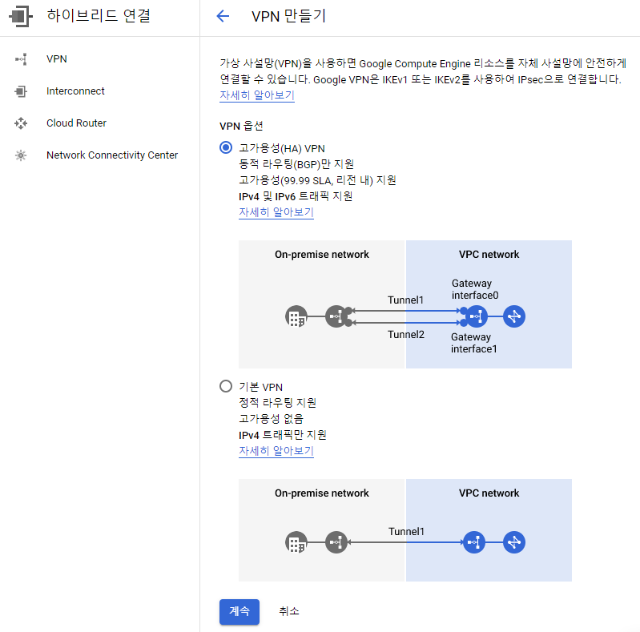

HA VPN Gateway 생성 화면에서 이름, VPC 네트워크, 리전을 지정한다. 이 예제에서는 `gw-to-aws`라는 이름과 `gateway-vpc`, `asia-northeast3`을 사용했다.

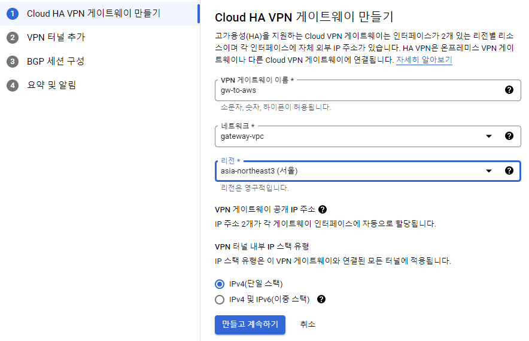

HA VPN Gateway가 생성되면 Google Cloud가 두 개의 외부 IP를 자동으로 할당한다. 이 IP는 AWS의 Customer Gateway를 만들 때 사용하므로 기록해 둔다.

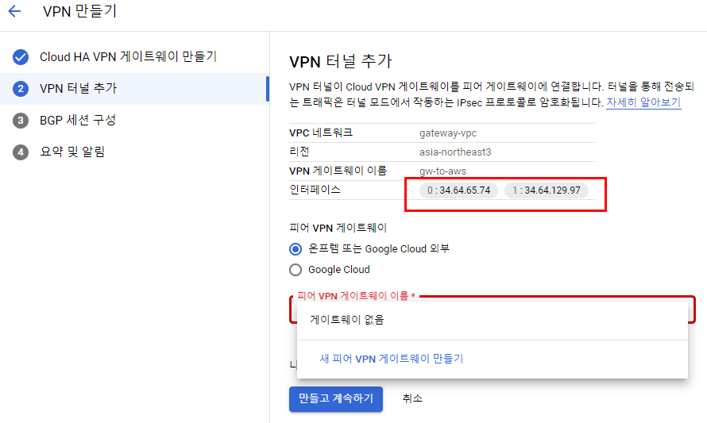

Google Cloud HA VPN Gateway의 두 IP를 AWS의 Customer Gateway 두 개에 각각 연결할 예정이다.

## 5. AWS Virtual Private Gateway 생성 및 VPC 연결

AWS VPC 콘솔의 가상 사설 네트워크 메뉴에서 Virtual Private Gateway를 선택한다.

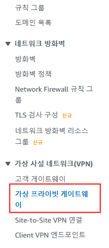

Virtual Private Gateway를 생성하면서 이름과 ASN을 지정한다. 이 예제에서는 AWS ASN을 `65002`로 설정했다.

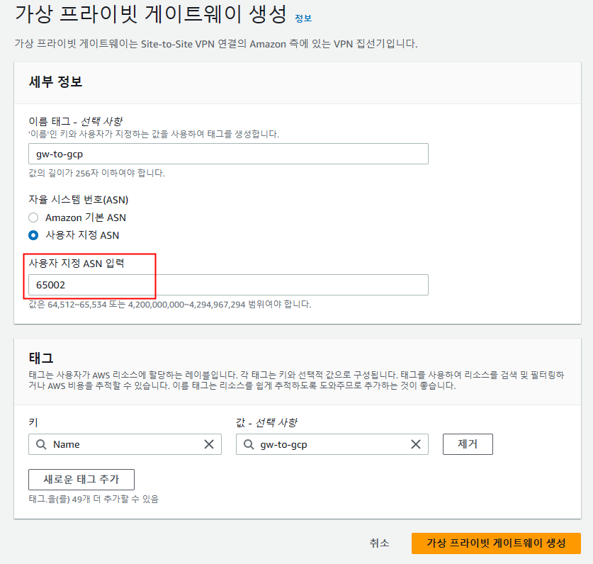

생성된 VGW를 대상 VPC에 연결한다.

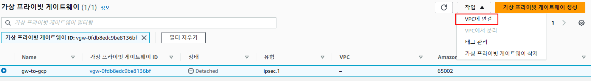

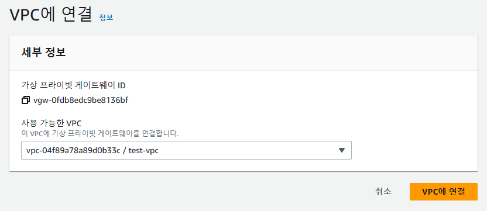

이번 글은 AWS Virtual Private Gateway 기준이다. Transit Gateway를 사용하는 구성은 라우팅 테이블과 VPN 연결 방식이 달라지므로, 같은 절차로 간주하면 안 된다. AWS와 Google Cloud의 연동에서 Transit Gateway를 사용하면 ECMP를 활용할 수 있지만, 이 글의 구성은 VGW를 사용한다.

## 6. AWS Customer Gateway 생성

Customer Gateway는 AWS 외부에 있는 VPN 장치를 AWS에 등록하는 리소스다. 여기서는 Google Cloud HA VPN Gateway의 외부 IP를 Customer Gateway의 IP 주소로 사용한다.

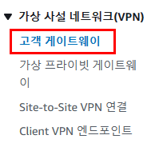

Customer Gateway를 생성할 때 다음 항목을 입력한다.

- 라우팅 옵션: Dynamic
- BGP ASN: Google Cloud Cloud Router의 ASN인 `65001`
- IP 주소: Google Cloud HA VPN Gateway 인터페이스 0의 외부 IP

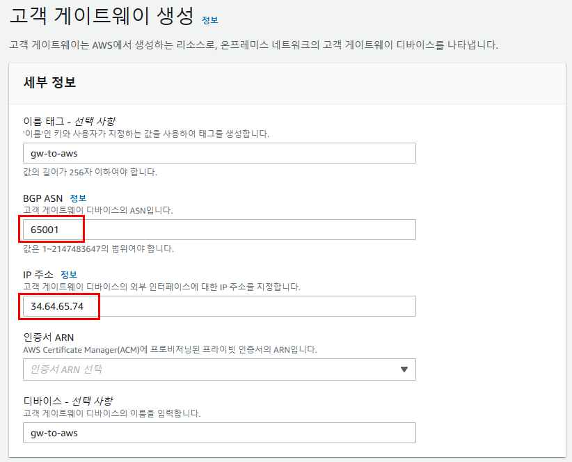

Google Cloud HA VPN Gateway의 두 번째 인터페이스도 사용해야 하므로 Customer Gateway를 하나 더 생성한다. 두 번째 Customer Gateway에는 HA VPN Gateway 인터페이스 1의 외부 IP를 입력한다.

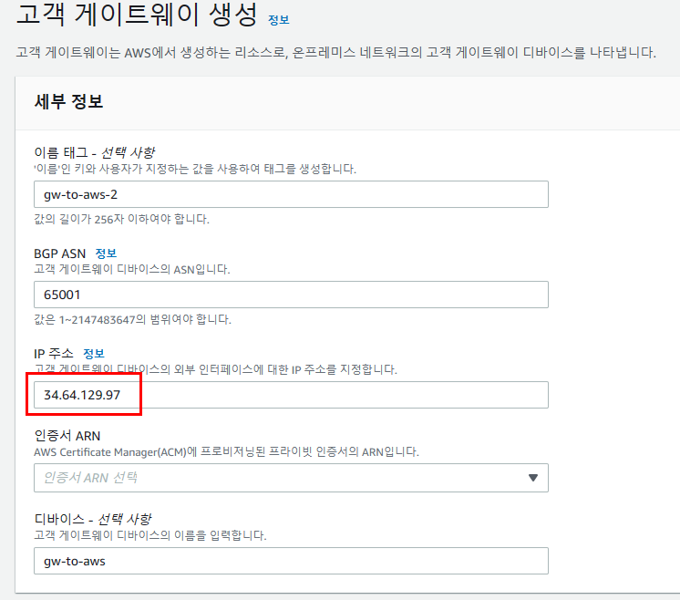

AWS Customer Gateway 두 개는 각각 Google Cloud HA VPN Gateway의 서로 다른 인터페이스를 가리킨다.

## 7. AWS Site-to-Site VPN 연결 생성

AWS VPC 콘솔에서 Site-to-Site VPN 연결 생성을 시작한다.

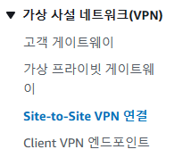

첫 번째 VPN 연결에서는 다음 값을 지정한다.

- 대상 게이트웨이 유형: Virtual Private Gateway
- 대상 게이트웨이: 앞에서 만든 VGW
- Customer Gateway: 첫 번째 Customer Gateway
- 라우팅 옵션: Dynamic

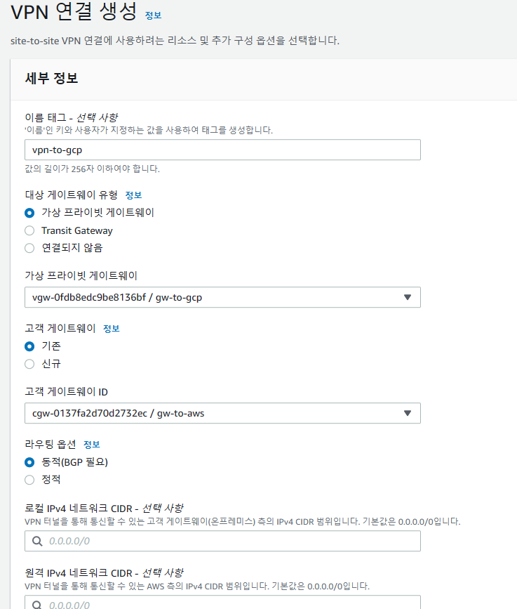

AWS VPN 연결 하나에는 두 개의 터널이 생성된다. 터널 옵션에서 IKE 버전은 `IKEv2`를 선택하고, 사전 공유 키는 AWS가 자동 생성하거나 운영 환경에 맞는 강한 값을 사용한다.

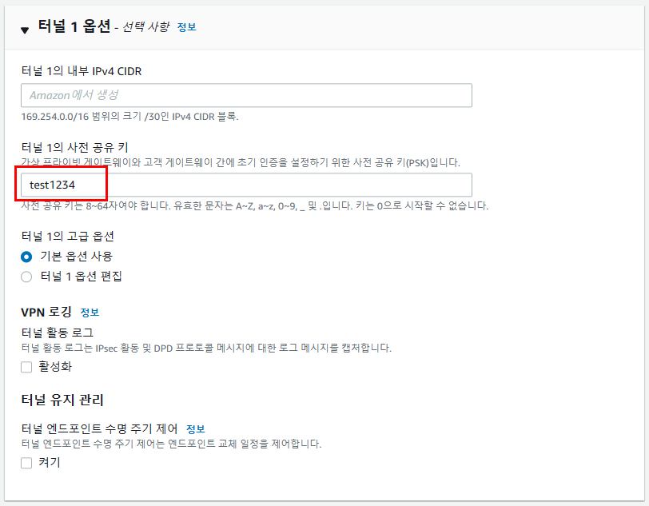

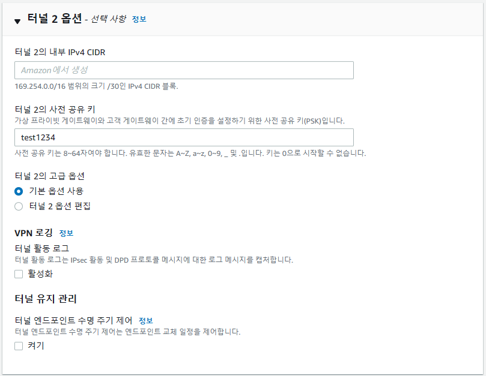

Google Cloud 공식 문서에서는 AWS와의 HA VPN 구성에서 IKEv2를 사용하고, AWS 측 변환 세트를 너무 많이 선택하지 않도록 안내한다. 기본 설정을 그대로 사용하기보다 양쪽에서 호환되는 Phase 1·Phase 2 암호화, 무결성, DH 그룹을 명시적으로 확인하는 것이 좋다.

첫 번째 VPN 연결이 생성되면 두 터널의 외부 IP와 내부 터널 CIDR을 확인할 수 있다.

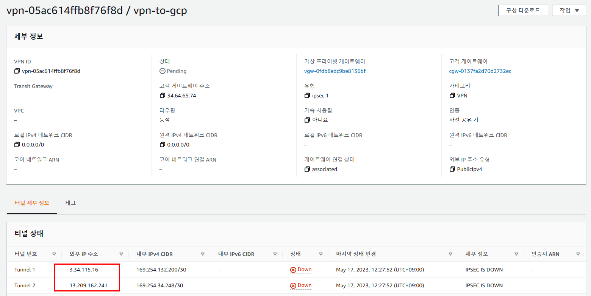

이제 두 번째 VPN 연결을 만든다. 두 번째 연결에서는 첫 번째와 다른 Customer Gateway를 선택한다.

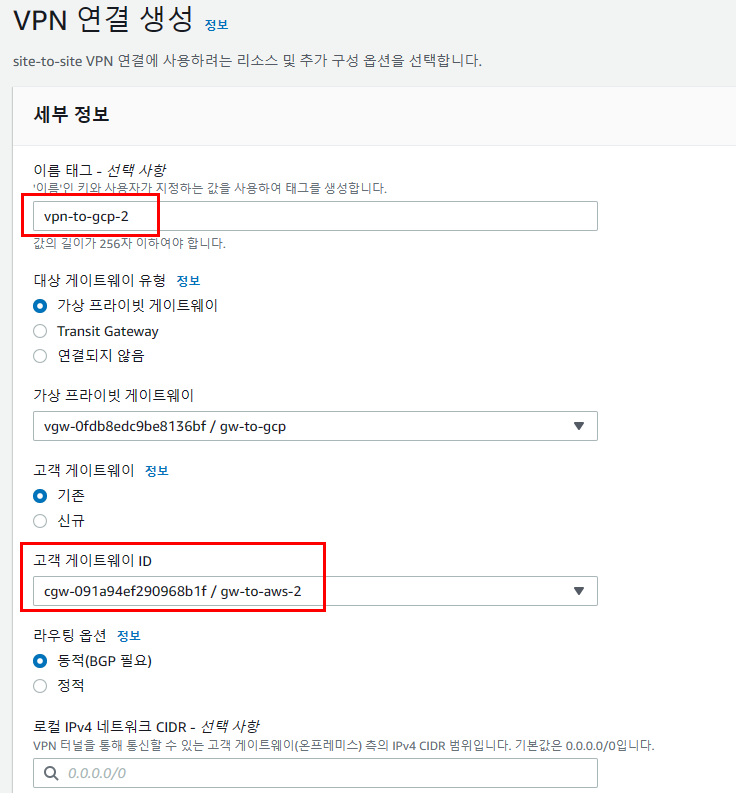

두 번째 VPN 연결의 두 터널에도 각각 IKEv2와 사전 공유 키를 설정한다. 테스트 환경에서는 임시 키를 사용했지만, 운영 환경에서는 터널별로 서로 다른 강한 키를 사용한다.

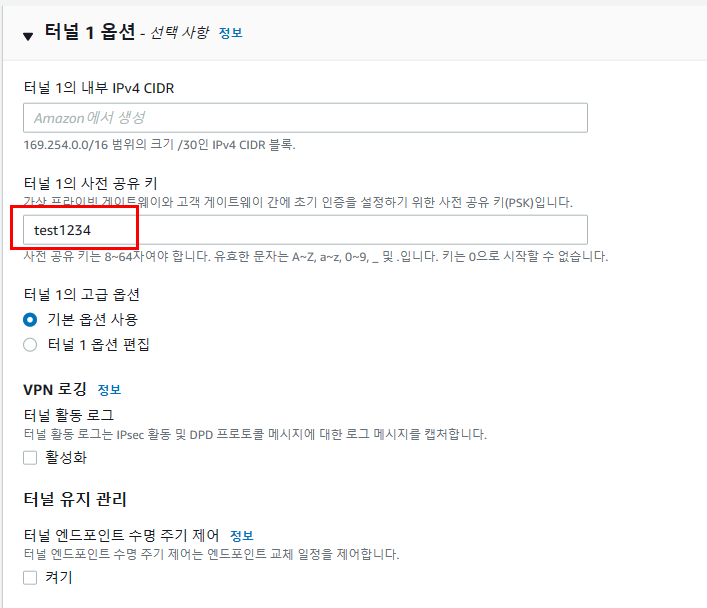

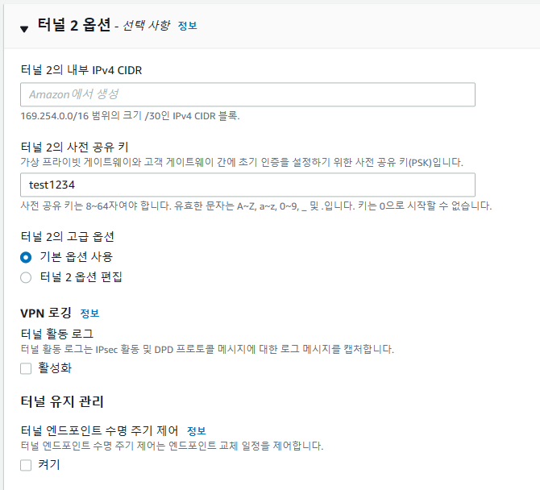

두 번째 VPN 연결까지 생성하면 AWS 쪽에는 총 네 개의 터널이 준비된다.

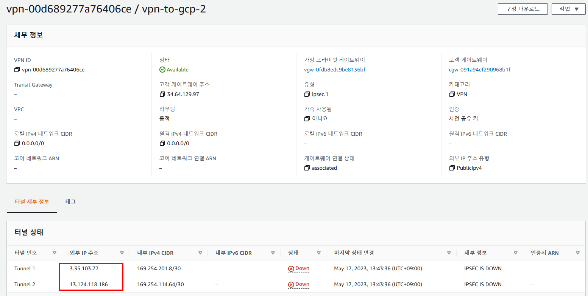

AWS Site-to-Site VPN 연결 하나가 두 개의 터널을 제공한다는 점을 이용해 두 VPN 연결을 만든 것이다. AWS 공식 문서에서도 VPN 연결 하나마다 두 개의 터널이 제공된다고 안내한다.

## 8. AWS VPN 구성 파일에서 BGP 정보 확인

각 AWS VPN 연결에서 구성 다운로드를 선택한다.

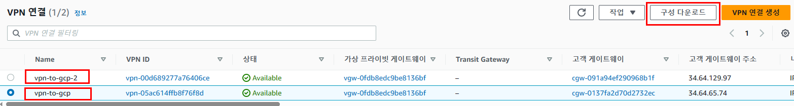

구성 다운로드 화면에서 피어 장비에 맞는 공급 업체와 장치 정보를 선택한다. 다운로드된 구성 파일은 실제 장비에 그대로 적용하는 파일이 아니라, 터널 외부 IP, 내부 BGP 주소, IKE 설정, 사전 공유 키 등의 값을 확인하는 자료로도 사용할 수 있다. 이 글에서는 구성 파일을 실제 장비에 적용하지 않고 BGP 정보를 확인하는 데만 사용하므로, 해당 선택 화면은 생략한다.

구성 파일에서 각 터널의 내부 BGP 주소를 확인한다.

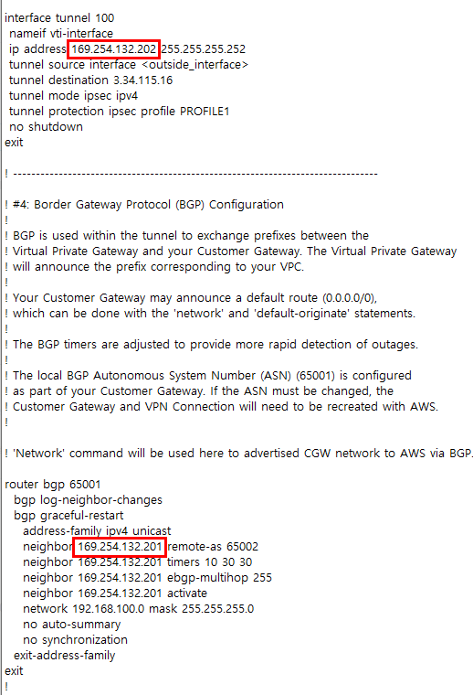

이번 테스트 구성에서 확인한 BGP 주소는 다음과 같다. 주소는 AWS가 VPN 연결을 만들 때 할당하므로, 다른 환경에서는 반드시 새로 내려받은 구성 파일의 값을 사용해야 한다.

| AWS VPN 연결 | AWS 터널 | AWS BGP 주소 | Google Cloud BGP 주소 |
| --- | --- | --- | --- |
| `vpn-to-gcp` | 터널 1 | `169.254.132.201` | `169.254.132.202` |
| `vpn-to-gcp` | 터널 2 | `169.254.34.249` | `169.254.34.250` |
| `vpn-to-gcp-2` | 터널 1 | `169.254.201.9` | `169.254.201.10` |
| `vpn-to-gcp-2` | 터널 2 | `169.254.114.65` | `169.254.114.66` |

`169.254.0.0/16` 대역은 터널 내부 BGP 통신에 사용되는 링크 로컬 주소다. 위 표의 주소를 그대로 재사용하지 말고, 각자 생성한 AWS VPN 구성 파일에서 확인한다.

## 9. Google Cloud 외부 Peer VPN Gateway 생성

Google Cloud VPN 터널 목록에서 VPN 터널 생성을 시작한다.

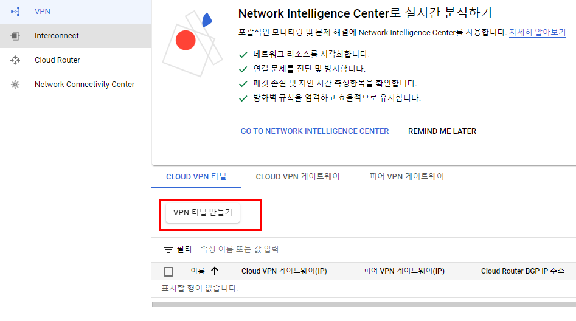

먼저 생성한 HA VPN Gateway를 선택한다.

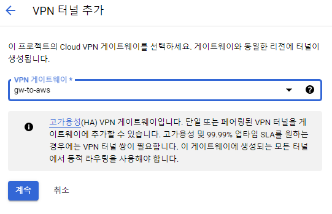

피어 VPN Gateway에서 외부에 있는 피어 게이트웨이를 선택한다.

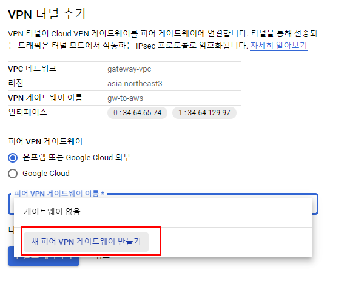

AWS VPN 연결 두 개에서 생성된 네 개의 터널 외부 IP를 하나의 외부 Peer VPN Gateway에 네 개의 인터페이스로 등록한다.

```text
Peer interface 0: AWS VPN 연결 1의 터널 1 외부 IP
Peer interface 1: AWS VPN 연결 1의 터널 2 외부 IP
Peer interface 2: AWS VPN 연결 2의 터널 1 외부 IP
Peer interface 3: AWS VPN 연결 2의 터널 2 외부 IP
```

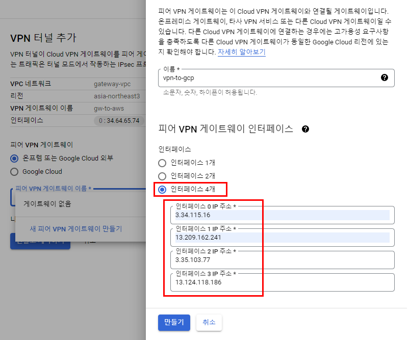

외부 Peer VPN Gateway를 만든 뒤 HA VPN Gateway와 연결할 터널 수로 `VPN 터널 4개 만들기`를 선택한다.

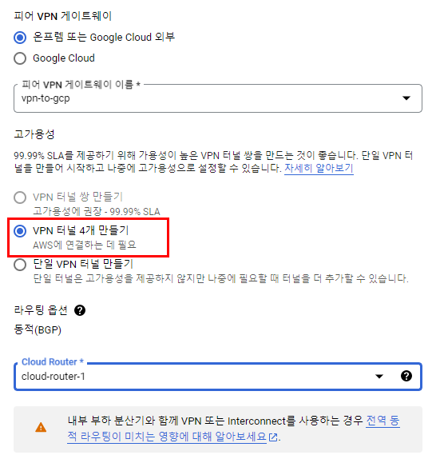

Google Cloud 공식 구성은 다음과 같이 두 HA VPN 인터페이스와 AWS 외부 인터페이스를 연결한다.

| Google Cloud HA VPN 인터페이스 | AWS Peer 인터페이스 |
| --- | --- |
| 인터페이스 0 | 0, 1 |
| 인터페이스 1 | 2, 3 |

AWS 외부 IP와 인터페이스 번호를 잘못 연결하면 터널 상태가 올라오지 않을 수 있다. 외부 IP를 만든 뒤에는 주소를 변경할 수 없으므로, AWS에서 내려받은 구성 파일과 대조한 후 입력한다.

## 10. 네 개의 VPN 터널 구성

네 개의 터널에 각각 다음 정보를 입력한다.

- Google Cloud HA VPN 인터페이스
- AWS Peer VPN Gateway 인터페이스
- IKE 버전 `IKEv2`
- AWS와 동일한 사전 공유 키

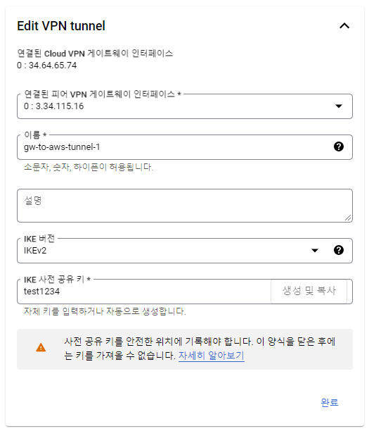

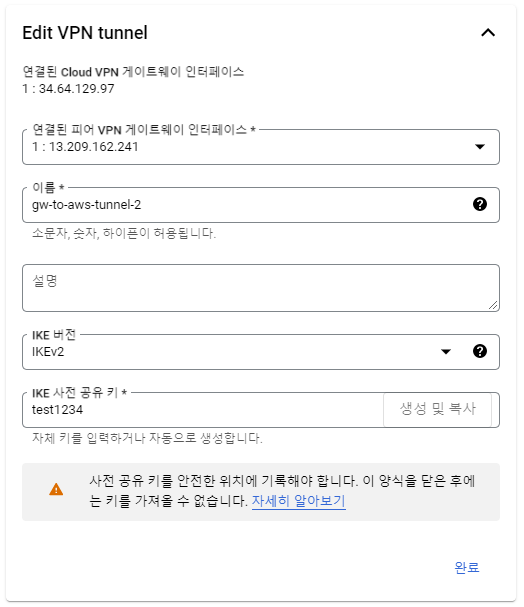

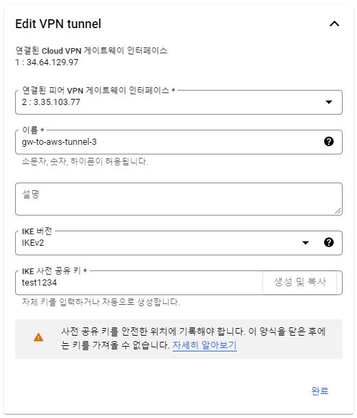

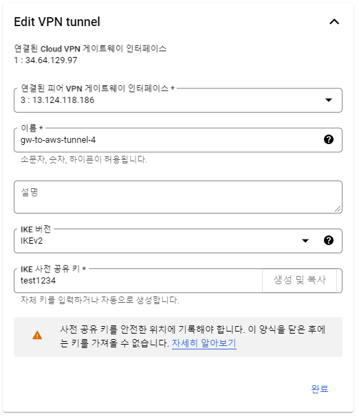

캡처는 삭제된 테스트 환경에서 임시로 사용한 키를 보여준다. 실제 운영 환경에서는 화면에 보이는 값을 재사용하지 않고, AWS에서 생성하거나 별도로 관리하는 강한 키를 터널별로 입력한다.

## 11. Cloud Router에 BGP 세션 구성

VPN 터널을 만든 뒤 Cloud Router에서 BGP 세션을 구성한다.

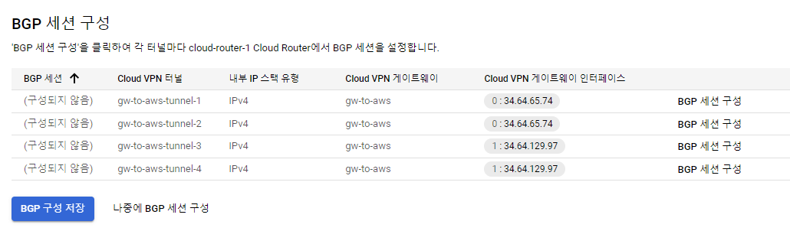

각 터널마다 BGP 세션을 하나씩 만들고 다음 값을 입력한다.

- 피어 ASN: AWS VGW의 ASN `65002`
- Cloud Router BGP IPv4 주소: Google Cloud 쪽 BGP 주소
- BGP 피어 IPv4 주소: AWS 쪽 BGP 주소
- 터널: 해당 VPN 터널

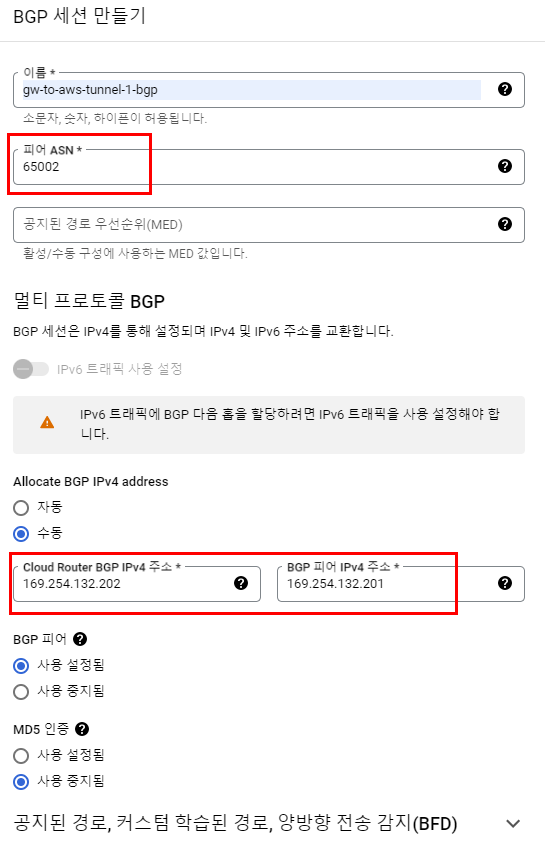

앞에서 확인한 BGP 주소 표의 Google Cloud 주소와 AWS 주소를 서로 반대 방향으로 입력하지 않도록 주의한다. Google Cloud 주소는 로컬 주소이고, AWS 주소는 피어 주소다.

BGP 세션 구성을 저장하면 네 개의 터널과 BGP 세션 상태를 요약 화면에서 확인할 수 있다.

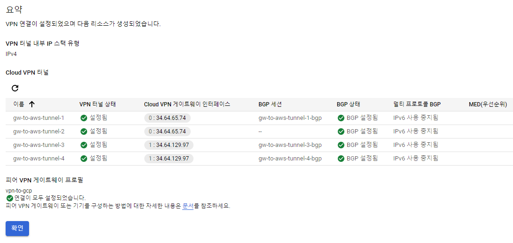

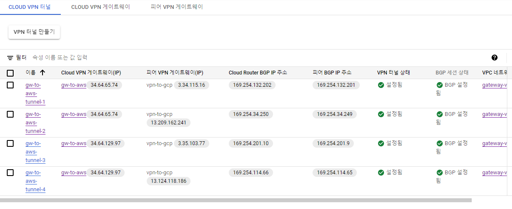

## 12. AWS 라우팅 전파 활성화

마지막으로 AWS VPC에서 실제 워크로드가 사용하는 라우팅 테이블을 확인한다. 해당 라우팅 테이블에서 VGW의 라우팅 전파를 활성화하면 BGP를 통해 학습한 원격 네트워크 경로가 자동으로 반영된다.

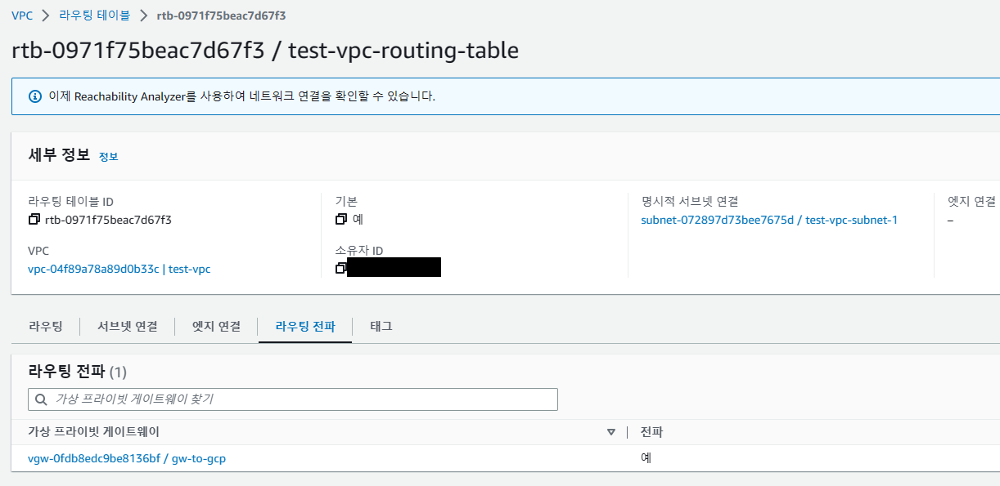

AWS 라우팅 전파를 활성화하는 것만으로 방화벽이 열리는 것은 아니다. 다음 항목도 함께 확인해야 한다.

- AWS 라우팅 테이블에 Google Cloud VPC CIDR이 전파됐는지 확인
- Google Cloud VPC의 유효 경로에 AWS VPC CIDR이 표시되는지 확인
- Google Cloud 방화벽에서 AWS VPC 대역의 필요한 인바운드 트래픽 허용
- AWS Security Group과 Network ACL에서 Google Cloud VPC 대역 허용
- 운영체제 방화벽이 ICMP 또는 애플리케이션 포트를 차단하지 않는지 확인

AWS 콘솔에서 VGW 라우팅 전파를 활성화하는 방법은 [AWS VPC 라우팅 테이블 문서](https://docs.aws.amazon.com/vpc/latest/userguide/WorkWithRouteTables.html)에서 확인할 수 있다.

## 13. 연결 상태 확인

AWS VPN 연결 상세 화면에서 두 VPN 연결과 네 개 터널의 상태가 `Up` 또는 `Available`인지 확인한다.

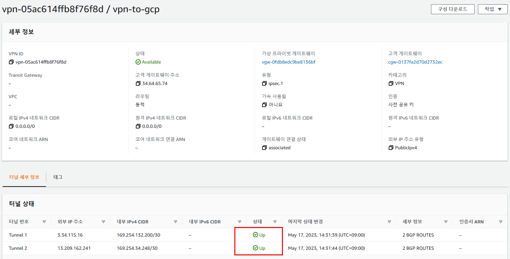

Google Cloud에서도 네 개의 VPN 터널과 BGP 세션이 정상 상태인지 확인한다.

상태가 정상으로 보이더라도 실제 사설 IP 통신을 테스트해야 한다. 양쪽 VPC에 테스트 VM이 있다면 다음과 같이 테스트할 수 있다.

```bash
# Google Cloud VM에서 AWS EC2의 사설 IP로 테스트
ping -c 4 <AWS_EC2_PRIVATE_IP>

# AWS EC2에서 Google Cloud VM의 사설 IP로 테스트
ping -c 4 <GCP_VM_PRIVATE_IP>
```

ICMP를 허용하지 않는 환경이라면 실제 서비스 포트를 확인한다.

```bash
nc -vz <REMOTE_PRIVATE_IP> <PORT>
```

Google Cloud 공식 문서도 VPN Gateway의 외부 IP를 ping하는 것은 터널을 통한 통신 테스트가 아니며, 양쪽 네트워크의 실제 시스템 사설 IP를 이용해 확인해야 한다고 안내한다. [Cloud VPN 문제 해결 문서](https://docs.cloud.google.com/network-connectivity/docs/vpn/support/troubleshooting)

고가용성을 확인하려면 네 개 중 하나의 터널을 일시적으로 중단한 뒤 통신이 계속되는지 확인한다. 테스트가 끝난 후에는 터널을 원래 상태로 복구한다.

## 14. 문제가 발생할 때 확인할 순서

### VPN 터널이 올라오지 않는 경우

- AWS 외부 IP와 Google Cloud Peer 인터페이스 매핑이 정확한지 확인한다.
- 양쪽 IKE 버전이 모두 IKEv2인지 확인한다.
- 양쪽 PSK가 일치하는지 확인한다.
- AWS와 Google Cloud의 Phase 1·Phase 2 암호화 설정이 호환되는지 확인한다.
- UDP 500, UDP 4500, IPsec 관련 트래픽이 차단되지 않는지 확인한다.

### 터널은 올라왔지만 BGP가 Established가 되지 않는 경우

- Google Cloud ASN과 AWS ASN이 서로 올바르게 입력됐는지 확인한다.
- 로컬 BGP 주소와 피어 BGP 주소를 반대로 입력하지 않았는지 확인한다.
- 각 주소가 해당 터널의 `/30` 대역에 포함되는지 확인한다.
- BGP 통신에 사용되는 TCP 179가 필요한 경로에서 허용되는지 확인한다.

### BGP는 정상인데 실제 통신이 되지 않는 경우

- AWS 라우팅 테이블에서 VGW 라우팅 전파가 활성화됐는지 확인한다.
- Google Cloud Cloud Router가 반대편 네트워크 CIDR을 광고하고 있는지 확인한다.
- Google Cloud 방화벽과 AWS Security Group·NACL을 확인한다.
- 테스트 대상 VM의 운영체제 방화벽과 애플리케이션 포트를 확인한다.
- 양쪽 네트워크의 CIDR이 겹치지 않는지 다시 확인한다.

Google Cloud는 HA VPN에서 피어 라우터가 광고한 목적지로만 트래픽을 전달하므로, 터널 상태만 확인하지 말고 BGP 학습 경로와 광고 경로도 함께 확인해야 한다. [Cloud VPN 방화벽 구성 문서](https://docs.cloud.google.com/network-connectivity/docs/vpn/how-to/configuring-firewall-rules)

## 15. 테스트 리소스 정리

VPN 연결은 사용 시간과 데이터 전송량에 따라 비용이 발생할 수 있다. 테스트가 끝났다면 다음 리소스를 확인하고 삭제한다.

- AWS Site-to-Site VPN 연결 2개
- AWS Customer Gateway 2개
- AWS Virtual Private Gateway
- Google Cloud VPN 터널 4개
- Google Cloud 외부 Peer VPN Gateway
- Google Cloud HA VPN Gateway
- Cloud Router
- 테스트용 VPC, 서브넷, VM

리소스를 삭제하기 전에 다른 서비스가 해당 네트워크를 사용하고 있지 않은지 확인한다. 운영 환경의 리소스를 테스트 리소스와 혼동하지 않도록 이름과 라벨을 분리하는 것도 중요하다.

## 마무리

Google Cloud HA VPN과 AWS Virtual Private Gateway를 연결하려면 한쪽의 VPN Gateway만 만드는 것으로 끝나지 않는다. 양쪽에 Customer Gateway와 VPN 연결을 구성하고, AWS에서 생성된 네 개의 외부 터널 IP와 내부 BGP 주소를 Google Cloud에 정확히 반영해야 한다.

이번 구성에서는 다음 순서로 연결을 완성했다.

```text
Cloud Router 생성
  ↓
Google Cloud HA VPN Gateway 생성
  ↓
AWS Virtual Private Gateway와 VPC 연결
  ↓
AWS Customer Gateway 2개 생성
  ↓
AWS Site-to-Site VPN 연결 2개 생성
  ↓
AWS 구성 파일에서 외부 IP와 BGP 주소 확인
  ↓
Google Cloud 외부 Peer VPN Gateway 생성
  ↓
VPN 터널 4개 생성
  ↓
Cloud Router BGP 세션 4개 구성
  ↓
AWS 라우팅 전파 활성화
  ↓
사설 IP 통신과 장애 전환 확인
```

실제 운영 환경에서는 테스트 캡처의 IP, 리소스 ID, 사전 공유 키를 재사용하지 않고, 각 환경에서 새로 생성한 값과 강한 인증 정보를 사용해야 한다.
