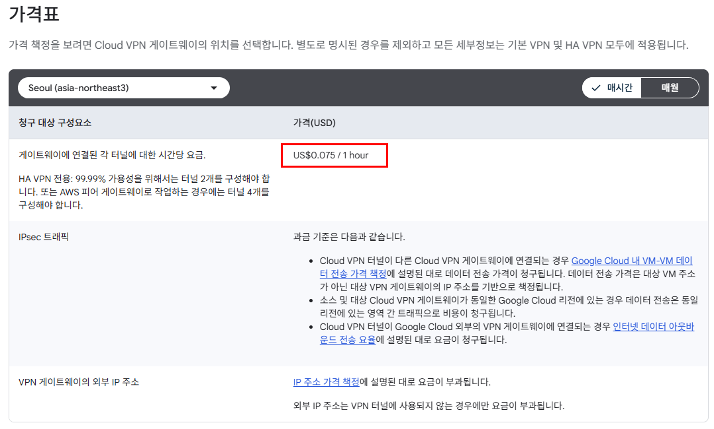
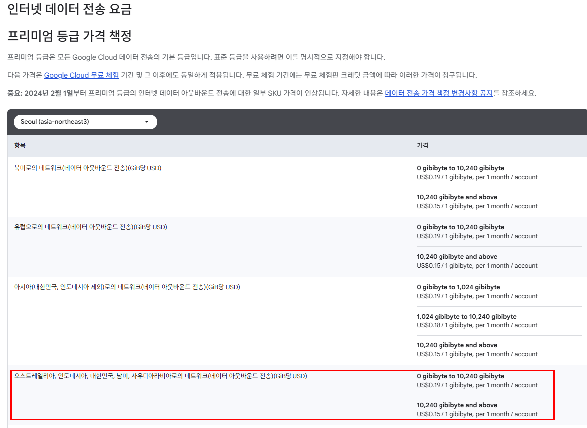

+++
title = 'GCP Cloud VPN 종류별 특징과 비용, 선택 가이드'
date = '2026-09-23T00:00:00+09:00'
draft = false
slug = 'gcp-cloud-vpn-selection-guide'
description = 'GCP Cloud VPN과 Cloud Interconnect의 특징과 비용을 같은 시나리오로 비교하고, HA VPN과 Classic VPN을 선택하는 기준을 정리한다.'
tags = ['gcp', 'google-cloud', 'cloud-vpn', 'ha-vpn', 'classic-vpn', 'cloud-router', 'interconnect', 'networking']
categories = ['IT개발']
showTableOfContents = true
+++

Google Cloud에서 온프레미스 데이터센터나 다른 클라우드와 사설 네트워크를 연결하는 방법은 크게 두 가지다.

- 공개 인터넷을 경유하는 IPsec 기반 **Cloud VPN**
- 전용 회선 또는 통신사를 이용하는 **Cloud Interconnect**

Cloud VPN은 빠르고 저렴하게 시작할 수 있고, Cloud Interconnect는 높은 처리량과 예측 가능한 네트워크 품질에 적합하다. 이 글에서는 두 방식을 같은 조건으로 비교해 어떤 상황에서 무엇을 선택할지 정리한다.

가격은 **2026년 9월 23일 Google Cloud 공식 가격 문서를 확인한 기준**이다. 가격은 변경될 수 있으므로 실제 구성 전에는 [Network Connectivity 가격표](https://cloud.google.com/network-connectivity/pricing#interconnect-pricing)와 [VPC 네트워크 가격표](https://cloud.google.com/vpc/network-pricing?hl=ko)를 다시 확인해야 한다.

## 1. 결론부터 보기

| 상황 | 추천 구성 |
| --- | --- |
| 테스트, 개발, 낮은 트래픽 | HA VPN |
| 신규 운영 환경에서 BGP와 이중화 필요 | HA VPN + Cloud Router |
| 콜로케이션 접근이 어렵거나 통신사 관리형 연결 필요 | Partner Interconnect |
| 대규모 트래픽과 직접 연결 필요 | Dedicated Interconnect |
| AWS와 전용 클라우드 연결 필요 | Cross-Cloud Interconnect 또는 Partner Cross-Cloud Interconnect |
| BGP를 지원하지 않는 오래된 장비 | Classic VPN 정적 라우팅을 임시 또는 호환성 용도로 검토 |

신규 운영 환경에서 동적 라우팅과 고가용성이 필요하다면 기본 선택은 **HA VPN + Cloud Router**다. Classic VPN은 현재 레거시 장비와의 호환성이 필요한 경우에만 제한적으로 검토하는 편이 좋다.

## 2. Cloud VPN 종류

Cloud VPN은 Google Cloud VPC와 외부 네트워크 사이에 IPsec 사이트 간 터널을 만드는 관리형 서비스다. 사용자 PC가 접속하는 SSL VPN이나 Client VPN 용도는 아니다.

### HA VPN

HA VPN은 BGP 기반의 고가용성 VPN이다.

- 동적 라우팅(BGP)만 지원
- 게이트웨이에 두 개의 인터페이스 제공
- 두 인터페이스에 터널을 구성하면 Google Cloud 쪽 99.99% SLA 조건 충족 가능
- active-active 또는 active-passive 라우팅 구성 가능
- IPv4와 IPv6 지원
- 외부 IP가 자동 할당되고 Classic VPN처럼 전달 규칙을 직접 만들 필요 없음

일반적인 온프레미스 연결은 다음처럼 구성한다.

```text
GCP HA VPN interface 0  <->  온프레미스 VPN gateway 0
GCP HA VPN interface 1  <->  온프레미스 VPN gateway 1
```

피어 장비가 외부 IP 하나만 제공해도 두 GCP 인터페이스에서 터널을 구성할 수 있다. 다만 피어 장비가 한 대뿐이면 해당 장비 장애까지 제거되는 것은 아니다. [HA VPN 토폴로지](https://docs.cloud.google.com/network-connectivity/docs/vpn/concepts/topologies)

AWS와 연결할 때는 AWS의 두 Site-to-Site VPN 연결에서 네 개의 터널을 구성하는 방식이 일반적이다. Google Cloud 공식 가격 문서도 AWS 피어 게이트웨이에서 99.99% 구성을 위해 네 개 터널을 안내한다.

### Classic VPN

Classic VPN은 정적 라우팅을 사용하는 이전 방식의 VPN이다.

- 정적 라우팅만 지원
- BGP 동적 라우팅 신규 구성 불가
- HA VPN보다 낮은 99.9% SLA
- 외부 IP와 전달 규칙을 직접 구성
- IPv6 미지원

Google Cloud는 2025년 8월 1일부터 Classic VPN의 신규 BGP 구성을 지원하지 않는다. 기존 BGP 터널은 계속 동작할 수 있지만 지원과 가용성 SLA가 적용되지 않는다. 따라서 BGP가 필요한 신규 환경에는 HA VPN을 사용해야 한다. [Classic VPN 지원 중단 안내](https://docs.cloud.google.com/network-connectivity/docs/vpn/deprecations/classic-vpn-deprecation)

## 3. Cloud Router는 무엇인가

Cloud Router는 VPN 종류가 아니라 BGP를 실행하는 관리형 라우터다. HA VPN과 함께 사용해 다음 경로를 동적으로 교환한다.

- GCP VPC 서브넷 경로를 피어 네트워크에 광고
- 피어 네트워크의 사설 경로를 GCP에서 학습
- 터널 장애 시 다른 터널로 경로 전환
- BGP 우선순위에 따른 active-active 또는 active-passive 구성

Cloud Router 자체는 무료이며, BGP 제어 트래픽에 일반적인 네트워크 비용이 적용될 수 있다. [Cloud Router 가격](https://cloud.google.com/network-connectivity/pricing)

## 4. 비용 비교 시나리오

다음 조건을 동일하게 적용해 비교한다. Cloud VPN은 GCP 리전뿐 아니라 외부 피어의 위치에 따라 데이터 전송 요금이 달라질 수 있으므로, 이 글에서는 **서울 리전의 VPC와 GCP 외부의 국내 온프레미스 IDC**를 연결하는 상황으로 고정한다.

### 가정

- GCP 리전: `asia-northeast3`(서울)
- 연결 대상: GCP 외부의 국내 온프레미스 IDC
- 기간: 1개월, 월 평균 `730시간`
- GCP VPC에서 외부 데이터센터로 나가는 데이터: 월 `2TiB` = `2,048GiB`
- VPN: HA VPN 터널 2개
- 네트워크 서비스 등급: `Premium Tier`(Cloud VPN gateway는 Standard Tier 미지원)
- Partner Interconnect: 10Gbps VLAN attachment 2개(99.9% 가용성 기준)
- Dedicated Interconnect: 10Gbps 회선 2개(99.9% 가용성 기준)
- 세금, 통신사 비용, 콜로케이션 비용, 장비 비용은 제외
- 환율 참고: `1달러 = 1,400원` 가정

아래 모든 시간당 비용은 **월 평균 730시간 기준**으로 계산한다. 실제 청구액은 해당 월의 실제 사용 시간과 적용 중인 할인에 따라 달라질 수 있다.

여기서 `asia-northeast3`은 Google Cloud 서울 리전이며, `asia-northeast3-a/b/c`는 해당 리전 안의 영역(zone)이다. 이 글에서 말하는 연결 대상은 Google Cloud 밖에 있는 국내 온프레미스·코로케이션 데이터센터다. AWS 서울 리전과 같은 다른 클라우드에 연결하는 경우에는 Cloud VPN 또는 Cross-Cloud/Partner Cross-Cloud Interconnect의 별도 가격표를 적용해야 하므로, 아래 Interconnect 금액을 그대로 적용하면 안 된다. GCP 내부 서울 리전의 VM이나 다른 VPC를 연결하는 경우에도 이 Cloud VPN 비용 시나리오를 그대로 적용하지 않는다.

월 2TiB를 730시간에 균등하게 나눈 평균 처리량은 약 6.7Mbps다. 이 글에서 Interconnect를 10Gbps로 통일한 것은 월간 평균 트래픽을 맞추기 위한 것이 아니라, 같은 회선 용량을 기준으로 Partner와 Dedicated의 비용을 비교하기 위해서다. 두 Interconnect 구성 모두 각 VLAN attachment 또는 회선을 10Gbps로 설정하고 이중화한다.

HA VPN은 10Gbps와 같은 고정 대역폭 상품이 아니다. 터널당 한도는 패킷 크기에 따라 약 1~3Gbps이며, 2개 터널을 구성해도 10Gbps 처리량이 보장되는 것은 아니다. 따라서 아래 표에서 HA VPN은 10Gbps 대체 상품이 아니라, 같은 데이터 전송량을 기준으로 한 저비용 기준선으로 표시한다.

이 시나리오는 Google Cloud에서 실제로 제공하는 가격 예시를 바탕으로 단순화한 것이다. 아래 2개 연결 구성은 99.9% 가용성 수준의 비교이며, 99.99% 운영 토폴로지는 별도로 설명한다. Interconnect는 실제로 파트너나 회선 사업자 비용이 추가되므로 아래 표는 Google Cloud 청구액 중심의 비교다.

### 월 비용 비교

| 구성 | 대역폭 또는 처리량 기준 | 고정 비용 | 데이터 전송 비용 | Google Cloud 예상 합계 | 원화 참고 |
| --- | --- | ---: | ---: | ---: | ---: |
| HA VPN 2개 터널 | 고정 대역폭 없음, 터널당 약 1~3Gbps | `$109.50` | `$389.12` | **`$498.62`** | 약 698,068원 |
| Partner Interconnect 10Gbps 2개 | 각 VLAN attachment 10Gbps, 이중화 | `$3,445.60` | `$86.02` | **`$3,531.62`** | 약 4,944,262원 |
| Dedicated Interconnect 10Gbps 2개 | 각 회선 10Gbps, 이중화 | `$3,544.88` | `$86.02` | **`$3,630.90`** | 약 5,083,254원 |

Partner와 Dedicated의 Google Cloud 고정 비용 차이는 약 `$99.28`이다. Partner는 10Gbps VLAN attachment 비용에 통신사 서비스 비용이 포함되지 않고, Dedicated는 Google Cloud 포트 비용 외에 콜로케이션, 물리 회선, cross-connect, 라우터 운영 비용이 포함되지 않는다. 따라서 실제 구매 비용은 Google Cloud 청구액만으로 판단할 수 없다. [Partner Interconnect 공식 안내](https://docs.cloud.google.com/network-connectivity/docs/interconnect/concepts/partner-overview)도 서비스 제공업체 비용이 별도라고 설명한다.

또한 99.99% 가용성이 필요한 운영 환경에서는 두 연결만으로 충분하지 않을 수 있다. 공식 권장 토폴로지는 Partner Interconnect의 경우 최소 4개 VLAN attachment를 두 리전에 나누고, Dedicated Interconnect의 경우 최소 4개 연결을 두 개의 metro에 나누는 구성이다. 이 경우 Google Cloud 고정 비용만 단순 계산해도 Partner는 약 `$6,891.20`, Dedicated는 약 `$7,089.76`로 증가하며, 두 방식 모두 외부 회선 비용은 별도다. 두 리전으로 확장할 때 발생할 수 있는 추가 네트워크 비용과 애플리케이션 변경은 이 계산에 포함하지 않았다. [Partner Interconnect 99.99% 구성](https://docs.cloud.google.com/network-connectivity/docs/interconnect/tutorials/partner-creating-9999-availability)과 [Dedicated Interconnect 가용성 안내](https://docs.cloud.google.com/network-connectivity/docs/interconnect/concepts/dedicated-overview)

서울 리전의 Cloud VPN 가격표에서 게이트웨이 위치를 `Seoul (asia-northeast3)`로 선택하면 터널 단가를 확인할 수 있다.



[Cloud VPN gateway는 Standard Tier를 지원하지 않으므로](https://docs.cloud.google.com/network-tiers/docs/overview), HA VPN 데이터 전송 비용은 Premium Tier 기준으로 계산한다. 서울에서 국내 외부 IDC로 전송하는 경우 가격표의 대한민국 대상 구간은 `0~10TiB`까지 `$0.19/GiB`, `10TiB` 초과분은 `$0.15/GiB`다.



#### HA VPN 계산

서울(`asia-northeast3`) 게이트웨이의 터널 단가 `$0.075/시간`을 적용한다. [Cloud VPN 가격표](https://cloud.google.com/vpn/pricing?hl=ko)는 외부 VPN 게이트웨이로의 데이터 전송에 인터넷 데이터 아웃바운드 요율이 적용된다고 안내한다. 서울 출발·국내 목적지의 구체적인 요율은 [VPC 네트워크 가격표](https://cloud.google.com/vpc/network-pricing?hl=ko)에서 출발 리전을 서울로 선택해 확인한다.

```text
터널 비용: 2 x $0.075 x 730시간 = $109.50
데이터 전송: 2,048GiB x $0.19 = $389.12
합계: $498.62
```

HA VPN은 고정 비용이 작고, 별도 회선이나 콜로케이션이 필요하지 않다. 따라서 트래픽이 적거나 빠른 구축이 중요한 환경에 유리하다.

#### Partner Interconnect 계산

공식 가격표에서 10Gbps Partner VLAN attachment 하나의 단가는 시간당 `$2.36`다. 이중화를 위해 2개를 사용한다. 서울과 국내 외부 IDC가 속한 아시아 연결의 Interconnect 데이터 전송 단가 `$0.042/GiB`를 적용한다.

```text
VLAN attachment: 2 x $2.36 x 730시간 = $3,445.60
데이터 전송: 2,048GiB x $0.042 = $86.016
합계: $3,531.616
```

Partner Interconnect는 VLAN attachment만 생성하면 완성되는 연결이 아니다. GCP에서는 VLAN attachment와 Cloud Router를 구성하고, 별도로 지원 서비스 제공업체를 통해 데이터센터와 통신사 네트워크를 연결해야 한다. 서비스 제공업체는 pairing key를 사용해 VLAN attachment를 연결하며, Layer 2 방식에서는 온프레미스 라우터와 BGP를 직접 구성하고 Layer 3 방식에서는 서비스 제공업체가 일부 BGP 구성을 담당한다. [Partner Interconnect 구성 안내](https://docs.cloud.google.com/network-connectivity/docs/interconnect/concepts/partner-overview)

VLAN 용량을 낮추면 시간당 attachment 비용은 줄어든다. 하지만 GiB당 데이터 전송 단가는 용량과 무관하고, 통신사 서비스 비용도 별도로 발생한다. 다음은 730시간 기준으로 GCP VLAN attachment 비용만 비교한 예시다.

| 이중화 구성 | 월 GCP attachment 비용 |
| --- | ---: |
| 50Mbps 2개 | 약 `$79.09` |
| 100Mbps 2개 | `$91.25` |
| 1Gbps 2개 | 약 `$405.59` |
| 10Gbps 2개 | `$3,445.60` |

따라서 평균 트래픽이 낮더라도 순간 피크를 수용하고, 한 경로가 중단된 뒤 남은 attachment 하나로 필요한 트래픽을 처리할 수 있도록 용량을 정해야 한다. 이 글의 월 2TiB는 평균 약 6.7Mbps이지만, 50Mbps 2개가 모든 운영 환경에 충분하다는 뜻은 아니다.

### Partner 1Gbps와 Dedicated 10Gbps 비교

Partner Interconnect는 VLAN attachment 용량을 1Gbps로 선택할 수 있다. Dedicated Interconnect는 10Gbps 또는 100Gbps 회선으로 연결할 수 있으며, 이 글의 비교에서는 10Gbps 회선 2개를 기준으로 한다. 월 평균 트래픽이 약 6.7Mbps이고 순간 트래픽도 1Gbps를 넘지 않는다면, Partner는 각 attachment를 1Gbps로 낮춰 Dedicated 10Gbps보다 작은 비용으로 구성할 수 있다. 아래는 두 방식 모두 2개 연결로 이중화하고, 앞의 시나리오와 같은 월 2TiB를 전송한다고 가정한 계산이다. Partner Interconnect의 1Gbps attachment 단가는 시간당 `$0.2778`이다.

| 구성 | GCP 고정 비용 | 데이터 전송 비용 | Google Cloud 예상 합계 | 원화 참고 |
| --- | ---: | ---: | ---: | ---: |
| Partner Interconnect 1Gbps 2개 | `$405.59` | `$86.02` | **`$491.61`** | 약 688,254원 |
| Dedicated Interconnect 10Gbps 2개 | `$3,544.88` | `$86.02` | **`$3,630.90`** | 약 5,083,254원 |

이 조건에서는 Partner 1Gbps 2개의 Google Cloud 비용이 Dedicated 10Gbps 2개보다 약 `$3,139` 낮다. 단, 한 경로가 장애를 일으키면 남은 attachment 하나로 처리해야 하므로 이 예시는 장애 시 최대 1Gbps까지 처리하면 되는 환경에 적합하다. 또한 Partner 서비스 제공업체 비용은 별도이며, VLAN 용량을 1Gbps로 낮춰도 통신사 비용이 같은 비율로 줄어든다는 보장은 없다.

10Gbps 기준의 Google Cloud 청구액은 Partner Interconnect가 Dedicated Interconnect보다 약 `$99.28` 낮을 뿐이다. 이 차이는 Partner Interconnect의 통신사 서비스 비용을 포함하지 않은 결과이므로, Partner를 가격 절감 목적으로 선택할 수 있다는 의미는 아니다. 실제 견적에서는 통신사 비용까지 포함하면 Partner가 Dedicated보다 비싸질 수도 있다.

#### Dedicated Interconnect 계산

공식 가격표의 10Gbps Cloud Interconnect connection 단가 `$2.328/시간`과 10Gbps VLAN attachment 단가 `$0.10/시간`을 적용한다. 이중화를 위해 각각 2개를 사용한다.

```text
회선: 2 x $2.328 x 730시간 = $3,398.88
VLAN attachment: 2 x $0.10 x 730시간 = $146.00
데이터 전송: 2,048GiB x $0.042 = $86.016
합계: $3,630.896
```

Dedicated Interconnect는 고정 비용이 크지만 높은 처리량과 직접 연결을 제공한다. 위 계산에는 콜로케이션, 회선 설치, 라우터, cross-connect 비용이 포함되지 않았으므로 실제 비용은 더 높아질 수 있다.

## 5. 비용표를 어떻게 해석할까

10Gbps 회선끼리 비교하면 Google Cloud 청구액은 거의 비슷하다. 그러나 이 표는 Partner의 통신사 비용과 Dedicated의 콜로케이션·물리 회선·cross-connect 비용을 제외한 값이다. HA VPN은 고정 10Gbps 상품이 아니므로 두 Interconnect와 같은 대역폭 비교 대상으로 해석하면 안 된다. 실제로는 다음 순서로 판단해야 한다.

### 10Gbps에서 Partner와 Dedicated 선택

10Gbps 환경에서 Partner Interconnect를 선택하는 이유는 Google Cloud 요금이 저렴해서가 아니다. Google의 콜로케이션 시설에 직접 장비를 설치하기 어렵거나, 통신사가 제공하는 관리형 연결과 기존 회선망을 이용해야 할 때 Partner가 유리하다. 반대로 콜로케이션과 라우터를 직접 운영할 수 있고 물리 회선을 직접 관리하려면 Dedicated를 우선 검토할 수 있다.

따라서 10Gbps 구성에서는 다음처럼 판단한다.

- 비용만 비교: 두 방식의 Google Cloud 청구액은 거의 비슷함
- Partner 선택: 통신사 관리, 위치 제약 완화, 자체 물리 회선 운영 부담 감소
- Dedicated 선택: 직접 연결, 경로와 장비에 대한 통제, 통신사 중간 구간 최소화

### 트래픽이 적은 경우

월 데이터가 적고 별도 회선 계약을 원하지 않는다면 HA VPN이 현실적이다. 터널 비용과 데이터 전송 비용만 고려하면 되며, 구성도 빠르다.

### 트래픽이 증가하는 경우

VPN은 외부로 나가는 데이터 전송 단가가 커질 수 있고, 터널당 처리량 한도도 고려해야 한다. 트래픽이 꾸준히 증가하면 Partner Interconnect의 VLAN 비용과 파트너 회선 비용을 합산해 다시 비교해야 한다.

### 매우 높은 처리량이 필요한 경우

Dedicated Interconnect는 10Gbps 이상의 회선과 직접 연결이 필요한 환경에 적합하다. 일반적인 소규모 서비스에서 비용을 줄이기 위한 선택지는 아니다.

### AWS와 연결하는 경우

낮은 트래픽과 빠른 구축이 목적이면 HA VPN을 먼저 검토한다. AWS와 GCP 사이에 대규모 트래픽이 지속되거나 인터넷 경로를 사용하지 않아야 한다면 Cross-Cloud Interconnect 또는 Partner Cross-Cloud Interconnect를 비교한다.

## 6. Cloud VPN과 Interconnect의 차이

| 항목 | HA VPN | Partner Interconnect | Dedicated Interconnect |
| --- | --- | --- | --- |
| 경로 | 인터넷 기반 IPsec | 서비스 제공업체 전용 연결 | Google과 직접 연결 |
| 시작 비용 | 낮음 | 중간 | 높음 |
| 구축 속도 | 빠름 | 파트너 일정 필요 | 회선과 시설 준비 필요 |
| 처리량 | 터널 PPS와 패킷 크기에 영향 | 선택한 VLAN 용량 | 10Gbps 이상 고정 회선 |
| 지연 시간 | 인터넷 경로에 따라 변동 | 비교적 예측 가능 | 가장 예측 가능 |
| 암호화 | IPsec 기본 제공 | 필요하면 HA VPN over Interconnect | 필요하면 HA VPN over Interconnect |
| 적합한 환경 | 테스트, 일반 운영, 낮은 트래픽 | 콜로케이션이 어렵거나 파트너 회선을 활용하는 환경 | 직접 회선·콜로케이션 운영이 가능한 대규모 또는 핵심 연결 |

Partner Interconnect와 Dedicated Interconnect 자체는 전용 연결 경로를 제공하지만 IPsec 암호화를 기본 제공하는 VPN은 아니다. 암호화가 필요하면 HA VPN over Interconnect를 추가할 수 있으며, 이 경우 Interconnect와 VLAN attachment, HA VPN 터널 비용을 함께 계산해야 한다. 대신 해당 구성에서는 Cloud VPN 데이터 전송 비용이 아니라 Cloud Interconnect 데이터 전송 비용이 적용된다. [HA VPN over Cloud Interconnect](https://docs.cloud.google.com/network-connectivity/docs/interconnect/concepts/ha-vpn-interconnect)

Cloud VPN 터널의 한도는 평균 패킷 크기에 따라 달라진다. 현재 공식 제한은 터널당 인바운드와 아웃바운드 합계 `250,000 packets per second`이며, 대략 `1~3Gbps`에 해당할 수 있다. 고정된 3Gbps로 이해하면 안 된다. [Cloud VPN 할당량과 제한](https://docs.cloud.google.com/network-connectivity/quotas)

## 7. 선택 체크리스트

다음 질문에 답하면 선택이 쉬워진다.

- 피어 장비가 BGP를 지원하는가?
- VPN 터널 하나가 중단되어도 서비스가 계속되어야 하는가?
- 월간 외부 송신량이 얼마나 되는가?
- 인터넷 기반 IPsec으로 충분한가?
- 통신사 회선 계약과 콜로케이션을 운영할 수 있는가?
- 1Gbps 이상의 처리량이나 일정한 지연 시간이 필요한가?
- AWS와 연결할 때 전용 클라우드 간 연결이 필요한가?

구성 방식은 다음처럼 정리할 수 있다.

```text
BGP와 고가용성이 필요한가?
  ├─ 예 -> HA VPN + Cloud Router
  └─ 아니오 -> 기존 장비 호환성이 필요한 경우에만 Classic VPN 검토

높은 처리량 또는 인터넷 경로를 피해야 하는가?
  ├─ 아니오 -> HA VPN
  └─ 예 -> 연결 대상과 운영 방식 확인
       ├─ 다른 클라우드 -> Cross-Cloud 또는 Partner Cross-Cloud Interconnect
       ├─ 직접 장비·물리 회선 운영 가능 -> Dedicated Interconnect
       └─ 통신사 관리형 연결 필요 -> Partner Interconnect
```

## 마무리

Cloud VPN은 낮은 초기 비용과 빠른 구축이 장점이고, Cloud Interconnect는 높은 처리량과 안정적인 연결 품질이 장점이다.

신규 운영 환경에서는 HA VPN과 Cloud Router를 기본으로 검토한다. Classic VPN은 BGP를 지원하지 않는 레거시 장비와의 연결처럼 제한적인 상황에서만 사용한다.

비용만 보면 같은 트래픽에서도 결과가 달라질 수 있다. Cloud VPN은 고정 비용이 낮지만 데이터 전송 비용과 터널당 처리량 한도를 함께 봐야 하고, Interconnect는 데이터 전송 단가가 낮아질 수 있지만 회선과 연결의 고정 비용이 발생한다. 10Gbps급 회선이 필요하면 Partner와 Dedicated를 같은 용량으로 비교하되, Partner를 자동으로 저렴한 선택지로 보면 안 된다. 콜로케이션과 물리 회선 운영이 가능하면 Dedicated를, 통신사 관리형 연결이 필요하면 Partner를 검토하는 방식이 적절하다.

이 글의 비교표는 서울 리전의 VPC와 GCP 외부 국내 IDC 사이에 월 2TiB를 전송하는 예시다. 실제 운영에서는 게이트웨이 리전, 피어 위치, 터널 수, 파트너 비용, 회선 구성, 세금을 반영해 다시 계산해야 한다. 특히 Cloud VPN은 목적지가 국내인지 해외인지에 따라 인터넷 아웃바운드 단가가 달라진다.
