+++
title = 'GCP Compute Engine Persistent Disk를 LVM으로 구성하고 용량 확장하기'
date = '2026-09-21T00:00:00+09:00'
draft = false
slug = 'gcp-compute-engine-persistent-disk-lvm-resize'
description = 'GCP Compute Engine에 연결한 Persistent Disk로 LVM을 구성하고, 디스크 확장 후 PV·LV·XFS 파일시스템까지 용량을 늘리는 과정을 정리한다.'
tags = ['gcp', 'compute-engine', 'persistent-disk', 'lvm', 'linux']
categories = ['IT개발']
showTableOfContents = true
+++

Google Cloud의 Compute Engine VM에 여러 개의 Persistent Disk를 연결하고 LVM으로 구성한 뒤, 기존 디스크의 용량을 늘려 LVM과 XFS 파일시스템에 반영하는 과정을 정리한다.

일반적인 클라우드 환경에서는 디스크 하나를 파일시스템으로 포맷해 사용하는 것만으로 충분한 경우가 많다. 하지만 기존 LVM 기반 서버를 클라우드로 이전했거나 여러 디스크를 하나의 저장 공간으로 관리해야 한다면, 클라우드 콘솔에서 디스크 크기를 늘린 뒤에도 PV, LV, 파일시스템을 차례로 확장해야 한다.

이 글은 Linux 디스크와 파일시스템의 기본 개념을 알고 있으며, Compute Engine VM 생성과 터미널 접속 경험이 있는 사용자를 대상으로 한다.

## 1. 실습 환경과 구성

이번 실습 환경은 다음과 같다.

| 항목 | 설정 |
| --- | --- |
| 클라우드 | Google Cloud Compute Engine |
| 운영체제 | Rocky Linux 8 |
| VM 이름 | `linux-lvm` |
| 부팅 디스크 | 20GB |
| 추가 디스크 | 10GB, 10GB, 50GB |
| 볼륨 그룹 | `vg1` |
| 논리 볼륨 | `lv1` |
| 최초 LV 크기 | 30GB |
| 파일시스템 | XFS |
| 마운트 경로 | `/mnt` |
| 확장 대상 | 세 번째 추가 디스크 50GB → 100GB |

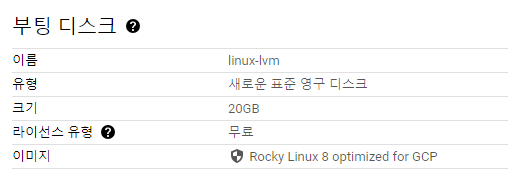

전체 작업 흐름은 다음과 같다.

```text
Persistent Disk
      ↓
PV(Physical Volume)
      ↓
VG(Volume Group)
      ↓
LV(Logical Volume)
      ↓
XFS 파일시스템
      ↓
마운트 경로
```

용량을 확장할 때는 반대 방향으로 기반 스토리지부터 차례대로 넓힌다.

```text
GCP 디스크 확장 → PV 확장 → LV 확장 → XFS 확장 → 결과 확인
```

## 2. 작업 전 주의사항

`pvcreate`, `vgcreate`, `mkfs.xfs`는 디스크 구조를 새로 만드는 명령이다. 사용 중인 디스크를 잘못 지정하면 기존 데이터를 잃을 수 있으므로, 명령을 실행하기 전에 대상 디스크와 백업 상태를 반드시 확인한다.

> **주의**
>
> 이 글의 `/dev/sdb`, `/dev/sdc`, `/dev/sdd`는 실습 VM에서 확인된 장치명이다. 다른 VM에서는 장치명이 다를 수 있으므로 그대로 입력하면 안 된다.

GCP Linux VM의 `/dev/sdX` 또는 `/dev/nvmeXnY` 장치명은 재부팅이나 디스크 재연결 후 달라질 수 있다. 운영 환경에서는 다음 명령으로 영구 장치명을 확인하고 `/dev/disk/by-id/google-*` 경로를 사용하는 것이 안전하다.

```bash
ls -l /dev/disk/by-id/google-*
```

Google Cloud에서도 Linux VM에서 [영구 장치 이름 사용](https://docs.cloud.google.com/compute/docs/disks/set-persistent-device-name-in-linux-vm)을 권장한다.

Persistent Disk는 크기를 늘릴 수 있지만 직접 축소할 수는 없다. 파일시스템이나 파티션을 변경하기 전에는 스냅샷 또는 별도 백업을 만드는 것이 좋다. 자세한 제한은 [Persistent Disk 크기 변경 문서](https://docs.cloud.google.com/compute/docs/disks/resize-persistent-disk)에서 확인할 수 있다.

## 3. Compute Engine에 추가 디스크 연결

Compute Engine VM 생성 화면에서 Rocky Linux 8 부팅 디스크를 선택하고, 고급 옵션의 디스크 항목에 추가 디스크 3개를 구성했다.

```text
linux-lvm-disk1: 10GB
linux-lvm-disk2: 10GB
linux-lvm-disk3: 50GB
```

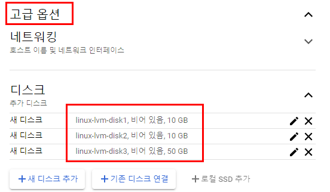

VM을 생성한 뒤 SSH로 접속하고 관리자 권한을 얻는다.

```bash
sudo -i
```

`lsblk`로 부팅 디스크와 추가 디스크를 구분한다.

```bash
lsblk
```

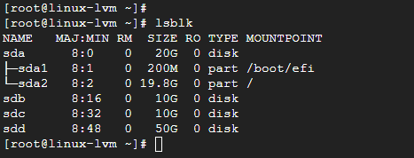

실습 환경에서는 추가 디스크가 `/dev/sdb`, `/dev/sdc`, `/dev/sdd`로 표시됐다. `fdisk -l`로 각 디스크의 전체 경로와 크기를 한 번 더 확인한다.

```bash
fdisk -l
```

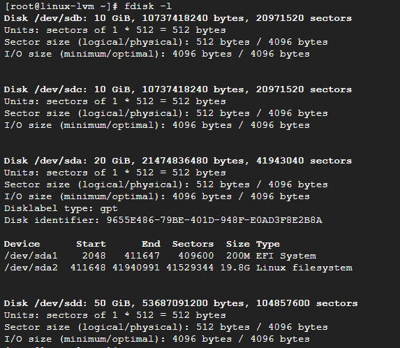

## 4. LVM 패키지 설치

Rocky Linux에서 LVM 명령을 사용하려면 `lvm2` 패키지가 필요하다.

```bash
dnf install -y lvm2
```

Rocky Linux 8에서는 `yum install lvm2 -y`를 사용해도 동일하게 설치할 수 있다. 실습 캡처에서는 `yum`을 사용했다.

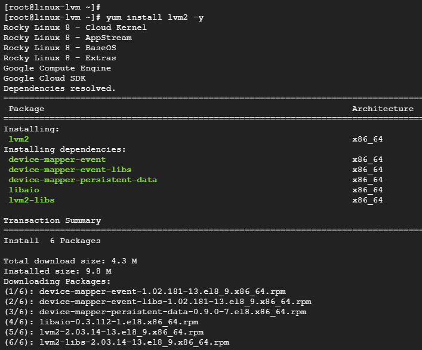

## 5. PV 구성

PV(Physical Volume)는 LVM이 사용할 수 있도록 초기화한 물리 디스크 또는 파티션이다. 이 실습에서는 파티션을 별도로 만들지 않고 추가 디스크 전체를 PV로 사용한다.

대상 디스크가 비어 있고 장치명이 정확한지 마지막으로 확인한 뒤 PV를 생성한다.

```bash
pvcreate /dev/sdb /dev/sdc /dev/sdd
```

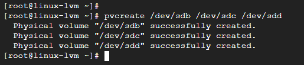

다음 명령으로 생성된 PV와 크기를 확인한다.

```bash
pvdisplay
pvs
pvscan
```

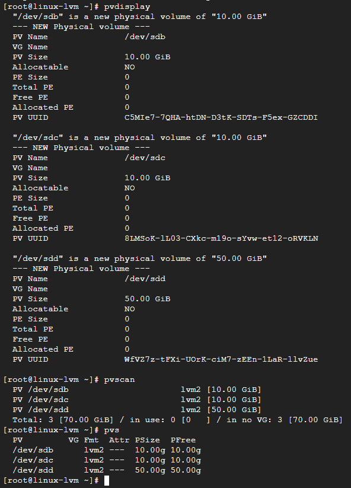

10GB, 10GB, 50GB 디스크가 각각 PV로 생성됐고, 아직 VG에는 포함되지 않은 상태다.

## 6. VG 구성

VG(Volume Group)는 여러 PV를 하나의 저장 공간 풀로 묶는다. 세 개의 PV로 `vg1`을 생성한다.

```bash
vgcreate vg1 /dev/sdb /dev/sdc /dev/sdd
```

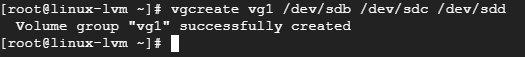

이미 존재하는 VG에 새 PV를 추가할 때는 `vgextend`를 사용한다.

```bash
vgextend vg1 /dev/sdd
```

이번 실습에서는 처음부터 세 디스크를 모두 지정해 `vgcreate`를 실행했으므로 `vgextend`를 추가로 실행하지 않는다.

VG 상태와 전체 여유 공간을 확인한다.

```bash
vgdisplay vg1
vgs
vgscan
```

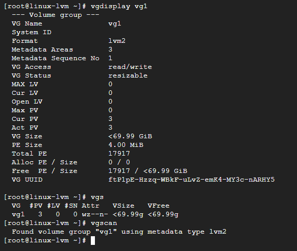

세 PV를 합친 `vg1`의 크기가 약 70GiB로 표시된다.

## 7. LV와 XFS 파일시스템 생성

LV(Logical Volume)는 VG의 공간을 할당받아 파일시스템이나 애플리케이션에서 사용할 수 있게 만든 논리적인 블록 장치다.

`vg1`에서 30GB를 할당해 `lv1`을 생성한다.

```bash
lvcreate -n lv1 -L 30G vg1
```

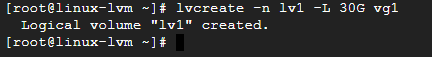

생성 결과를 확인한다.

```bash
lvs
lvdisplay /dev/vg1/lv1
lvscan
```

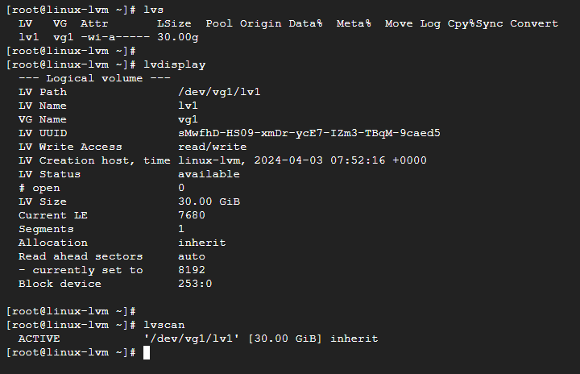

`lsblk`에서는 `/dev/sdd` 아래에 `vg1-lv1`이 표시된다.

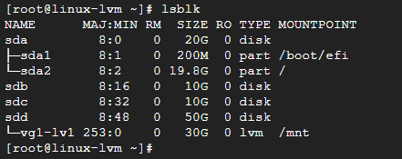

다만 이 트리만 보고 LV의 모든 데이터가 `/dev/sdd`에만 할당됐다고 판단하면 안 된다. LV의 물리 영역은 VG에 포함된 여러 PV에 분산될 수 있다. 실제 할당 위치는 다음 명령으로 확인한다.

```bash
lvs -o lv_name,vg_name,lv_size,devices
```

이제 LV에 XFS 파일시스템을 만들고 `/mnt`에 마운트한다.

```bash
mkfs.xfs /dev/vg1/lv1
mount /dev/vg1/lv1 /mnt
```

> `mkfs.xfs`는 대상 장치의 기존 파일시스템과 데이터를 초기화한다. 새 LV에 한 번만 실행한다.

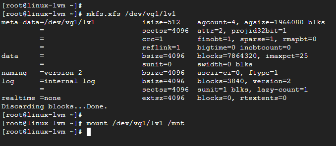

`df -h`에서 약 30GB 크기의 `/dev/mapper/vg1-lv1`이 `/mnt`에 마운트된 것을 확인한다.

```bash
df -h
```

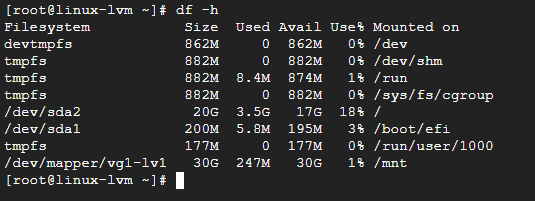

용량 확장 후에도 데이터가 유지되는지 확인하기 위해 테스트 파일을 만든다.

```bash
echo "Hello Google Cloud & LVM!" > /mnt/hello.txt
cat /mnt/hello.txt
```

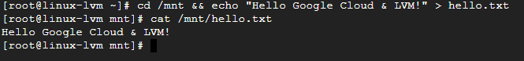

## 8. GCP Persistent Disk 용량 확장

Compute Engine의 VM 세부정보에서 추가 디스크 목록을 확인하고, 확장할 `linux-lvm-disk3`을 선택한다.

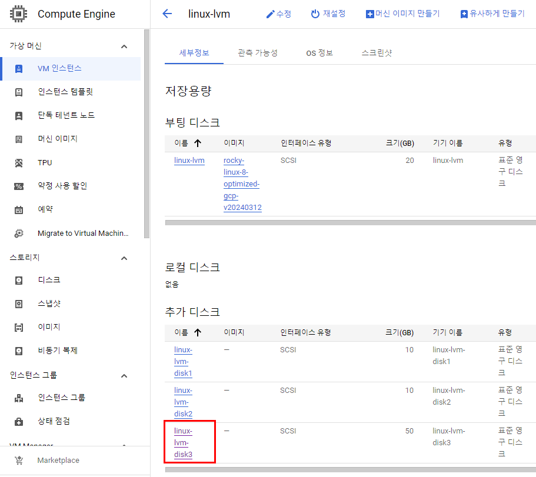

디스크 세부정보 화면에서 현재 크기가 50GB인지 확인한 뒤 상단의 수정 버튼을 클릭한다.

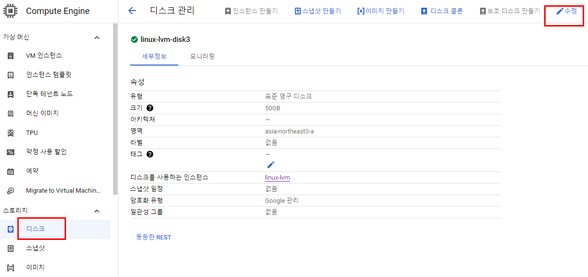

크기를 100GB로 변경하고 저장한다.

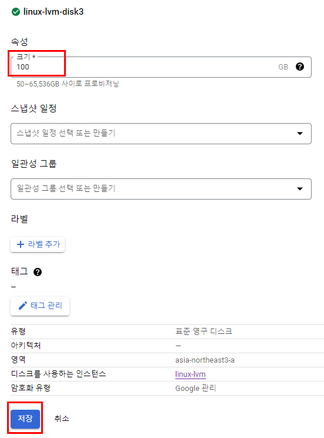

디스크 확장은 실행 중인 VM에 연결된 상태에서도 가능하다. 다만 확장 후 게스트 운영체제의 PV와 파일시스템까지 자동으로 늘어나는 것은 아니다.

VM 터미널에서 `lsblk`와 `pvs`를 비교한다.

```bash
lsblk
pvs
```

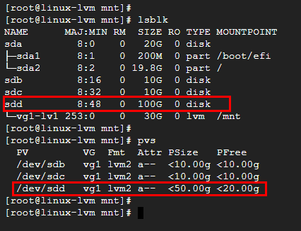

`lsblk`에서는 `/dev/sdd`가 100GB로 보이지만, `pvs`의 `/dev/sdd`는 여전히 50GB다. 클라우드 디스크 확장은 완료됐지만 LVM의 PV가 새 공간을 아직 인식하지 못한 상태다.

## 9. 확장된 공간을 PV에 반영

이번 실습에서는 작업 과정을 명확히 확인하기 위해 파일시스템을 마운트 해제하고 LV를 비활성화한 뒤 PV를 확장했다.

```bash
umount /mnt
lvchange -an /dev/vg1/lv1
```

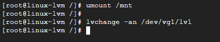

`pvresize`를 실행해 `/dev/sdd`의 늘어난 크기를 PV에 반영한다.

```bash
pvresize /dev/sdd
pvs
```

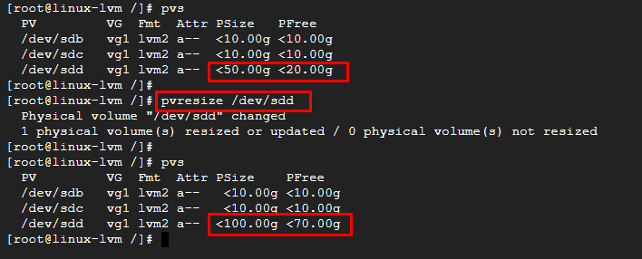

`/dev/sdd`의 PV 크기가 약 50GiB에서 100GiB로 늘었고, 이 PV에는 약 70GiB의 여유 공간이 표시된다. 여기에 `/dev/sdb`와 `/dev/sdc`의 여유 공간 약 20GiB까지 더하면 VG 전체 여유 공간은 약 90GiB다. 따라서 기존 30GiB LV에 VG의 여유 공간을 모두 추가하면 최종 크기는 약 120GiB가 된다.

LV를 다시 활성화한다.

```bash
lvchange -ay /dev/vg1/lv1
```

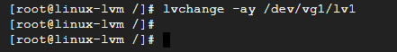

## 10. LV와 XFS 파일시스템 확장

VG에 남은 모든 여유 공간을 `lv1`에 할당하고 파일시스템도 함께 확장한다.

실습에서는 다음 명령을 사용했다.

```bash
lvresize -r -l +100%FREE /dev/vg1/lv1
```

- `-l +100%FREE`: VG의 남은 모든 Physical Extent를 추가한다.
- `-r`: LV와 파일시스템을 함께 확장한다.

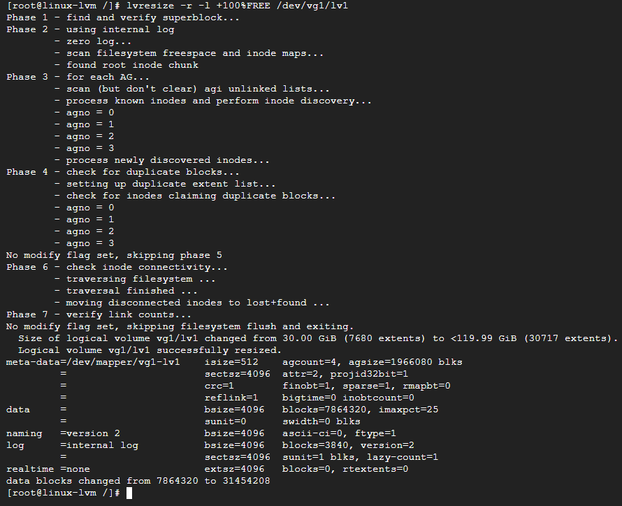

캡처에서는 LV가 30GiB에서 약 119.99GiB로 확장됐고 XFS 파일시스템 크기도 함께 변경됐다.

`+100%FREE`는 이번에 늘어난 50GB만 사용하는 옵션이 아니다. VG에 원래 남아 있던 공간까지 모두 사용한다. 새로 추가된 공간 중 50GB만 LV에 더하려면 다음처럼 증가량 앞에 `+`를 붙인다.

```bash
lvextend -r -L +50G /dev/vg1/lv1
```

`-L 100G`처럼 `+` 없이 지정하면 100GB를 추가하는 것이 아니라 LV의 최종 크기를 100GB로 맞춘다.

### XFS를 별도 명령으로 확장하는 방법

환경에 따라 `-r`을 이용한 XFS 확장이 실패한다면 LV와 파일시스템을 나누어 확장할 수 있다.

```bash
lvextend -l +100%FREE /dev/vg1/lv1
mount /dev/vg1/lv1 /mnt
xfs_growfs /mnt
```

XFS는 마운트된 상태에서 `xfs_growfs`로 확장한다. 옵션 없이 마운트 경로를 지정하면 기반 장치에서 사용할 수 있는 최대 크기까지 늘어난다. 자세한 내용은 [Red Hat XFS 확장 문서](https://docs.redhat.com/en/documentation/red_hat_enterprise_linux/8/html/managing_file_systems/increasing-the-size-of-an-xfs-file-system_managing-file-systems)에서 확인할 수 있다.

## 11. 확장 결과와 데이터 확인

`-r` 옵션으로 파일시스템까지 확장한 경우 LV를 다시 마운트하고 결과를 확인한다.

```bash
mount /dev/vg1/lv1 /mnt
df -h
cat /mnt/hello.txt
```

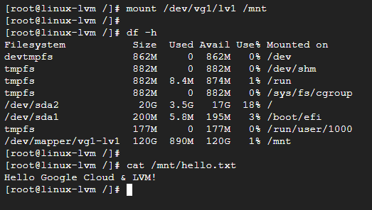

확인 결과는 다음과 같다.

- `/dev/mapper/vg1-lv1` 용량이 약 30GB에서 120GB로 증가했다.
- 파일시스템이 `/mnt`에 정상적으로 마운트됐다.
- 확장 전에 만든 `/mnt/hello.txt`의 내용이 유지됐다.

마지막으로 각 계층의 크기를 함께 확인하면 누락된 확장 단계가 없는지 판단하기 쉽다.

```bash
lsblk
pvs
vgs
lvs
df -hT /mnt
```

## 12. 재부팅 후에도 자동으로 마운트하기

지금까지 실행한 `mount` 명령은 재부팅 후 유지되지 않는다. 운영 환경에서는 파일시스템 UUID를 확인해 `/etc/fstab`에 등록한다.

```bash
blkid /dev/vg1/lv1
```

출력된 UUID를 사용해 `/etc/fstab`에 다음 형식으로 추가한다.

```text
UUID=<확인한-UUID> /mnt xfs defaults,nofail 0 0
```

재부팅하기 전에 설정이 올바른지 반드시 검사한다.

```bash
mount -av
findmnt /mnt
```

`/mnt`는 실습용 경로다. 실제 서버에서는 용도에 맞게 `/data`와 같은 별도 마운트 경로를 정하는 것이 관리하기 편하다.

## 13. 자주 확인할 문제

### GCP에서는 100GB인데 pvs에는 50GB로 표시되는 경우

클라우드 디스크만 확장되고 PV에는 반영되지 않은 상태다. 대상 장치를 다시 확인한 뒤 `pvresize`를 실행한다.

```bash
pvresize /dev/sdd
```

### lvs 용량은 늘었는데 df 용량이 그대로인 경우

LV만 확장되고 파일시스템이 확장되지 않았을 수 있다. XFS가 마운트된 상태에서 다음 명령을 실행한다.

```bash
xfs_growfs /mnt
```

### 재부팅 후 디스크 장치명이 달라진 경우

`/dev/sdb` 같은 장치명에 의존하지 말고 `/dev/disk/by-id/google-*` 경로나 파일시스템 UUID를 사용한다. `/etc/fstab`도 UUID 기준으로 구성한다.

### 마운트 해제가 되지 않는 경우

현재 디렉터리가 `/mnt` 아래에 있거나 프로세스가 파일을 사용하고 있을 수 있다. 다른 경로로 이동한 뒤 사용 중인 프로세스를 확인한다.

```bash
cd /
fuser -vm /mnt
```

## 마무리

GCP 콘솔에서 Persistent Disk 크기를 늘리는 것만으로 LVM과 파일시스템의 사용 가능 공간이 자동으로 확장되지는 않는다. 운영체제에서 디스크 크기를 확인한 뒤 `pvresize`로 PV를 확장하고, `lvresize` 또는 `lvextend`로 LV를 늘린 다음 XFS 파일시스템까지 확장해야 한다.

이번 실습에서는 10GB, 10GB, 50GB 디스크로 VG를 구성하고 30GB LV를 만든 뒤, 50GB 디스크를 100GB로 확장했다. 마지막으로 VG의 남은 공간을 모두 LV에 할당해 약 120GB의 XFS 파일시스템으로 확장했고, 기존 데이터가 유지되는 것까지 확인했다.
