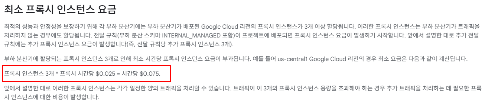
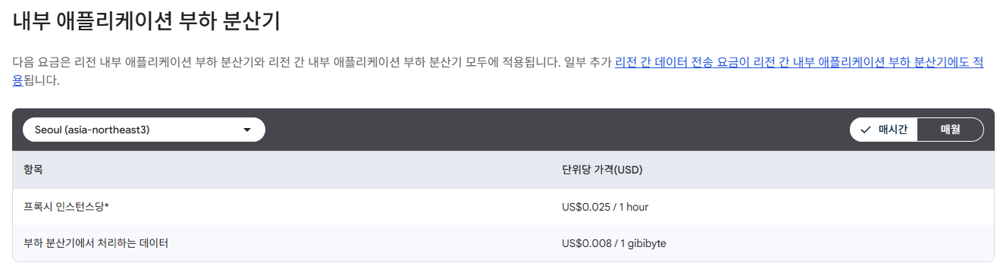

+++
title = 'GCP 내부 애플리케이션 로드 밸런서 비용과 Stateful MIG 대안'
date = '2026-09-23T00:00:00+09:00'
draft = false
slug = 'gcp-internal-load-balancer-stateful-mig'
description = 'Envoy 기반 GCP 내부 애플리케이션 로드 밸런서의 프록시 인스턴스 비용을 살펴보고, 소규모 환경에서 Stateful MIG로 내부 IP를 유지하는 대안을 정리한다.'
tags = ['gcp', 'google-cloud', 'load-balancer', 'internal-load-balancer', 'stateful-mig', 'cost-optimization']
categories = ['IT개발']
showTableOfContents = true
+++

Google Cloud에서 내부 서비스에 단일 진입점을 제공하기 위해 내부 로드 밸런서를 구성할 수 있다. 하지만 모든 내부 로드 밸런서가 같은 방식으로 동작하는 것은 아니다.

이 글에서 다루는 대상은 `INTERNAL_MANAGED` 스킴을 사용하는 **Envoy 기반 내부 애플리케이션 로드 밸런서**다. 이 방식은 Google이 관리하는 프록시 계층을 통해 요청을 백엔드로 전달하며, 경로 기반 라우팅이나 HTTP(S) 처리 같은 기능을 제공한다.

문제는 트래픽이 거의 없어도 최소 프록시 인스턴스 비용이 발생한다는 점이다. VM 한두 대로 운영하는 작은 내부 서비스라면, 로드 밸런서가 제공하는 기능보다 고정 내부 IP를 유지하는 Stateful Managed Instance Group(MIG)이 더 적합할 수 있다.

## 1. Envoy 기반 내부 로드 밸런서의 동작

Envoy 기반 로드 밸런서는 클라이언트와 백엔드 VM 사이에 Google 관리 프록시를 둔다.

```text
클라이언트
    |
    v
내부 로드 밸런서 프록시(Envoy)
    |
    v
백엔드 VM 또는 NEG
```

클라이언트의 연결을 프록시가 먼저 종료하고, 프록시가 백엔드로 별도의 연결을 만든다. 이 구조를 이용하면 다음과 같은 기능을 사용할 수 있다.

- URL 경로와 호스트 기반 라우팅
- HTTP와 HTTPS 처리
- 여러 백엔드 그룹으로 요청 분배
- Google 관리형 프록시를 통한 확장
- 백엔드 서비스와 상태 확인 연계

프록시는 VPC와 리전 단위로 사용되며, 이를 위해 별도의 proxy-only subnet도 필요하다. 프록시 전용 서브넷은 백엔드 VM에 사용하는 일반 서브넷과 분리해야 한다. [Proxy-only subnet 공식 문서](https://docs.cloud.google.com/load-balancing/docs/proxy-only-subnets)

## 2. 트래픽이 적어도 발생하는 최소 비용

Google Cloud 공식 가격 문서에 따르면 로드 밸런서 하나에는 성능과 안정성을 위해 최소 3개의 프록시 인스턴스가 할당된다. 트래픽이 없어도 이 최소 프록시 인스턴스 비용은 발생하며, 전달 규칙이 `INTERNAL_MANAGED`로 배포된 시점부터 과금이 시작된다.

사용자가 프록시 수를 1개로 줄이는 방식은 제공되지 않는다. 트래픽이 증가하면 Google Cloud가 필요한 프록시 수를 자동으로 늘린다.

아래 가격은 **2026년 9월 23일 Google Cloud 공식 가격 문서를 확인한 기준**이다. 가격과 리전별 단가는 변경될 수 있으므로, 실제 구성 전에는 가격 문서와 Google Cloud Pricing Calculator에서 다시 확인해야 한다.

확인 당시 가격 문서의 예시 단가는 프록시 인스턴스당 시간당 `$0.025`다.

```text
최소 비용 예시
3개 x $0.025 x 730시간 = 월 $54.75
```

1달러를 1,400원으로 가정하면 월 약 76,650원이다. 이는 비용 규모를 이해하기 위한 단순 환산 예시이며, 실제 원화 청구 금액은 결제 시점의 환율과 결제 계정 설정에 따라 달라진다.

아래 화면은 최소 프록시 인스턴스 요금을 설명하는 Google Cloud 공식 가격 문서의 내용이다. 화면에 표시된 것처럼 최소 3개의 프록시 인스턴스가 할당되며, 예시 단가가 프록시 인스턴스당 시간당 `$0.025`이므로 시간당 최소 `$0.075`가 계산된다.



서울 리전(`asia-northeast3`)의 가격표에는 프록시 인스턴스당 시간당 `$0.025`, 부하 분산기에서 처리하는 데이터 GiB당 `$0.008`이 표시된다. 아래 화면은 이 글을 작성한 시점에 확인한 서울 리전의 가격표다.



프록시 인스턴스 비용과 별도로 전달 규칙 및 데이터 처리 비용이 발생할 수 있다. 실제 청구 금액은 리전별 단가, 세금, 데이터 처리량, 전달 규칙 비용 등에 따라 달라지므로, 구성 전에 [Cloud Load Balancing 가격 문서](https://cloud.google.com/load-balancing/pricing)와 Pricing Calculator에서 확인해야 한다.

## 3. 프록시 인스턴스의 처리 기준

프록시 수는 사용자가 직접 지정하는 값이 아니라, 일정 기간 동안 측정된 트래픽 용량을 기준으로 자동 계산된다. Google Cloud는 10분 단위로 다음 항목을 측정하고, 필요한 프록시 수가 가장 많은 항목을 기준으로 사용량을 계산한다.

| 기준 | 프록시 1개가 처리할 수 있는 예시 용량 |
| --- | --- |
| 대역폭 | 최대 18MB/s |
| 신규 HTTP 연결 | 초당 600개 |
| 신규 HTTPS 연결 | 초당 150개 |
| 활성 연결 | 3,000개 |
| 요청 수 | 초당 1,400개, Cloud Logging 미사용 기준 |

Cloud Logging을 100% 샘플링하면 프록시 한 개의 요청 처리 용량이 예시상 초당 700개로 줄어들 수 있다. 실제 용량은 프로토콜, TLS, 로깅 설정 등 여러 조건에 영향을 받는다.

따라서 “초당 100MB 또는 1,000개의 연결과 요청이 발생할 때부터 유용하다”처럼 하나의 고정 기준으로 표현하는 것은 정확하지 않다.

예를 들어 대역폭만 단순하게 계산하면 초당 100MB는 `100 / 18`이므로 약 6개의 프록시 용량이 필요할 수 있다. 반면 1,000개의 활성 연결은 프록시 1개 기준인 3,000개보다 작고, 초당 1,000개의 요청도 1,400개보다 작다. 그러나 초당 1,000개의 신규 HTTPS 연결은 프록시 1개 기준인 150개를 넘기므로 여러 프록시가 필요할 수 있다.

즉, 로드 밸런서의 적합성은 단순히 VM 개수로 판단하기보다 다음을 함께 확인해야 한다.

- 신규 연결 수와 활성 연결 수
- HTTP인지 HTTPS인지 여부
- 초당 요청 수
- 양방향 데이터 처리량
- TLS 종료와 Cloud Logging 사용 여부
- 경로 기반 라우팅이나 다중 백엔드가 필요한지 여부

## 4. 소규모 서비스에서 비용이 아쉬운 이유

다음과 같은 환경에서는 최소 프록시 비용이 서비스 규모에 비해 크게 느껴질 수 있다.

- 내부 서비스의 백엔드 VM이 1대뿐인 경우
- 고정된 포트로 TCP 연결만 전달하면 되는 경우
- URL 경로 기반 라우팅이 필요하지 않은 경우
- 월간 트래픽과 요청 수가 적은 경우
- VM이 재생성되어도 동일한 내부 IP로 접근하면 되는 경우

이런 환경에서 Envoy 기반 애플리케이션 로드 밸런서를 사용하면 VM 비용 외에 프록시 인스턴스, 데이터 처리, 전달 규칙 비용이 추가된다. 특히 요청량이 거의 없어도 최소 프록시 비용이 발생하므로, “트래픽이 적으면 로드 밸런서 비용도 거의 없을 것”이라고 예상하면 실제 청구액과 차이가 생길 수 있다.

## 5. Stateful MIG를 이용한 대안

대안으로 Managed Instance Group에 Stateful 구성을 적용하고, VM의 내부 IP를 보존하는 방식을 사용할 수 있다.

Stateful MIG는 VM이 재시작, 재생성, 자동 복구, 업데이트될 때 VM별 상태를 유지할 수 있다. Stateful IP로 지정한 내부 IP는 VM이 다시 만들어져도 같은 VM 인스턴스에 다시 연결된다. [Stateful MIG 공식 문서](https://docs.cloud.google.com/compute/docs/instance-groups/how-stateful-migs-work)

구성 흐름은 다음과 같다.

1. 인스턴스 템플릿을 만든다.
2. 내부 IP를 정적 주소로 예약한다.
3. 인스턴스 그룹을 만든다.
4. `nic0`의 내부 IP를 Stateful IP로 지정한다.
5. 애플리케이션 상태 확인과 자동 복구를 구성한다.
6. 내부 클라이언트가 해당 내부 IP 또는 내부 DNS 이름으로 접속하도록 구성한다.

`gcloud`를 사용할 때는 MIG 생성 또는 업데이트 과정에서 `--stateful-internal-ip` 옵션을 사용해 내부 IP를 Stateful로 지정할 수 있다.

```bash
gcloud compute instance-groups managed create APP_GROUP \
    --region REGION \
    --template APP_TEMPLATE \
    --base-instance-name app \
    --size 1 \
    --instance-redistribution-type NONE \
    --stateful-internal-ip interface-name=nic0
```

실제 명령어에는 리전 또는 영역, 기본 인스턴스 이름, IP 삭제 정책 등 환경에 맞는 옵션을 추가해야 한다. 정적 내부 IP를 영구 보존할지, 인스턴스가 영구 삭제될 때 주소 예약도 삭제할지는 운영 정책에 따라 결정한다. [Stateful IP 주소 구성 문서](https://docs.cloud.google.com/compute/docs/instance-groups/configuring-stateful-ip-addresses-in-migs)

## 6. 1대와 2대 구성의 차이

### VM 1대

VM 1대가 서비스의 주 인스턴스이고, 장애가 발생하면 같은 내부 IP로 재생성되면 되는 경우에 적합하다.

```text
내부 클라이언트 -> 고정 내부 IP -> Stateful MIG VM 1대
```

이 구조는 로드 밸런서 없이도 VM 재생성 이후 접속 주소를 유지할 수 있다. 다만 로드 밸런서가 제공하는 요청 분산, L7 라우팅, 단일 진입점 고가용성을 대신 제공하지는 않는다.

### VM 2대

VM 2대를 운영하면 각 VM에 고유한 Stateful 내부 IP가 필요하다.

```text
내부 클라이언트 -> VM A의 고정 IP
                 -> VM B의 고정 IP
```

두 VM을 구성한다고 해서 자동으로 하나의 가상 IP가 만들어지거나 트래픽이 자동 분산되는 것은 아니다. 클라이언트가 두 주소를 모두 알고 있어야 하며, 분산이나 장애 전환은 애플리케이션, 클라이언트, DNS 또는 별도의 네트워크 구성에서 처리해야 한다.

따라서 “VM 2대의 고정 IP”와 “단일 진입점으로 동작하는 로드 밸런서”는 서로 다른 요구사항이다. 하나의 주소로 안정적인 분산과 장애 전환이 필요하다면 로드 밸런서를 제거하기보다, 비용과 기능을 비교해 적절한 로드 밸런서 유형을 선택해야 한다.

## 7. Stateful MIG가 적합한 경우

Stateful MIG는 다음과 같은 상황에 적합하다.

- 단일 VM 또는 소수의 고정 VM을 운영하는 경우
- VM 재생성 후에도 동일한 내부 IP가 필요할 때
- 경로 기반 HTTP 라우팅이 필요하지 않을 때
- 클라이언트가 특정 VM 주소로 직접 연결해도 될 때
- 로드 밸런서의 최소 프록시 비용을 줄이고 싶을 때

반대로 다음과 같은 경우에는 Envoy 기반 내부 애플리케이션 로드 밸런서가 더 적합하다.

- 여러 서비스 또는 백엔드 그룹을 하나의 주소로 제공해야 할 때
- URL 경로와 호스트에 따라 요청을 분기해야 할 때
- HTTPS 종료와 인증서 관리를 중앙화해야 할 때
- 백엔드 장애 시 단일 진입점에서 자동으로 다른 백엔드로 보내야 할 때
- 트래픽 증가에 맞춰 프록시와 백엔드 구성을 확장해야 할 때

## 8. Stateful MIG 사용 시 주의사항

Stateful MIG는 비용을 줄일 수 있는 만능 대체제가 아니다.

첫째, Stateful IP는 주소 보존 기능이지 로드 밸런싱 기능이 아니다. IP가 유지되더라도 요청을 여러 VM으로 분배하거나, 여러 VM 중 정상 인스턴스를 하나의 주소로 선택해 주지는 않는다.

둘째, Stateful MIG에서는 자동 확장을 사용할 수 없다. 인스턴스별 IP와 상태를 보존해야 하기 때문에 인스턴스 수를 자유롭게 늘리고 줄이는 Stateless MIG와 운영 방식이 다르다. [Stateful MIG 구성 제한](https://docs.cloud.google.com/compute/docs/instance-groups/configuring-stateful-migs)

셋째, 리전 MIG에서 Stateful 구성을 사용할 때는 자동 재분배 정책을 신중하게 설정해야 한다. Google Cloud 문서에서는 Stateful 리전 MIG의 경우 자동 영역 재분배로 Stateful 인스턴스가 삭제되지 않도록 재분배 유형을 `NONE`으로 설정하는 내용을 안내한다.

넷째, VM 내부에 애플리케이션 상태나 로컬 데이터를 저장한다면 IP만 보존해서는 충분하지 않다. 디스크, 데이터 복제, 백업, 장애 복구 절차까지 함께 설계해야 한다.

## 9. 선택 기준 정리

| 요구사항 | 적합한 구성 |
| --- | --- |
| VM 한 대에 고정된 내부 주소로 접근 | Stateful MIG + Stateful 내부 IP |
| VM 두 대를 각각 고정 주소로 운영 | Stateful MIG 2대 + 애플리케이션 또는 클라이언트 측 제어 |
| 하나의 주소로 여러 백엔드에 분산 | 로드 밸런서 |
| URL 경로 기반 분기 | Envoy 기반 애플리케이션 로드 밸런서 |
| 트래픽이 적고 L7 기능이 필요 없음 | Stateful MIG 또는 요구사항에 맞는 단순한 L4 구성 검토 |
| 요청량이 크고 자동 확장이 필요함 | 로드 밸런서 + Stateless MIG/NEG |

## 마무리

GCP 내부 애플리케이션 로드 밸런서는 Envoy 프록시를 통해 HTTP(S) 라우팅과 백엔드 분산을 제공한다. 반면 최소 3개의 프록시 인스턴스가 할당되므로, 사용량이 적은 서비스에서도 일정한 기본 비용이 발생한다.

VM 1대 또는 2대를 운영하고 고정된 내부 주소만 필요하다면 Stateful MIG의 Stateful 내부 IP 구성을 대안으로 검토할 수 있다. 이 방식은 VM이 재생성되어도 내부 IP를 유지하는 데 효과적이지만, 로드 밸런서의 분산과 장애 전환 기능을 대신하지는 않는다.

결국 선택 기준은 “VM이 몇 대인가”보다 다음 질문에 가깝다.

- 하나의 주소로 여러 백엔드에 트래픽을 분산해야 하는가?
- HTTP(S) 라우팅이나 TLS 종료가 필요한가?
- VM 재생성 후 동일한 내부 IP만 유지하면 되는가?
- 최소 프록시 비용을 감수할 만큼 로드 밸런서 기능이 필요한가?

이 질문에 답한 뒤 로드 밸런서와 Stateful MIG 중 하나를 선택하면, 기능과 비용 사이의 균형을 더 명확하게 잡을 수 있다.
