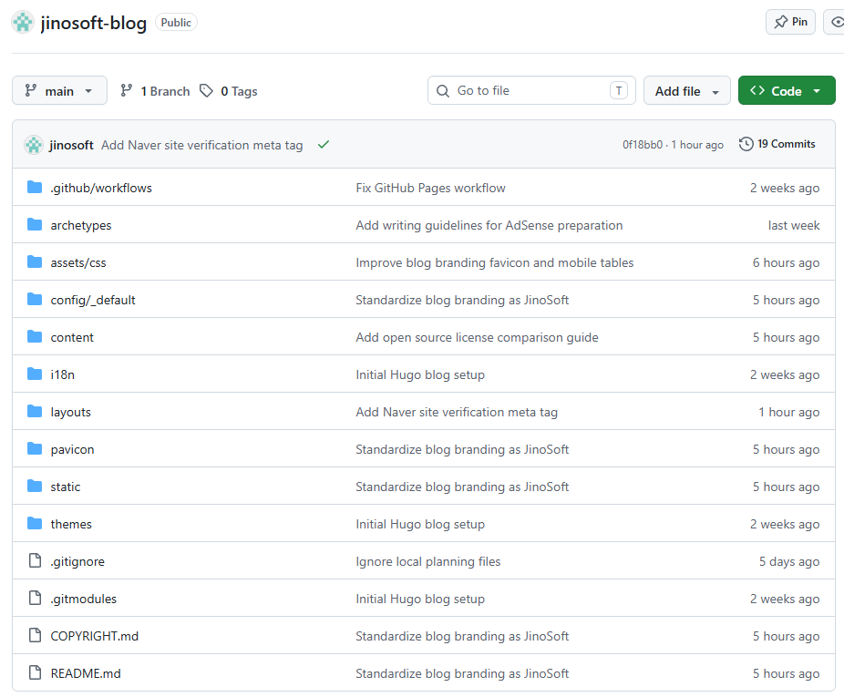

+++
title = 'GitHub Public이면 내 블로그를 가져다 써도 될까? fork와 LICENSE의 차이'
date = '2026-09-28T00:00:00+09:00'
draft = false
slug = 'github-public-repository-open-source-license'
description = '공개 블로그 저장소를 fork한 뒤 글·이미지·코드를 재사용해도 될까? GitHub의 fork 허용 범위와 LICENSE, COPYRIGHT의 차이를 실제 사례로 정리한다.'
tags = ['github', 'open-source', 'license', 'copyright']
categories = ['IT개발']
showTableOfContents = true
+++

누군가 내 GitHub 블로그 저장소를 fork했다. 그 사람이 글과 캡처 이미지를 그대로 가져가 자기 사이트에 올려도 될까? 사용자 정의 CSS와 Blowfish 테마는 같은 조건일까?

실제 [Jinosoft 블로그 저장소](https://github.com/jinosoft/jinosoft-blog)는 `Public`이지만 루트에 오픈소스 `LICENSE`를 두지 않았다. 직접 만든 콘텐츠의 이용 조건은 [COPYRIGHT.md](https://github.com/jinosoft/jinosoft-blog/blob/main/COPYRIGHT.md)에 적었다. 아래에서 이 저장소를 사례로 살펴본다.

## fork는 가능한데, 재게시도 가능할까?

GitHub의 [서비스 약관](https://docs.github.com/en/site-policy/github-terms/github-terms-of-service)은 `Public` 저장소에 대해 GitHub 기능을 통한 **보기와 fork**를 허용한다. fork는 GitHub 안에서 저장소의 사본을 자신의 계정에 만드는 기능이다.

이 저장소의 파일을 이용하는 상황별로 보면 차이가 분명하다.

| 하려는 일 | 확인할 조건 |
| --- | --- |
| GitHub에서 저장소를 보고 fork하기 | GitHub 서비스 약관상 가능 |
| fork한 블로그를 다른 도메인에 그대로 배포하기 | 글·이미지 등 직접 만든 콘텐츠의 재게시에는 별도 허가 필요 |
| 블로그 글과 캡처를 자기 사이트에 그대로 게시하기 | [COPYRIGHT.md](https://github.com/jinosoft/jinosoft-blog/blob/main/COPYRIGHT.md)에 따른 별도 허가 필요 |
| 사용자 정의 CSS를 복사해 자기 사이트에 사용하기 | [COPYRIGHT.md](https://github.com/jinosoft/jinosoft-blog/blob/main/COPYRIGHT.md)에 따른 별도 허가 필요 |
| Blowfish 테마를 자기 사이트에 사용하기 | 테마의 [MIT License](https://github.com/nunocoracao/blowfish/blob/main/LICENSE)에 따라 사용 가능, 배포 시 저작권·허가문 유지 |

fork할 수 있다는 사실만으로 글을 다른 사이트에 재게시하거나 사용자 정의 코드를 자기 제품에 포함해 배포할 권리까지 받은 것은 아니다. GitHub도 공개 저장소의 보기·fork 권한과 별도의 재사용 허가를 구분한다. 저작권법상 예외가 적용되는 경우는 별개다. [GitHub 저장소 라이선스 안내](https://docs.github.com/en/repositories/managing-your-repositorys-settings-and-features/customizing-your-repository/licensing-a-repository), [Choose a License: No License](https://choosealicense.com/no-permission/)

## LICENSE가 없으면 어떻게 되나

루트에 `LICENSE` 파일을 두는 것은 의무가 아니다. README나 개별 파일에서 재사용 조건을 명시할 수도 있다. **어디에도 재사용 허가가 없다면** 원칙적으로 저작권자가 권리를 보유하며, 다른 사람에게 일반적인 수정·재배포 권한을 부여하지 않은 상태다. `Copyright` 문구가 없어도 저작권 보호는 기본적으로 발생한다. [GitHub 라이선스 안내](https://docs.github.com/en/repositories/managing-your-repositorys-settings-and-features/customizing-your-repository/licensing-a-repository)

반대로 MIT 같은 오픈소스 라이선스를 적용하면 조건을 지키는 사람에게 사용·수정·배포 권한을 명시적으로 준다. **출처 표시가 재사용 허가를 대신하지는 않는다.** 허가된 범위는 해당 파일의 라이선스나 권리자의 별도 허락으로 확인해야 한다.

`COPYRIGHT.md`는 이 저장소에서 누가 어떤 콘텐츠의 권리를 갖고 있고 어떤 이용을 허락하지 않는지 알리는 문서다. 이를 적었다고 GitHub 서비스 약관에 따른 보기·fork 권한이 사라지는 것은 아니다. 또 공개된 파일을 누군가 복사하는 것을 기술적으로 막아 주는 장치도 아니다.

## 한 저장소 안에서도 라이선스는 다를 수 있다

이 블로그의 글·캡처 이미지·사용자 정의 설정과 CSS에는 [COPYRIGHT.md](https://github.com/jinosoft/jinosoft-blog/blob/main/COPYRIGHT.md)의 조건이 적용된다. `themes/blowfish`는 별도 Git 서브모듈이며 테마 개발자의 [MIT License](https://github.com/nunocoracao/blowfish/blob/main/LICENSE)를 따른다. Hugo 같은 외부 도구도 각자의 이용 조건을 가진다.

Blowfish를 사용할 수 있다고 해서 블로그 글과 이미지까지 가져갈 수 있는 것은 아니다. 한 저장소에서 파일을 찾았더라도 **파일을 누가 만들었고 어떤 조건으로 제공했는지** 각각 확인해야 한다.

## 누군가 실제로 가져다 썼다면

GitHub에서 저장소를 **fork만 했다면** 그 사실만으로 무단 재게시라고 볼 수 없다. 글·이미지를 자기 사이트에 올리거나 사용자 정의 코드를 별도 제품에 배포했다면, 먼저 허가 여부와 실제 사용 범위를 확인한다.

1. 원본 글과 복제된 페이지의 URL, 일치하는 부분, 확인 날짜와 화면을 보관한다. Git 커밋 기록도 원본을 언제 작성했는지 보여주는 자료가 된다.
2. 상대 사이트 운영자에게 원본과 복제된 콘텐츠의 **구체적인 URL**을 전달하고 삭제 또는 이용 허가 협의를 요청한다.
3. GitHub에 무단 복제물이 게시됐다면 [저작권 침해 신고 안내](https://docs.github.com/en/site-policy/content-removal-policies/guide-to-submitting-a-dmca-takedown-notice)를 확인한다. GitHub는 침해를 주장하는 파일이나 URL을 구체적으로 적도록 요구하며, 상대방이 이의를 제기할 수도 있다. 단순한 fork만을 근거로 신고해서는 안 된다.

다른 웹사이트에 게시됐다면 해당 사이트나 호스팅 서비스의 저작권 신고 절차를 확인한다. [Google 검색결과 삭제 요청](https://support.google.com/legal-help-center/answer/14855708?hl=en)도 가능하지만, 검색결과에서 빠져도 **원본 웹사이트의 복제물은 그대로 남을 수 있다.** 실제 게시물을 내리려면 게시 사이트 측에도 요청해야 한다. [Google 검색 도움말](https://support.google.com/websearch/answer/13652412?hl=en)

## 내 저장소를 공개할 때 선택할 것

- **GitHub의 보기·fork를 허용하고 일반적인 재사용은 허락하지 않을 때:** `Public`으로 공개할 수 있다. 별도의 재사용 허가를 부여하지 않고 README나 저작권 안내에 이용 조건을 분명히 적는다. 비공개로 유지해야 하는 파일은 애초에 공개 저장소에 넣지 않는다.
- **코드 재사용은 허용하고 글·이미지는 보호할 때:** 코드에 적용할 라이선스와 그 범위를 명시하고, 글·이미지의 조건은 따로 적는다. 저장소 루트에 `LICENSE` 하나만 두면 모든 파일에 적용된다고 오해할 수 있으므로 적용 대상 디렉터리나 파일을 README에도 밝혀 둔다.
- **전체를 재사용 가능하게 공개할 때:** 코드, 글, 이미지 각각에 적절한 이용 조건을 정하고 타인이 만든 자료를 그 조건으로 다시 허가할 권리가 있는지도 확인한다.

결론은 간단하다. **`Public`은 접근 범위를, `LICENSE`는 재사용 허가를 정한다.** 이 블로그처럼 공개 저장소를 운영하면서 글과 이미지는 별도 조건으로 관리할 수도 있다. 다른 사람의 저장소를 이용할 때도 `Public` 표시만 보지 말고, 실제로 사용하려는 파일의 라이선스를 확인해야 한다.

오픈소스를 *사용하는 쪽*의 조건은 [상용 제품에 쓰는 오픈소스 라이선스 비교](/posts/open-source-license-commercial-use/)에서 이어서 다뤘다.
