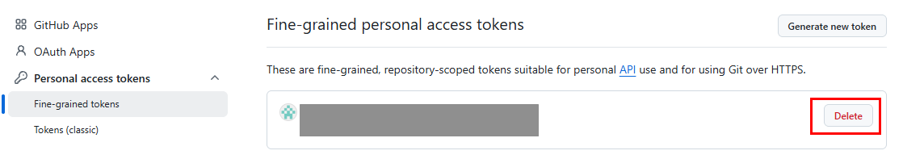

+++
title = 'GitHub에 토큰을 올렸다면? 파일 삭제보다 먼저 해야 할 일'
date = '2026-09-28T00:00:00+09:00'
draft = false
slug = 'github-token-leak-response'
description = 'GitHub 공개 저장소에 PAT나 API 키를 올렸을 때 토큰 폐기, 영향 확인, 파일과 Git 기록 정리, 재발 방지까지 순서대로 정리한다.'
tags = ['github', 'security', 'git', 'token']
categories = ['IT개발']
showTableOfContents = true
+++

GitHub 저장소에 `.env`나 설정 파일을 올린 뒤, 그 안에 토큰이 들어 있었다는 사실을 발견했다. 파일을 지우고 다시 push하면 해결될까?

**아니다. 먼저 토큰을 폐기하거나 교체해야 한다.** 파일을 삭제한 새 커밋을 올려도 이전 커밋에는 값이 남을 수 있다. 이 글은 공개 저장소에 GitHub Personal Access Token(PAT) 또는 다른 서비스의 API 키를 올린 상황을 기준으로, 대응 순서를 정리한다. 실제 토큰을 사용한 실습은 하지 않는다.

## 먼저 확인할 것: 어디까지 공개됐나

| 상황 | 우선 조치 |
| --- | --- |
| 로컬 파일에만 있고 Git에 추가하지 않음 | 파일을 Git 관리 대상에서 제외하고, 다른 곳에 공유한 적이 있는지 확인 |
| 로컬 커밋에만 있고 원격에 push하지 않음 | push하기 전에 커밋에서 제거하고, 다른 경로로 노출됐는지 확인 |
| 공개 저장소에 push함 | **토큰 폐기·교체를 최우선**으로 처리한 뒤 영향 범위 확인 |
| 비공개 저장소나 CI 로그에 노출됨 | 접근 가능한 사람과 로그 보존 범위를 확인하고 토큰 폐기·교체 |

공개 저장소에 올라갔다면 누가 봤는지 확인할 때까지 기다리지 않는다. GitHub도 비밀정보가 노출되면 먼저 해당 자격 증명을 폐기하거나 교체하도록 안내한다. [GitHub: 저장소에서 민감정보 제거](https://docs.github.com/en/authentication/keeping-your-account-and-data-secure/removing-sensitive-data-from-a-repository)

## 1. 노출된 토큰을 폐기하고 새로 발급한다

GitHub PAT라면 GitHub의 `Settings > Developer settings > Personal access tokens`에서 해당 토큰을 찾아 삭제한다. Fine-grained token과 classic token의 목록이 분리되어 있으므로 발급한 종류를 확인한다. 다른 서비스의 API 키라면 **그 서비스의 관리 화면**에서 폐기하거나 교체한다. GitHub 저장소에서 파일을 삭제해도 외부 서비스의 키가 무효화되지는 않는다. [GitHub: PAT 관리](https://docs.github.com/en/authentication/keeping-your-account-and-data-secure/managing-your-personal-access-tokens)



새 토큰은 필요한 저장소와 권한만 허용하고 만료일을 설정한다. 기존 토큰을 사용하던 로컬 도구나 자동화가 있다면 새 자격 증명으로 갱신한다. GitHub Actions에서 필요한 값은 코드에 직접 적지 말고 저장소의 Secrets에 보관하며, 워크플로에서 가능한 경우 기본 제공 `GITHUB_TOKEN` 사용도 검토한다. [GitHub: PAT 보안 권장사항](https://docs.github.com/en/authentication/keeping-your-account-and-data-secure/managing-your-personal-access-tokens)

> 토큰을 이미 폐기했더라도, 노출된 동안 사용됐을 가능성은 별도로 확인해야 한다.

## 2. 노출 범위와 사용 흔적을 확인한다

어떤 토큰이었는지, 읽기·쓰기 권한이 어디까지였는지, 처음 공개된 시점부터 폐기할 때까지 무엇을 할 수 있었는지 정리한다. 저장소의 커밋·PR·Actions 로그, 연결된 서비스의 접근 기록과 변경 이력을 살펴본다. 예상하지 못한 로그인, 리소스 변경이나 과금이 보이면 해당 서비스의 사고 대응 절차를 따른다.

GitHub의 secret scanning 경고가 있다면 감지된 위치와 상태를 확인한다. **경고가 없다고 안전하다는 뜻은 아니다.** 탐지 대상과 설정에 따라 감지하지 못하는 값도 있다. GitHub는 공개 저장소의 일부 토큰을 자동으로 무효화할 수 있지만, 자동 조치를 가정하지 말고 발급처에서 직접 상태를 확인한다. [GitHub: secret scanning](https://docs.github.com/en/code-security/concepts/secret-security/secret-scanning), [GitHub: 경고 평가](https://docs.github.com/en/code-security/tutorials/remediate-leaked-secrets/evaluating-alerts)

## 3. 현재 파일에서 제거한다

예를 들어 `.env` 파일 전체가 실수로 추적됐다면, 토큰을 폐기한 뒤 아래처럼 Git의 추적 대상에서 제외한다.

```bash
git rm --cached -- .env
```

`--cached`는 **로컬 파일은 남기고 Git의 추적 대상에서만 제거**한다. 따라서 로컬 `.env`에 남은 유출 토큰도 지우고, 필요한 경우 새 토큰으로 교체한다. 이어서 `.gitignore`에 `.env`를 추가하고 변경 사항을 커밋한다. 다른 설정값도 함께 들어 있는 파일이라면 파일 전체를 제외하는 대신 **비밀값만 제거**하고, 필요한 설정은 환경변수나 별도 비밀 저장소로 옮긴다. `.gitignore`는 앞으로의 실수를 줄여 주지만 **이미 커밋된 내용을 지우지는 않는다.** [Git: git-rm](https://git-scm.com/docs/git-rm), [GitHub: 저장소에서 민감정보 제거](https://docs.github.com/en/authentication/keeping-your-account-and-data-secure/removing-sensitive-data-from-a-repository)

## 4. Git 기록 삭제가 필요한지 판단한다

현재 파일에서 비밀값을 지워도 이전 커밋, PR, fork 또는 다른 사람의 clone에는 남아 있을 수 있다. 파일이 커밋 기록에 포함됐는지는 파일 경로를 기준으로 확인할 수 있다.

```bash
git log --all -- .env
```

이 명령은 `.env`라는 **경로의 기록만** 확인한다. 다른 파일에 토큰을 적었거나 파일명이 바뀌었다면 그 파일도 별도로 확인해야 하며, 이 결과만으로 저장소 전체에 비밀정보가 없다고 판단할 수는 없다.

**폐기된 토큰만 남아 있다면** Git 기록을 무조건 다시 쓰기보다, 토큰이 실제로 무효화됐는지와 다른 민감정보가 함께 노출됐는지를 먼저 확인한다. GitHub도 토큰을 폐기·교체했다면 기록 재작성까지는 필요하지 않을 수 있다고 설명한다.

반면 **폐기할 수 없는 개인정보나 다른 민감정보**까지 공개됐다면 기록 정리를 검토해야 한다. `git-filter-repo` 같은 도구로 기록을 다시 쓰면 커밋 ID가 바뀌고 협업자의 clone, PR, fork에 영향이 생긴다. 강제 push만으로 모든 사본이 사라지지도 않는다. 작업 전 백업과 영향 범위를 확인하고 협업자와 조율한 뒤 [GitHub 공식 절차](https://docs.github.com/en/authentication/keeping-your-account-and-data-secure/removing-sensitive-data-from-a-repository)를 따른다.

## 5. 같은 실수를 막는다

- `.env`, 개인 키, 로컬 설정 파일은 저장소에 추가하기 전에 제외한다. 공유할 설정 형식이 필요하면 실제 값이 없는 `.env.example`을 사용한다.
- 커밋 전에 `git diff --cached`로 스테이징된 내용을 확인한다. 화면 공유나 블로그 캡처에도 토큰이 보이지 않는지 살핀다.
- GitHub의 [push protection](https://docs.github.com/en/code-security/concepts/secret-security/push-protection)을 활용한다. 지원하는 비밀값을 push 단계에서 막아 주지만 모든 형태의 비밀정보를 탐지하는 것은 아니다.
- 토큰은 용도별로 분리하고 필요한 권한과 수명만 부여한다. 가능하다면 자격 증명 관리자나 서비스의 전용 비밀 저장 기능을 사용한다.

순서는 **폐기·교체 → 영향 확인 → 현재 파일 정리 → 필요할 때 기록 정리 → 재발 방지**다. 저장소를 깨끗하게 보이게 만드는 것보다, 유출된 토큰을 더 이상 사용할 수 없게 만드는 일이 먼저다.

공개 저장소 자체의 재사용 권한이 궁금하다면 [GitHub Public 저장소와 LICENSE의 차이](/posts/github-public-repository-open-source-license/)도 참고할 수 있다.
