+++
title = 'WSL 환경에서 Codex CLI 설치하고 구성하기'
date = '2026-09-18T00:00:00+09:00'
draft = false
slug = 'install-codexcli-with-wsl'
description = 'WSL2와 Ubuntu에 Codex CLI를 설치하고, Windows npm 경로 문제부터 ChatGPT 로그인, 모델 선택, 상태 표시줄과 세션 복원까지 구성한 기록.'
tags = ['wsl', 'ubuntu', 'codex', 'nodejs']
categories = ['IT개발']
showTableOfContents = true
+++

Windows에서 WSL과 Ubuntu를 준비한 뒤 Codex CLI를 설치하고 기본 설정을 진행했다. 설치 명령 자체는 짧지만, WSL에서 Windows에 설치된 npm이 먼저 잡히는 부분은 확인이 필요했다.

이 글에서는 실제 설치 화면을 따라 로그인, 모델 선택, 상태 표시줄 설정, 이전 대화 이어가기까지 정리한다.

## 설치 환경

아래는 2026년 9월 16일 캡처에서 확인한 환경이다. 버전 번호는 당시 설치 결과이며, 동일한 버전을 반드시 설치해야 한다는 뜻은 아니다.

| 항목 | 캡처 기준 |
| --- | --- |
| 운영 환경 | Windows의 WSL2 + Ubuntu |
| Node.js | v22.22.1 |
| npm | 11.17.0 |
| Codex CLI | 0.154.0 |
| 설치 방식 | Ubuntu의 apt로 Node.js·npm 설치 후 npm으로 Codex 설치 |
| 로그인 방식 | ChatGPT 계정 로그인 |

Codex 설치에는 여러 방법이 있다. 이 글은 캡처에 남긴 **npm 설치 과정**을 기준으로 설명한다. 현재 공식 문서는 별도의 설치 스크립트 방식도 안내하므로, npm을 사용하지 않는 경우에는 [Codex CLI 설치 안내](https://learn.chatgpt.com/docs/codex/cli)를 참고하면 된다.

## 1. WSL과 Ubuntu 설치

### Windows에서 WSL 설치

Windows 터미널이나 PowerShell을 **관리자 권한**으로 열고 실행한다.

```powershell
wsl --install
```

처음에는 WSL이 설치되어 있지 않다는 안내가 나왔고, 설치 명령을 실행한 뒤 WSL과 가상 머신 플랫폼 구성 요소가 설치되었다.

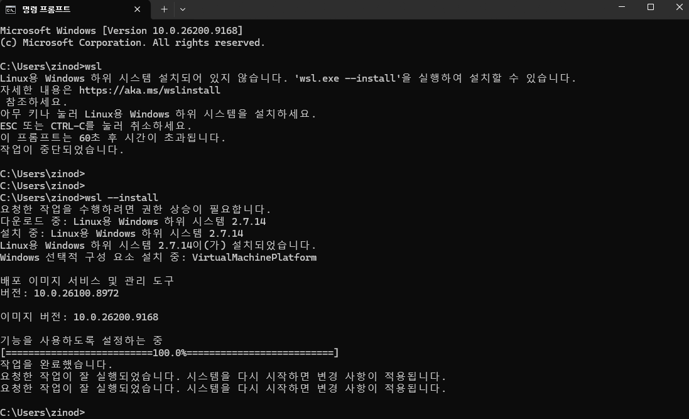

설치 결과에 시스템을 다시 시작하라는 안내가 있다면 Windows를 재부팅한다.

### Ubuntu 배포판 확인

재부팅 후 Windows 터미널에서 설치된 배포판을 확인한다.

```powershell
wsl -l -v
```

설치 과정에서는 다음과 같이 배포판이 없다는 안내도 확인했다. 이 메시지는 **설치된 Linux 배포판이 없다는 의미**이며, 메시지 자체가 재부팅 필요 여부를 알려 주는 것은 아니다.

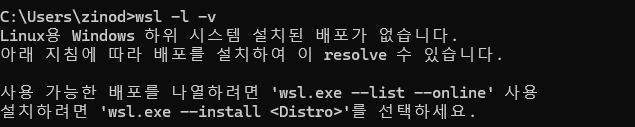

Ubuntu가 목록에 없다면 설치한다. 이미 설치되어 있다면 이 단계는 건너뛴다.

```powershell
wsl --install -d Ubuntu
```

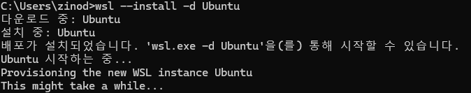

최초 실행에서 Linux 사용자 이름과 비밀번호 설정을 요청하면 입력한다. 이후 `sudo` 명령에 사용할 비밀번호다.

다시 `wsl -l -v`를 실행해 Ubuntu의 `VERSION`이 `2`인지 확인한다.

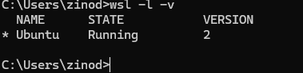

### Ubuntu로 진입

Windows 터미널에서 다음 명령으로 Ubuntu 셸을 연다.

```powershell
wsl -d Ubuntu
```

기본 배포판이 Ubuntu라면 `wsl`만 입력해도 된다. Ubuntu 셸에서 `exit`를 입력하면 Windows 셸로 돌아온다.

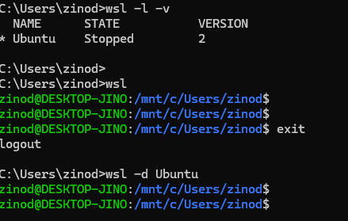

이후 설치 명령은 **WSL의 Ubuntu 셸 안에서** 실행한다. Windows의 `C:\Users\...>` 프롬프트와 Linux의 `사용자@호스트:경로$` 프롬프트를 구분하면 명령을 잘못된 환경에서 실행하는 일을 줄일 수 있다.

## 2. Node.js와 npm 경로 확인

Ubuntu 셸에서 Node.js와 npm의 버전과 실행 경로를 확인한다.

```bash
node -v
npm -v
which node
which npm
```

이 환경에서는 `node`가 없다는 메시지가 나왔는데도 `npm -v`는 버전을 출력했다. `which npm`으로 경로를 확인하니 Windows에 설치된 npm을 가리키고 있었다.

```text
/mnt/c/Program Files/nodejs/npm
```

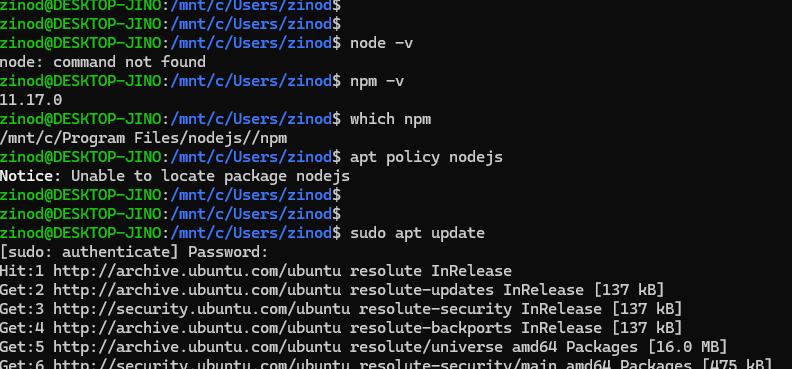

따라서 npm 버전이 출력된다는 사실만으로 WSL 내부의 Node.js 환경이 준비되었다고 판단하면 안 된다. **실행 파일이 어느 환경에 설치되어 있는지** 함께 확인해야 한다.

### Ubuntu에 Node.js와 npm 설치

이 설치에서는 Ubuntu 패키지 관리자인 apt를 사용했다. 먼저 패키지 목록과 설치 후보 버전을 확인한다.

```bash
sudo apt update
apt policy nodejs
```

캡처에서는 Node.js 22 계열이 설치 후보로 표시되었다. 배포판과 저장소에 따라 후보 버전은 달라질 수 있다.

```bash
sudo apt install -y nodejs npm
```

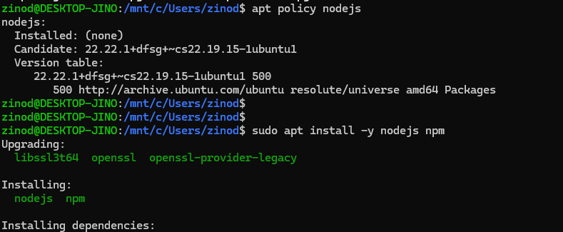

설치 후 버전과 경로를 다시 확인한다.

```bash
which node
which npm
node -v
npm -v
```

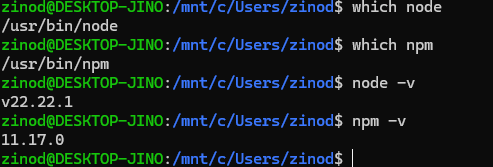

이 환경에서는 `node`와 `npm`이 각각 `/usr/bin/node`, `/usr/bin/npm`으로 확인되었다. nvm 같은 버전 관리 도구를 사용한다면 경로가 다를 수 있다. 핵심은 두 명령 모두 의도한 **WSL 내부의 설치 경로**를 사용하는 것이다.

## 3. Codex CLI 설치

이번 환경은 apt로 설치한 시스템 npm을 사용했으며, 전역 설치 위치에 쓰기 권한이 필요해 다음과 같이 설치했다.

```bash
sudo npm install -g @openai/codex
```

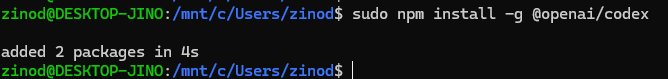

사용자 소유의 Node.js 환경이나 npm 전역 설치 경로를 사용한다면 `sudo` 없이 `npm install -g @openai/codex`로 설치한다. 위의 `sudo`는 이 글의 시스템 npm 설치 환경에 해당하며, 이후 Codex를 실행할 때 붙이는 옵션이 아니다.

설치 결과를 확인한다.

```bash
which codex
codex --version
```

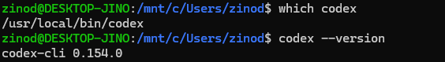

캡처에서는 `/usr/local/bin/codex`와 `codex-cli 0.154.0`이 출력되었다.

## 4. 작업 폴더에서 실행하고 로그인

### 프로젝트 폴더 선택

설치 확인 화면에서는 `/mnt/c/Users/...`에서 Codex를 실행했다. 실제 코드 작업을 시작할 때는 작업할 프로젝트 폴더로 이동한 뒤 실행하는 편이 좋다.

아직 프로젝트가 없다면 연습용 폴더를 만들 수 있다.

```bash
mkdir -p ~/projects/codex-test
cd ~/projects/codex-test
codex
```

이미 프로젝트가 있다면 해당 폴더로 이동해 `codex`를 실행한다. WSL의 Linux 홈 디렉터리 아래에 저장소를 두는 방식은 [OpenAI의 WSL 안내](https://learn.chatgpt.com/docs/windows/wsl)에서도 권장한다.

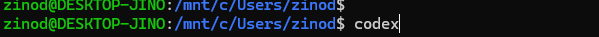

### ChatGPT 계정으로 로그인

처음 실행하면 로그인 방법을 선택하는 화면이 나온다. 여기서는 **Sign in with ChatGPT**를 선택했다.

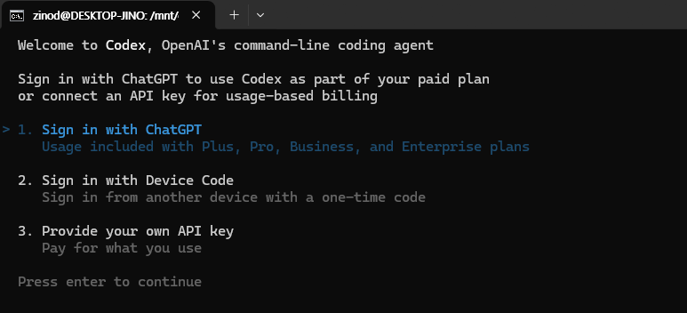

브라우저에서 계정 로그인과 인증을 마친 뒤 터미널로 돌아온다. 아래처럼 ChatGPT 계정으로 로그인했다는 메시지가 표시되면 다음 단계로 진행한다.

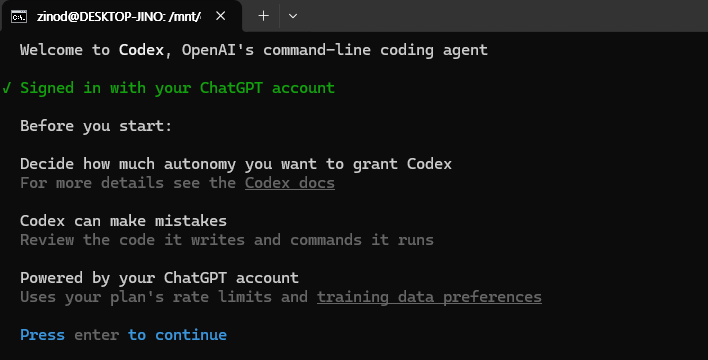

로그인 선택지와 이용 가능한 기능은 계정 및 버전에 따라 달라질 수 있다. 이 글은 ChatGPT 로그인 경로를 사용했으며, API 키 설정은 다루지 않는다.

### 디렉터리 신뢰 확인

현재 디렉터리의 내용을 신뢰하는지 묻는 화면이 나오면 표시된 경로를 확인한다.

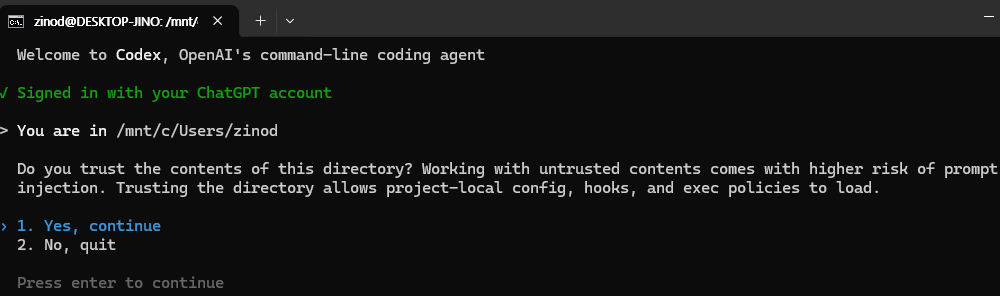

캡처에는 Windows 사용자 폴더가 표시되어 있다. 그대로 따라 승인하기보다 **자신이 작업하려는 프로젝트 경로인지** 먼저 확인한다. 경로가 잘못되었다면 종료하고 올바른 프로젝트 폴더에서 다시 실행한다.

## 5. 모델과 추론 수준 선택

여기부터 `/`로 시작하는 명령은 Ubuntu 셸이 아니라 **Codex 대화 입력창**에 입력한다.

```text
/model
```

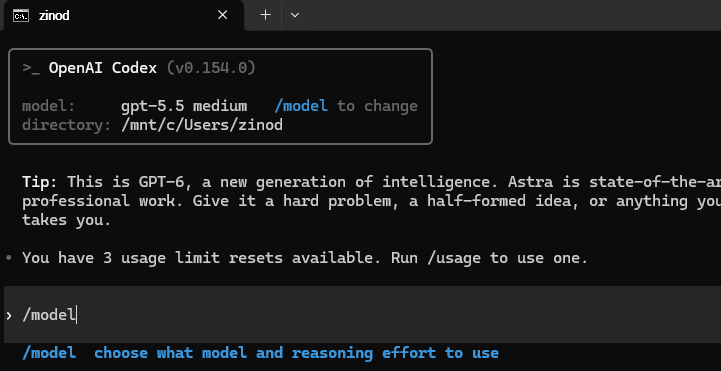

모델 선택 화면에서 사용할 모델을 고른다.

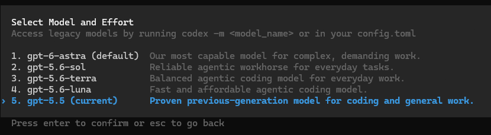

캡처 당시에는 `gpt-5.5`를 선택했다. 화면의 모델 목록은 당시 계정과 버전에서 표시된 것이므로, 같은 목록이 나온다고 가정하기보다는 현재 자신의 선택 화면을 기준으로 고르면 된다.

이어서 추론 수준을 선택하는 화면이 나왔다. 캡처에서는 `Medium`을 사용했다.

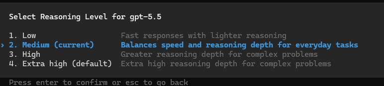

`/model`은 모델과 지원되는 추론 수준을 선택하는 명령이다. 선택 가능한 항목은 [공식 CLI 명령 문서](https://learn.chatgpt.com/docs/developer-commands?surface=cli)와 실제 실행 화면을 함께 확인한다.

### Fast 모드 확인

캡처에서는 다음 명령도 확인했다.

```text
/fast
```

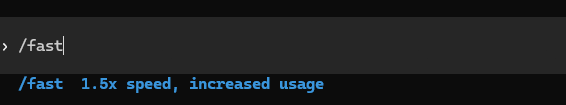

화면에는 속도 향상과 함께 사용량 증가 안내가 표시되어 있다. Fast 모드는 선택 사항이며, 사용할 모델에서 지원될 때 활성화할 수 있다. 캡처에 나온 배율을 모든 모델과 계정에 공통으로 적용되는 수치로 보지는 않는다.

## 6. 상태 표시줄 구성

모델, 현재 작업 경로, 남은 컨텍스트 등을 하단에서 확인하려면 상태 표시줄을 설정한다.

```text
/statusline
```

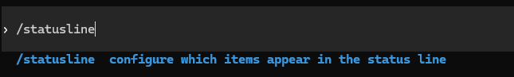

캡처에서는 다음 항목을 선택했다.

| 항목 | 표시 내용 |
| --- | --- |
| `model-with-reasoning` | 모델 이름과 추론 수준 |
| `current-dir` | 현재 작업 디렉터리 |
| `context-remaining` | 남은 컨텍스트 비율 |
| `five-hour-limit` | 5시간 사용 한도의 남은 양 |
| `weekly-limit` | 주간 사용 한도의 남은 양 |
| `total-output-tokens` | 세션에서 사용한 출력 토큰 수 |

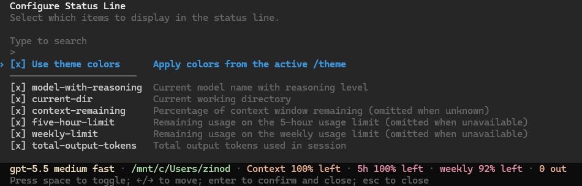

이 화면에서는 Space로 항목을 선택하거나 해제하고 Enter로 확정할 수 있다. 적용하면 하단에 선택한 정보가 표시된다.

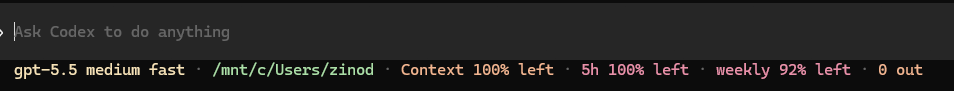

`Context`는 현재 대화의 컨텍스트 여유를 뜻한다. 계정의 사용 한도를 나타내는 5시간·주간 항목과는 다른 정보다. 사용 한도처럼 계정 정보를 필요로 하는 항목은 이용 환경에 따라 표시되지 않을 수 있다.

### 현재 세션 상태 확인

보다 자세한 상태는 다음 명령으로 확인한다.

```text
/status
```

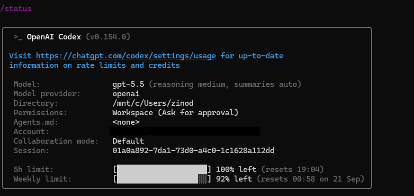

이 화면에서 모델과 작업 디렉터리, 권한 설정 등을 함께 확인할 수 있다. 설정을 바꾼 뒤 원하는 값이 적용되었는지 확인할 때 사용한다.

## 7. 이전 대화 이어가기

Codex에서 짧은 메시지를 보내 응답을 확인한 뒤 `/exit`로 종료한다. 캡처에서는 `안녕?`이라는 메시지로 동작을 확인했고, 종료 시 세션을 이어가는 명령이 표시되었다.

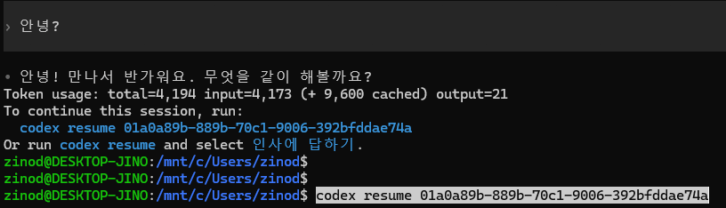

다시 이어갈 때는 **Ubuntu 셸에서** 실행한다.

```bash
codex resume
```

목록에서 이전 세션을 선택하거나, 현재 작업 디렉터리의 가장 최근 세션을 바로 이어갈 수 있다.

```bash
codex resume --last
```

특정 세션을 지정하려면 종료 화면에 표시된 `codex resume` 명령과 세션 ID를 사용한다. 캡처의 ID를 복사하는 대신 자신의 세션 ID를 사용해야 한다.

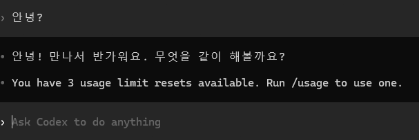

세션이 목록에 보이지 않으면 원래 작업했던 프로젝트 폴더인지 확인한다. 다른 디렉터리의 세션까지 찾을 때는 `codex resume --all`을 사용할 수 있다. 옵션은 [공식 resume 명령 설명](https://learn.chatgpt.com/docs/developer-commands?surface=cli#codex-resume)에 정리되어 있다.

## 설치 후 확인할 것

- `wsl -l -v`에서 Ubuntu가 WSL2로 구성되어 있는지 확인한다.
- `which node`, `which npm`, `which codex`로 WSL 내부 실행 파일이 잡히는지 확인한다.
- 실제 프로젝트 폴더에서 `codex`를 실행한다.
- `/model`, `/statusline`, `/status`로 현재 설정을 확인한다.
- 작업을 다시 이어갈 때는 해당 폴더에서 `codex resume`를 실행한다.

설치 과정에서 가장 헷갈렸던 부분은 WSL에서 Windows의 npm이 잡히는 상황이었다. 버전 출력과 실행 경로를 함께 확인하고 나니, Linux 환경 안에 Node.js와 Codex가 설치되었는지 구분할 수 있었다.
