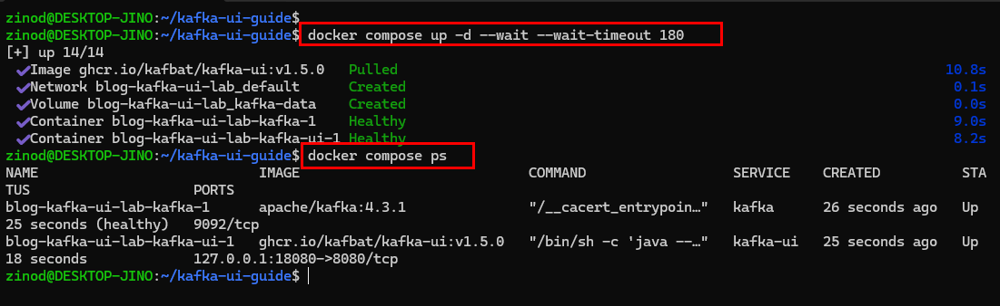
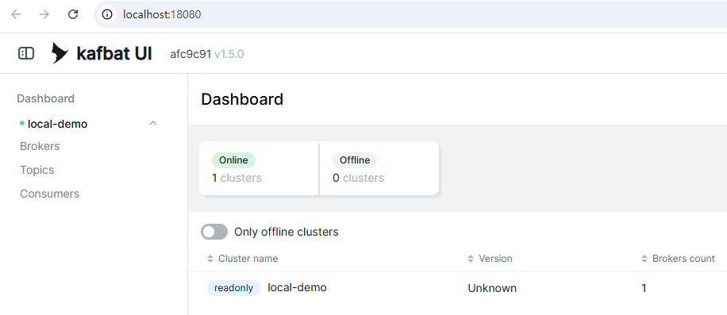
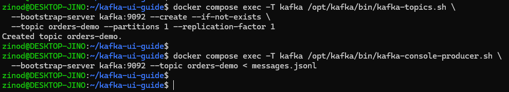
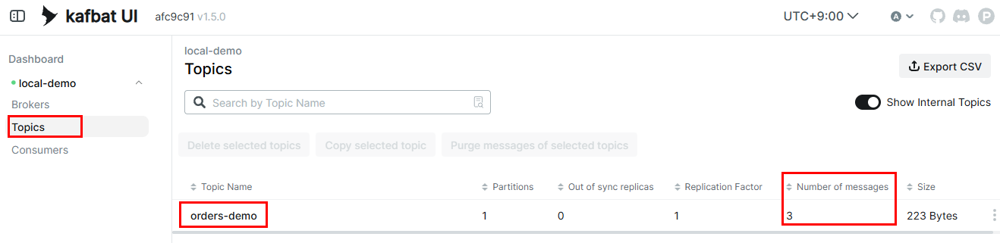
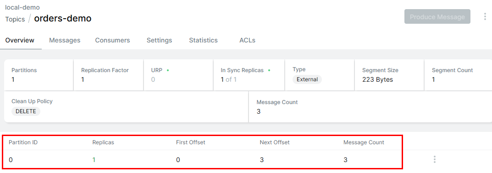
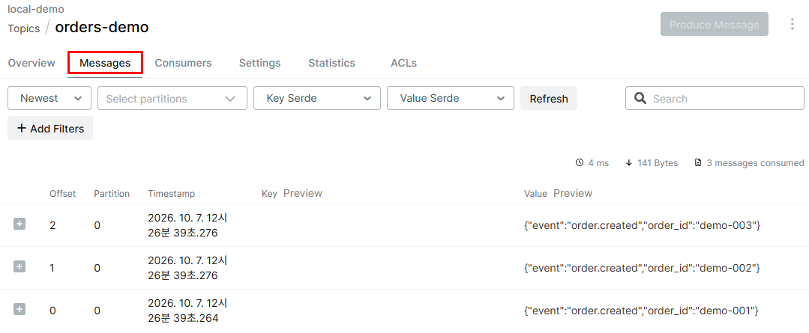
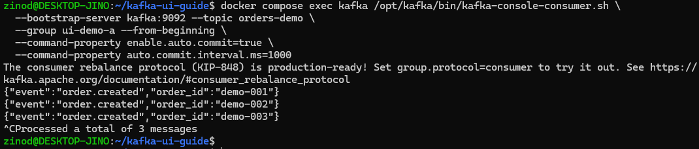
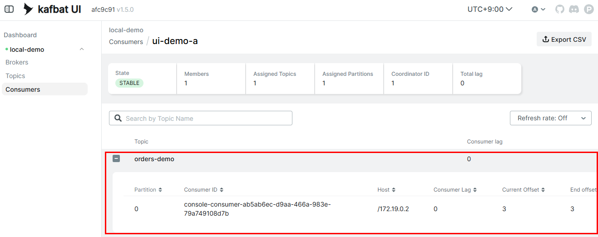
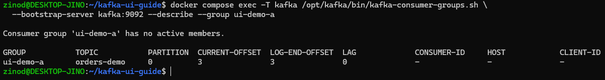
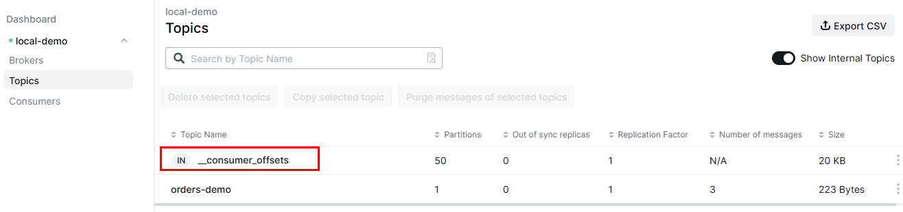

+++
title = 'Kafka를 웹에서 확인하기: Kafka UI 설치와 토픽·메시지 조회'
date = '2026-10-07T00:00:00+09:00'
draft = false
slug = 'kafka-ui-guide'
description = 'Docker Compose로 Kafka와 Kafbat UI를 실행하고 토픽·파티션·메시지를 조회한다. 주문 이벤트 3개로 소비자 그룹의 커밋된 offset과 lag, 소비 후에도 데이터가 남는 동작을 확인했다.'
tags = ['kafka', 'kafbat-ui', 'docker', 'consumer-group', 'offset']
categories = ['IT개발']
showTableOfContents = true
+++

[Kafka와 RabbitMQ 비교 실습](/posts/kafka-vs-rabbitmq-guide/)에서는 Kafka 메시지를 터미널로 읽었다. 이번에는 **Kafbat UI를 설치해 토픽에 저장된 메시지와 소비자 그룹의 읽기 위치를 웹에서 확인**했다.

주문 이벤트 3개를 발행하고 소비한 뒤, 그룹의 커밋된 offset은 `3`, lag는 `0`이 됐다. 반면 토픽의 메시지는 여전히 3개였다. 소비자를 종료해도 커밋된 offset은 남았다. 화면에 보이는 이 값들이 각각 무엇을 의미하는지 실행 과정과 함께 정리한다.

## 1. 실습 구성

Kafbat UI는 Kafka 클러스터의 토픽·메시지·소비자 그룹 등을 조회하는 별도 웹 도구다. Kafka 브로커 자체에 관리 화면을 추가하는 설정이 아니라, **Kafka에 접속하는 UI 서비스를 함께 실행**한다. [Kafbat UI 공식 저장소](https://github.com/kafbat/kafka-ui)

| 항목 | 이번 실습 |
| --- | --- |
| 실행 환경 | Windows + Docker Desktop + WSL Ubuntu |
| Kafka | `apache/kafka:4.3.1`, 단일 노드 KRaft |
| Kafka UI | `ghcr.io/kafbat/kafka-ui:v1.5.0` |
| 웹 접속 | `http://localhost:18080/` |
| 토픽 / 그룹 | `orders-demo` / `ui-demo-a` |
| 입력 데이터 | `order.created` 메시지 3개 |
| 확인 날짜 | 2026년 10월 7일 |

Docker가 없다면 [Docker Desktop 설치와 WSL 연동](/posts/docker-desktop-wsl-setup/)을 먼저 완료한다. Python과 Java는 호스트에 따로 설치하지 않는다. Kafka 명령은 컨테이너 안에서 실행한다.

이번 구성은 이전 비교 실습과 별개의 Kafka다. 기존 컨테이너를 수정하지 않고, 새 토픽에 동일한 테스트 메시지 3개를 발행한다. 단일 노드이므로 복제·장애 전환을 검증하는 구성은 아니다.

### 실습 파일

아래 두 파일을 같은 작업 디렉터리에 준비한다. 캡처에서는 `~/kafka-ui-guide`를 사용했다. 이후 명령은 모두 해당 디렉터리의 **WSL Bash 터미널**에서 실행한다.

- [compose.yaml](compose.yaml): Kafka와 Kafbat UI 설정
- [messages.jsonl](messages.jsonl): 주문 이벤트 테스트 데이터

```text
kafka-ui-guide/
  compose.yaml
  messages.jsonl
```

`messages.jsonl`의 내용은 다음과 같다. 실제 주문 정보가 아닌 테스트 데이터다.

```jsonl
{"event":"order.created","order_id":"demo-001"}
{"event":"order.created","order_id":"demo-002"}
{"event":"order.created","order_id":"demo-003"}
```

## 2. Docker Compose로 Kafka와 UI 실행

`compose.yaml`은 다음과 같이 구성했다.

```yaml
name: blog-kafka-ui-lab

services:
  kafka:
    image: apache/kafka:4.3.1
    environment:
      KAFKA_NODE_ID: 1
      KAFKA_PROCESS_ROLES: broker,controller
      KAFKA_LISTENERS: PLAINTEXT://:9092,CONTROLLER://:9093
      KAFKA_ADVERTISED_LISTENERS: PLAINTEXT://kafka:9092
      KAFKA_LISTENER_SECURITY_PROTOCOL_MAP: PLAINTEXT:PLAINTEXT,CONTROLLER:PLAINTEXT
      KAFKA_INTER_BROKER_LISTENER_NAME: PLAINTEXT
      KAFKA_CONTROLLER_LISTENER_NAMES: CONTROLLER
      KAFKA_CONTROLLER_QUORUM_VOTERS: 1@kafka:9093
      CLUSTER_ID: 4L6g3nShT-eMCtK--X86sw
      KAFKA_OFFSETS_TOPIC_REPLICATION_FACTOR: 1
      KAFKA_TRANSACTION_STATE_LOG_REPLICATION_FACTOR: 1
      KAFKA_TRANSACTION_STATE_LOG_MIN_ISR: 1
      KAFKA_GROUP_INITIAL_REBALANCE_DELAY_MS: 0
      KAFKA_LOG_DIRS: /var/lib/kafka/data
    volumes:
      - kafka-data:/var/lib/kafka/data
    healthcheck:
      test: ["CMD", "/opt/kafka/bin/kafka-topics.sh", "--bootstrap-server", "kafka:9092", "--list"]
      interval: 10s
      timeout: 10s
      retries: 12
      start_period: 30s

  kafka-ui:
    image: ghcr.io/kafbat/kafka-ui:v1.5.0
    depends_on:
      kafka:
        condition: service_healthy
    ports:
      - "127.0.0.1:18080:8080"
    environment:
      KAFKA_CLUSTERS_0_NAME: local-demo
      KAFKA_CLUSTERS_0_BOOTSTRAPSERVERS: kafka:9092
      KAFKA_CLUSTERS_0_READONLY: "true"
      DYNAMIC_CONFIG_ENABLED: "false"

volumes:
  kafka-data:
```

Kafka의 broker와 controller를 한 컨테이너에서 실행하고, 데이터는 `kafka-data` named volume에 저장한다. ZooKeeper는 사용하지 않는다. Kafka의 포트는 호스트에 공개하지 않고, UI만 `127.0.0.1:18080`에 공개한다.

### Compose에서 Kafka 연결 주소를 kafka:9092로 설정한 이유

`compose.yaml`의 `KAFKA_CLUSTERS_0_BOOTSTRAPSERVERS: kafka:9092`는 **UI 컨테이너가 Kafka에 접속할 주소**다. UI 컨테이너에서 `localhost`는 Kafka가 아니라 UI 자신을 가리키므로, 같은 Compose 네트워크의 Kafka 서비스 이름인 `kafka`와 포트 `9092`를 사용한다.

반면 **Windows 브라우저에서 UI에 접속할 주소는 `http://localhost:18080/`**다. 브라우저의 UI 접속 주소와 Compose 내부의 Kafka 연결 주소를 구분해야 한다.

bootstrap 주소만 맞추면 끝나는 것도 아니다. Kafka는 접속한 클라이언트에 브로커 주소를 알려 주므로, `KAFKA_ADVERTISED_LISTENERS`도 UI가 접근할 수 있는 `kafka:9092`로 지정했다. 이 주소는 컨테이너 간 접속용이며 Windows 브라우저에 입력하는 주소가 아니다. [Kafka advertised.listeners](https://kafka.apache.org/43/configuration/broker-configs/)

### 조회 전용으로 설정

`KAFKA_CLUSTERS_0_READONLY=true`로 UI의 변경 기능을 제한했다. 토픽 생성과 메시지 발행은 CLI에서 수행한다. 실제 화면에서도 **Produce Message**, 토픽 삭제 등의 버튼이 비활성화되어 있다. [Kafbat UI 설정](https://ui.docs.kafbat.io/configuration/misc-configuration-properties)

> 조회 전용 UI가 Kafka의 인증·ACL을 대신하는 것은 아니다. 이번 구성은 로그인과 TLS가 없는 로컬 실습용이다. 인터넷이나 LAN에 공개하지 않는다.

### 실행과 접속

```bash
docker compose config --quiet
docker compose up -d --wait --wait-timeout 180
docker compose ps
```

이번 실행에서는 Kafka와 UI가 모두 `healthy`로 표시됐다. UI의 호스트 포트는 `127.0.0.1:18080->8080/tcp`로 확인했다.



Windows 브라우저에서 `http://localhost:18080/`에 접속한다. Dashboard에 `Online 1 clusters`, `Offline 0 clusters`가 표시됐고, `local-demo` 클러스터의 브로커 수는 1이었다. 버전 칸은 `Unknown`으로 표시됐지만, 이후 토픽·메시지 조회는 정상적으로 동작했다. 사용한 Kafka 버전은 Compose 이미지 태그로 확인한다.



## 3. 토픽 생성과 메시지 조회

### 주문 이벤트 3개 발행

파티션 1개, 복제본 1개인 `orders-demo` 토픽을 만들고 파일의 세 줄을 발행한다.

```bash
docker compose exec -T kafka /opt/kafka/bin/kafka-topics.sh \
  --bootstrap-server kafka:9092 --create --if-not-exists \
  --topic orders-demo --partitions 1 --replication-factor 1

docker compose exec -T kafka /opt/kafka/bin/kafka-console-producer.sh \
  --bootstrap-server kafka:9092 --topic orders-demo < messages.jsonl
```

`-T`는 가상 터미널 할당을 끄는 옵션이다. producer는 파일 내용을 표준 입력으로 받아 발행하고 종료하므로, 별도 성공 메시지가 출력되지 않아도 다음 화면에서 데이터를 확인한다.



**producer를 반복 실행하면 메시지가 3개씩 추가된다.** 처음 실습에서는 한 번만 발행한다. `--if-not-exists`도 기존 토픽을 초기화하는 옵션은 아니다.

### Topics와 Overview

왼쪽 **Topics**를 선택하면 `orders-demo`가 표시된다. `Partitions 1`, `Replication Factor 1`, `Number of messages 3`을 확인했다.



토픽 이름을 클릭하면 **Overview**가 열린다. 아래 파티션 표에서 `Partition ID 0`, `First Offset 0`, `Next Offset 3`, `Message Count 3`을 확인했다.



offset은 파티션 안에서 각 레코드의 위치를 나타낸다. 새 토픽에 발행한 세 메시지의 offset은 `0`, `1`, `2`이고, 끝의 다음 위치는 `3`이다. **`Next Offset 3`이 offset 3인 메시지가 이미 있다는 뜻은 아니다.** [Kafka offset 설명](https://kafka.apache.org/43/javadoc/org/apache/kafka/clients/consumer/KafkaConsumer.html)

### Messages에서 본문 확인

**Messages** 탭에서 주문 이벤트의 JSON 본문을 확인했다. 이번 화면은 `Newest`로 설정되어 있어 최신 메시지가 위에 표시됐다.



| 주문 번호 | Partition | Offset |
| --- | ---: | ---: |
| `demo-001` | 0 | 0 |
| `demo-002` | 0 | 1 |
| `demo-003` | 0 | 2 |

화면의 정렬이 최신순이라는 것과 Kafka의 저장 순서는 구분해야 한다. `3 messages consumed`도 **UI가 조회한 결과**이지, 아래에서 사용할 `ui-demo-a` 그룹의 커밋 완료를 뜻하지 않는다.

## 4. 소비자 그룹의 offset과 lag 확인

### 콘솔 소비자로 읽기

`ui-demo-a` 그룹으로 메시지를 읽고 자동 offset 커밋을 활성화한다.

```bash
docker compose exec kafka /opt/kafka/bin/kafka-console-consumer.sh \
  --bootstrap-server kafka:9092 --topic orders-demo \
  --group ui-demo-a --from-beginning \
  --command-property enable.auto.commit=true \
  --command-property auto.commit.interval.ms=1000
```

이 명령은 메시지 3개를 읽은 뒤에도 새 메시지를 기다린다. 출력 직후 바로 종료하지 말고, 잠시 유지한 상태에서 UI의 그룹 정보를 확인한다. 이후 `Ctrl+C`로 종료한다. 캡처에서는 주문 이벤트 3개와 `Processed a total of 3 messages`가 출력됐다.



Kafka 4.3.1에서는 `--consumer-property`가 deprecated이므로 `--command-property`를 사용했다. KIP-848 문구는 소비자 프로토콜에 대한 안내이며 오류가 아니다. 이번 실습에서 별도로 프로토콜을 변경하지는 않았다. [Kafka 콘솔 소비자 옵션](https://github.com/apache/kafka/blob/4.3.1/tools/src/main/java/org/apache/kafka/tools/consumer/ConsoleConsumerOptions.java)

이미 커밋된 offset이 있는 그룹은 `--from-beginning`만으로 처음부터 다시 읽지 않는다. 재조회할 때는 새 그룹명을 사용하거나 별도로 읽기 위치를 조정해야 한다.

### Consumers에서 그룹의 위치 확인

왼쪽 **Consumers**에서 `ui-demo-a`를 열고 `orders-demo` 행을 펼친다. 캡처에서는 `State STABLE`, `Members 1`이 표시됐으며, 파티션 0의 `Current Offset 3`, `End offset 3`, `Consumer Lag 0`을 확인했다.




| 항목 | 이번 값 | 의미 |
| --- | ---: | --- |
| Current Offset | 3 | 그룹이 커밋한 다음 읽기 위치 |
| End offset | 3 | 파티션 끝의 다음 위치 |
| Consumer Lag | 0 | 이번 데이터에서 끝 위치와 커밋된 위치의 차이 |


**마지막으로 읽은 메시지는 offset 2이고, 커밋된 다음 위치는 3이다.** 파티션이 여러 개면 그룹의 커밋된 위치도 파티션별로 확인해야 한다. 실행 중 소비자의 현재 읽기 위치와 브로커에 커밋된 위치는 별개이며, 커밋 전에는 둘이 다를 수 있다. [Kafka 현재 위치와 커밋된 위치](https://kafka.apache.org/43/javadoc/org/apache/kafka/clients/consumer/KafkaConsumer.html)

이번 소비자는 내용을 터미널에 출력하는 예제다. `Lag 0`이 실제 결제·메일 발송·DB 저장까지 완료됐다는 뜻은 아니다. 애플리케이션이 처리를 완료한 뒤 해당 위치를 커밋하도록 설계해야 작업 완료 판단에 사용할 수 있다.

### 종료 후에도 커밋된 offset은 남는다

소비자를 종료한 뒤 CLI에서도 확인했다.

```bash
docker compose exec -T kafka /opt/kafka/bin/kafka-consumer-groups.sh \
  --bootstrap-server kafka:9092 --describe --group ui-demo-a
```



`has no active members`는 현재 실행 중인 그룹 멤버가 없다는 뜻이다. 오류나 offset 삭제를 의미하지 않는다. 실제 출력에서도 `CURRENT-OFFSET 3`, `LOG-END-OFFSET 3`, `LAG 0`이 남아 있었다. 따라서 같은 그룹을 다시 실행하면 저장된 위치에서 재개할 수 있다. 데이터와 그룹 offset이 보관 정책에 따라 남아 있는 조건에서 가능한 동작이다.

## 5. 메시지를 읽어도 토픽은 비워지지 않는다

그룹 offset을 확인하는 과정에서 Topics 목록에는 `orders-demo`의 메시지 수가 여전히 3으로 표시됐다. **offset 커밋은 그룹의 재개 위치를 저장하는 것이지, 토픽 메시지를 삭제하는 동작이 아니다.**



목록의 `__consumer_offsets`는 그룹의 커밋된 offset 등을 관리하는 Kafka 내부 토픽이다. **Show Internal Topics**를 활성화하면 함께 표시된다. 주문 이벤트를 발행할 대상이 아니므로 수정·삭제하지 않는다. [Kafka 그룹 offset 관리](https://kafka.apache.org/43/implementation/distribution/)

토픽 데이터를 무기한 보관하는 것은 아니다. 이번 Overview에는 `Clean Up Policy DELETE`가 표시됐다. 보관 기간·용량에 따라 오래된 데이터가 삭제될 수 있으며, 소비자가 아직 읽지 않았다고 반드시 남겨 두는 것도 아니다. 재조회가 필요하면 필요한 기간에 맞춰 보관 정책을 정해야 한다. [Kafka 토픽 보관 정책](https://kafka.apache.org/43/configuration/topic-configs/)

## 6. 접속 확인과 실습 정리

### 화면이나 클러스터가 열리지 않는다면

아래 항목은 문제 발생 시 확인할 기준이며, 이번 캡처에서 발생한 오류는 아니다.

- 웹에 접속되지 않으면 `docker compose ps`와 `docker compose logs --tail=100 kafka-ui`로 UI 상태를 확인한다. 브라우저 주소는 `http://localhost:18080/`이다.
- UI는 열리지만 클러스터가 Offline이면 `docker compose logs --tail=100 kafka`와 bootstrap·advertised 주소를 확인한다. 이번 구성에서는 둘 다 `kafka:9092`를 사용한다.
- `18080` 포트가 이미 사용 중이면 기존 서비스를 종료하지 말고 Compose의 호스트 포트만 변경한다. UI의 컨테이너 포트 `8080`은 그대로 둔다.
- 메시지 수나 offset이 캡처와 다르면 발행 횟수와 기존 그룹 offset을 먼저 확인한다. UI 메시지 조회만으로 그룹의 커밋 여부를 판단하지 않는다.

### 데이터 유지와 삭제

잠시 중지할 때는 다음 명령을 사용한다. 다시 실행할 때는 `docker compose start`를 사용한다.

```bash
docker compose stop
```

이번 구성의 Kafka 데이터는 `kafka-data` named volume에 저장된다. `docker compose down`으로 컨테이너를 제거해도 해당 볼륨은 유지된다. **실습 데이터까지 삭제할 때만**, 이 Compose 작업 디렉터리에서 다음 명령을 실행한다.

```bash
docker compose down --volumes
```

이 명령은 이번 프로젝트의 Kafka 데이터 볼륨도 삭제한다. 캡처와 필요한 데이터를 확보한 뒤 실행한다. [Docker Compose 정리 명령](https://docs.docker.com/reference/cli/docker/compose/down/)

## 마무리

Kafbat UI에서 주문 이벤트의 offset `0·1·2`와 그룹의 커밋된 offset `3`을 확인했다. 소비자를 종료해도 그룹 위치는 남았고, 토픽의 메시지 3개도 제거되지 않았다.

**Messages는 토픽에 무엇이 저장돼 있는지, Consumers는 각 그룹이 어디까지 커밋했는지 확인하는 화면**이다. 두 화면을 함께 보면 데이터 보관 상태와 소비 진행 상태를 구분할 수 있다.
