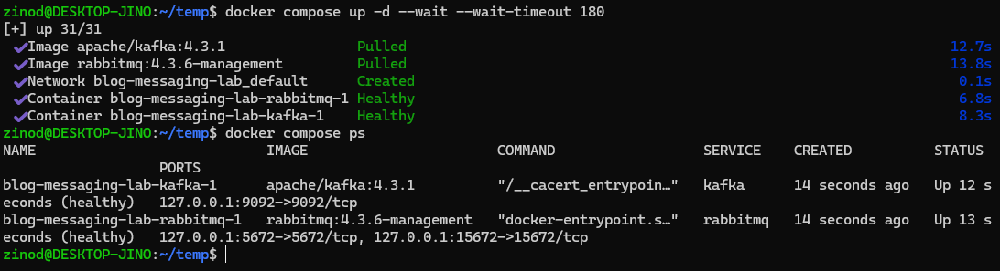
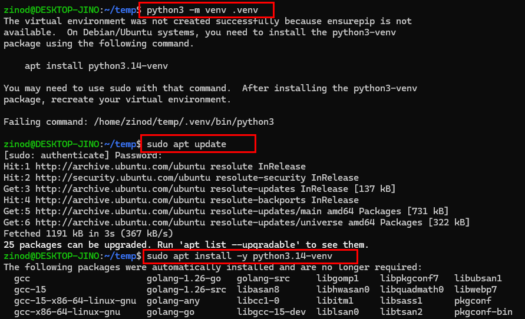
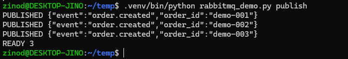
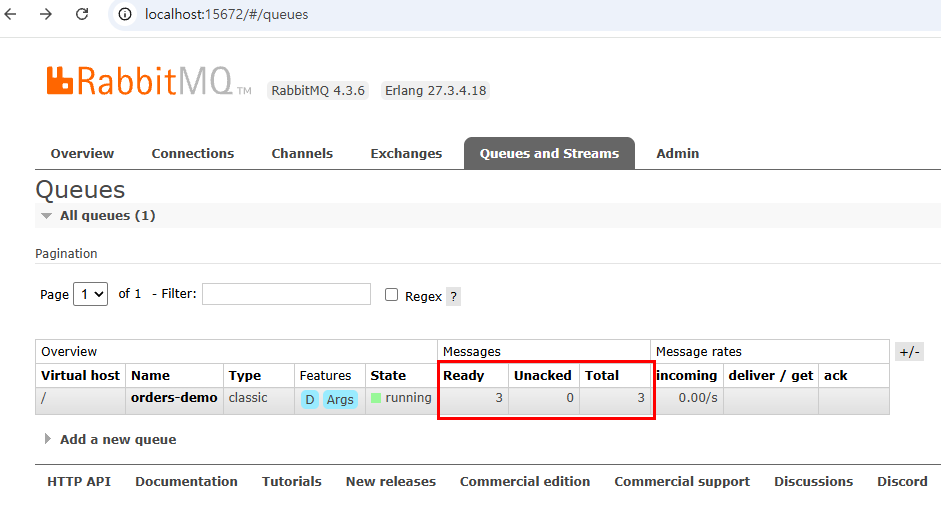
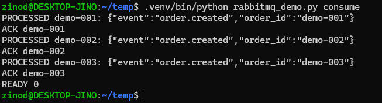
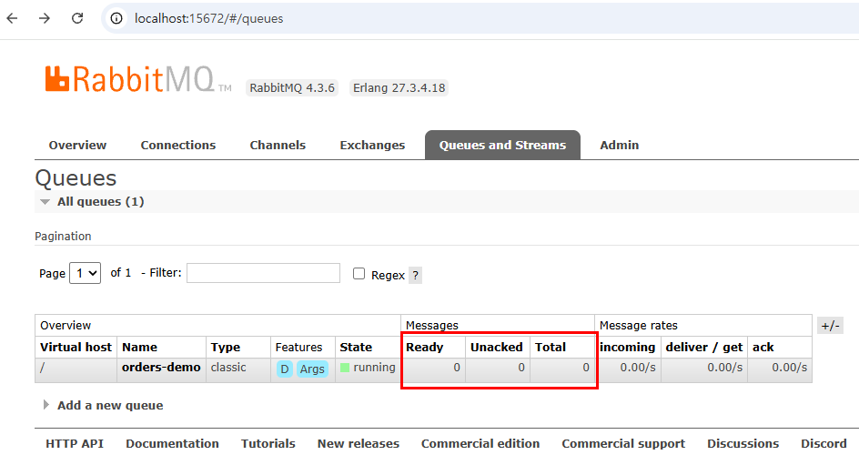
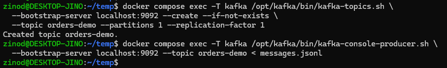
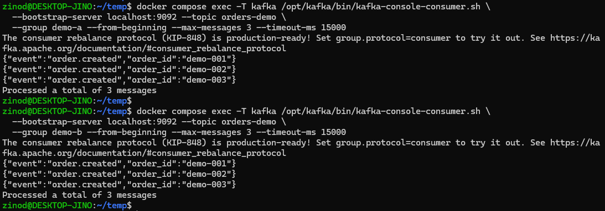

+++
title = 'Kafka와 RabbitMQ, 무엇이 다를까? 직접 실행하며 비교하기'
date = '2026-10-07T00:00:00+09:00'
draft = false
slug = 'kafka-vs-rabbitmq-guide'
description = 'Docker로 Kafka와 RabbitMQ에 같은 메시지 3개를 전송했다. ACK와 offset 커밋, 재전달과 재조회, RabbitMQ Streams의 차이를 구분하고 라우팅·보관·병렬 처리 기준으로 비교한다.'
tags = ['kafka', 'rabbitmq', 'docker', 'messaging', 'event-streaming']
categories = ['IT개발']
showTableOfContents = true
+++

Kafka와 RabbitMQ는 모두 서비스 사이에서 메시지를 전달할 때 사용한다. 하지만 “RabbitMQ는 한 번만 읽고, Kafka는 여러 번 읽는다”로 구분하면 정확하지 않다. RabbitMQ도 미확인 메시지를 재전달할 수 있고, Streams로 보관된 메시지를 다시 읽을 수 있다.

핵심은 **처리 완료가 메시지 제거로 이어지는가, 데이터를 남겨 두고 읽기 위치를 관리하는가**다.

Docker에서 두 서비스를 실행하고 같은 주문 메시지 3개를 보냈다. RabbitMQ에서는 소비자가 명시적으로 ACK를 보낸 뒤 큐가 비었고, Kafka에서는 서로 다른 소비자 그룹이 같은 메시지 3개를 각각 읽었다. 먼저 이 차이를 짚고, 실제 실행 과정을 살펴본다.

## 1. 재전달과 재조회는 다르다

### 조회·재전달·재조회 구분

메시지를 “다시 읽는다”는 표현에는 서로 다른 동작이 섞여 있다.


| 동작 | 목적 | 예시 |
| --- | --- | --- |
| 메시지 조회(Browse) | 큐의 메시지를 제거하지 않고 내용 확인 | IBM MQ의 queue browsing |
| 재전달(redelivery) | 완료 확인을 받지 못한 메시지를 다시 전달 | RabbitMQ의 미확인 메시지 requeue |
| 재조회(replay) | 처리했던 데이터도 보관 범위에서 다시 읽기 | Kafka의 offset 이동, RabbitMQ Streams |


IBM MQ의 queue browsing은 메시지를 제거하지 않는 조회다. **메시지를 가져온 뒤 ACK나 트랜잭션 커밋을 미루는 것과는 다른 기능**이다. 여기서 IBM MQ는 Browse 개념을 설명하는 예시이며, 아래 실습 대상은 아니다. [IBM MQ Browse 설명](https://public.dhe.ibm.com/software/iea/content/com.ibm.iea.wmq_v7/wmq/7.0/MQI/iea_340_wmqv7_API_4_BrowseMark.pdf)

RabbitMQ 관리 HTTP API도 메시지를 가져와 다시 큐에 넣는 `ack_requeue_true` 옵션을 제공한다. 다만 **가져오기와 requeue로 큐 상태가 바뀌므로**, IBM MQ의 Browse와 같다고 보면 안 된다. 이 API는 개발·문제 확인용이며 운영 소비자 구현용으로 권장되지 않는다. [RabbitMQ 메시지 조회 API](https://www.rabbitmq.com/docs/http-api-reference#post-apiqueuesvhostnameget)

### ACK·confirm·commit은 무엇을 확인하는가


| 용어 | 확인·확정하는 대상 |
| --- | --- |
| RabbitMQ consumer ACK | 소비자가 전달받은 메시지의 처리 완료를 브로커에 알림 |
| RabbitMQ publisher confirm | 브로커가 발행자에게 메시지 수신을 확인. 소비자의 처리 완료 확인은 아님 |
| Kafka offset commit | 그룹·파티션별로 다음에 재개할 읽기 위치를 저장. 토픽 데이터 삭제는 아님 |
| IBM MQ 트랜잭션 commit | 트랜잭션에 포함된 MQGET·MQPUT 작업을 확정 |


RabbitMQ의 **명시적 ACK(수동 ACK)**는 자동 ACK 대신 애플리케이션이 처리 후 `basic_ack`를 호출하는 방식이다. 사람이 직접 확인한다는 뜻은 아니다. publisher confirm은 반대 방향인 브로커의 발행 확인이며, consumer ACK와 독립적이다. [RabbitMQ ACK와 publisher confirm](https://www.rabbitmq.com/docs/confirms)

IBM MQ에서는 `MQGMO_SYNCPOINT`로 메시지를 가져온 뒤 트랜잭션을 commit하면 제거가 확정되고, backout하면 메시지가 큐에 복원된다. 따라서 “메시지를 가져온 뒤 commit했는가”는 이 방식에 맞는 설명이다. 다만 Kafka의 offset commit이나 RabbitMQ의 consumer ACK와 동일한 기능은 아니다. [IBM MQ 트랜잭션과 메시지 처리](https://www.ibm.com/docs/en/ibm-mq/9.4.x?topic=scenarios-introducing-units-work)

### 이번 실습의 비교 범위

이번 실습에서 비교하는 대상은 **RabbitMQ classic queue**와 **Kafka의 일반 소비자 그룹**이다.


| 기준 | RabbitMQ classic queue | Kafka 일반 소비자 그룹 |
| --- | --- | --- |
| 메시지 처리 후 | ACK를 받으면 해당 메시지를 큐에서 제거 | 읽었다는 이유만으로 토픽에서 제거하지 않음 |
| 완료 확인·재개 기준 | 전달된 메시지별 ACK | 그룹·파티션별 커밋된 offset |
| 작업 분담 | 같은 큐의 소비자에게 메시지를 분배 | 같은 그룹의 소비자에게 파티션을 분배 |
| 미완료 처리 재시도 | 미확인 메시지를 requeue하여 재전달 | 커밋된 위치에서 재개하거나 읽기 위치를 이동 |
| 완료된 데이터 재조회 | ACK로 제거된 메시지는 그 큐에서 다시 읽을 수 없음 | 커밋 후에도 데이터가 남아 있으면 가능 |
| 먼저 검토할 용도 | 메일 발송, 이미지 변환 등 작업 전달 | 주문 이벤트 보관, 서비스별 독립 소비와 재처리 |


이번 비교에서 RabbitMQ의 consumer ACK는 해당 큐의 메시지 제거로 이어지지만, Kafka의 offset commit은 토픽 데이터를 남겨 둔다. 또한 커밋하지 않아도 실행 중인 Kafka 소비자의 현재 위치는 `poll()`로 읽을 때 진행된다. [RabbitMQ ACK 설명](https://www.rabbitmq.com/docs/confirms), [Kafka 현재 위치와 커밋된 위치](https://kafka.apache.org/43/javadoc/org/apache/kafka/clients/consumer/KafkaConsumer.html)

Kafka는 이벤트를 토픽에 보관하고 소비자가 읽은 위치를 관리한다. 한 소비자 그룹이 읽어도 다른 그룹이 같은 이벤트를 읽을 수 있으며, 삭제 시점은 보관 기간·용량과 정리 정책에 영향을 받는다. `cleanup.policy=delete`는 오래된 데이터를 정리하고, `compact`는 같은 key의 최신 값을 남기는 방식이므로 모든 변경 이력을 보존하지는 않는다. **소비자가 아직 읽지 않았더라도 보관 정책에 따라 데이터가 삭제될 수 있다.** [Kafka 소개](https://kafka.apache.org/intro/), [토픽 보관 설정](https://kafka.apache.org/43/configuration/topic-configs/)

RabbitMQ Streams도 메시지를 로그에 보관하고 offset을 지정해 다시 읽을 수 있다. classic/quorum queue와는 소비 방식이 다르며, 기존 큐를 그대로 쓰면서 ACK만 생략하면 Streams가 되는 것은 아니다. [RabbitMQ Streams](https://www.rabbitmq.com/docs/streams)

## 2. 실습 환경 준비

Windows의 Docker Desktop을 WSL Ubuntu와 연동한 환경에서 진행했다. Docker가 없다면 [Docker Desktop 설치와 WSL 연동](/posts/docker-desktop-wsl-setup/)을 먼저 완료한다.

| 항목 | 이번 실습 |
| --- | --- |
| 실행 환경 | Windows + Docker Desktop + WSL Ubuntu |
| Docker Desktop / Engine | 4.94.0 / 29.8.2 |
| Kafka 이미지 | `apache/kafka:4.3.1` |
| RabbitMQ 이미지 | `rabbitmq:4.3.6-management` |
| Python 클라이언트 | `pika==1.3.2` |
| 입력 데이터 | `order.created` 메시지 3개 |
| 구성 | Kafka 1노드, RabbitMQ 1노드 |
| 확인 날짜 | 2026년 10월 7일 |

서비스는 기능 비교용으로 각각 한 대만 실행한다. 장애 전환이나 처리량을 측정하는 실험은 아니다.

### 실습 파일

다음 네 파일을 같은 작업 디렉터리에 준비한다. 아래 명령은 모두 해당 디렉터리의 **WSL Bash 터미널**에서 실행한다. 캡처에서는 `~/temp`를 사용했다.

- [compose.yaml](compose.yaml): 두 서비스와 포트 설정
- [messages.jsonl](messages.jsonl): 공통 주문 메시지
- [requirements.txt](requirements.txt): Python 패키지
- [rabbitmq_demo.py](rabbitmq_demo.py): RabbitMQ 발행·명시적 ACK 실습 코드

```text
kafka-rabbitmq-lab/
  compose.yaml
  messages.jsonl
  requirements.txt
  rabbitmq_demo.py
```

`messages.jsonl`은 실제 주문 데이터가 아니라 다음 세 줄의 테스트 데이터다.

```jsonl
{"event":"order.created","order_id":"demo-001"}
{"event":"order.created","order_id":"demo-002"}
{"event":"order.created","order_id":"demo-003"}
```

### Docker Compose 구성

`compose.yaml`의 내용은 다음과 같다.

```yaml
name: blog-messaging-lab

services:
  kafka:
    image: apache/kafka:4.3.1
    ports:
      - "127.0.0.1:9092:9092"
    healthcheck:
      test: ["CMD", "/opt/kafka/bin/kafka-topics.sh", "--bootstrap-server", "localhost:9092", "--list"]
      interval: 10s
      timeout: 10s
      retries: 12
      start_period: 30s

  rabbitmq:
    image: rabbitmq:4.3.6-management
    environment:
      RABBITMQ_DEFAULT_USER: bloglab
      RABBITMQ_DEFAULT_PASS: local-lab-only
    ports:
      - "127.0.0.1:5672:5672"
      - "127.0.0.1:15672:15672"
    healthcheck:
      test: ["CMD", "rabbitmq-diagnostics", "-q", "check_port_connectivity"]
      interval: 10s
      timeout: 10s
      retries: 12
      start_period: 20s
```

포트는 `127.0.0.1`에만 공개했다. `bloglab / local-lab-only`는 로컬 실습 계정이며, 공개 서버나 운영 환경에 사용하지 않는다. Kafka 명령은 컨테이너 안에서 실행하므로 호스트에 Java나 Kafka를 따로 설치하지 않아도 된다. [Kafka Docker 실행 안내](https://kafka.apache.org/quickstart/)

```bash
docker version
docker compose config --quiet
docker compose up -d --wait --wait-timeout 180
docker compose ps
```

첫 실행에서는 이미지를 내려받은 뒤 두 컨테이너가 모두 `Healthy`로 표시됐다.



시작에 실패하면 `docker compose logs kafka rabbitmq`로 로그를 확인한다. `9092`, `5672`, `15672` 포트를 다른 서비스가 사용 중인지도 살펴본다.

### Python 가상환경과 실제 발생한 오류

RabbitMQ 실습 코드는 Python의 Pika 클라이언트를 사용한다.

```bash
python3 -m venv .venv
.venv/bin/python -m pip install -r requirements.txt
```

이번 Ubuntu에서는 첫 번째 명령이 `ensurepip is not available` 오류로 실패했다. 오류 메시지에 안내된 `python3.14-venv`를 설치한 뒤 가상환경을 다시 만들었다.



```bash
sudo apt update
sudo apt install -y python3.14-venv
python3 -m venv .venv
.venv/bin/python -m pip install -r requirements.txt
```

`python3.14-venv`는 이번 Python 버전에 해당하는 패키지다. 다른 환경에서는 `python3 --version`과 오류 메시지를 확인해 버전에 맞는 venv 패키지를 설치한다. 설치 후에는 `pika-1.3.2` 설치 성공을 확인했다.

## 3. RabbitMQ에서 메시지 발행과 ACK 확인

### 처리 전에는 Ready 3

```bash
.venv/bin/python rabbitmq_demo.py publish
```

스크립트가 `orders-demo` classic queue를 만들고 메시지 3개를 발행한다. 터미널에는 주문 번호별 `PUBLISHED`와 `READY 3`이 출력됐다.



Windows 브라우저에서 `http://localhost:15672/`에 접속하고 `bloglab / local-lab-only`로 로그인한다. **Queues and Streams**에서 `orders-demo`를 확인한다.



| 항목 | 의미 | 확인한 값 |
| --- | --- | ---: |
| Ready | 소비자에게 전달할 수 있는 대기 메시지 | 3 |
| Unacked | 전달됐지만 아직 ACK를 받지 않은 메시지 | 0 |
| Total | Ready와 Unacked의 합계 | 3 |

### 처리 후에는 Ready 0

```bash
.venv/bin/python rabbitmq_demo.py consume
```

이번 코드는 메시지를 하나씩 가져와 내용을 출력하고 명시적으로 consumer ACK를 보낸다. 실제 결제나 주문 처리는 수행하지 않는다. 핵심은 자동 ACK를 끄고, 처리 단계 뒤에 ACK를 보내는 부분이다.

```python
method, _, body = channel.basic_get(queue=QUEUE, auto_ack=False)
# 메시지를 확인하고 예제 처리 결과를 출력한 뒤 실행
channel.basic_ack(delivery_tag=method.delivery_tag)
```

위 코드는 흐름을 설명하는 발췌이며, 빈 큐 확인 등을 포함한 전체 코드는 첨부한 `rabbitmq_demo.py`에 있다. 짧은 실습을 위해 `basic_get`을 사용했고, 운영용 worker 구현은 아니다.



관리 화면에서도 `Ready 0 / Unacked 0 / Total 0`으로 바뀌었다.



**큐 자체가 사라진 것은 아니다. 해당 큐의 메시지 3개가 ACK 후 제거된 것이다.** 같은 큐에서 이 메시지를 다시 읽으려면 별도 보관본으로 다시 발행하는 등의 방법이 필요하다.

### ACK를 보내지 않으면 어떻게 될까

명시적 ACK 모드에서 가져온 메시지는 `Unacked` 상태가 된다. ACK를 생략한다고 다음 `basic_get`에서 같은 메시지가 바로 반환되는 것은 아니다. 다시 전달하려면 `basic_nack(..., requeue=True)` 등으로 돌려보내거나, ACK 없이 채널·연결이 닫혀 자동으로 requeue되는 상황이 필요하다. TTL·전달 제한 등 큐 정책에 따라 이후 처리는 달라질 수 있다. 이는 **완료된 메시지의 재조회가 아니라 미확인 메시지의 재전달**이다. 이 경로는 이번 캡처에서 실험하지 않았다. [RabbitMQ 재전달 설명](https://www.rabbitmq.com/docs/confirms#negative-acknowledgement-and-requeuing-of-deliveries)

`requeue=True`를 무조건 반복하면 처리할 수 없는 메시지가 계속 재전달될 수 있다. 재시도 횟수·간격을 정해야 하며, `requeue=False`는 설정된 dead-letter exchange로 보내거나, 설정이 없으면 폐기하는 동작이다. “실패하면 자동으로 안전하게 보관된다”는 뜻은 아니다. [RabbitMQ 실패 메시지 처리](https://www.rabbitmq.com/docs/confirms#negative-acknowledgement-and-requeuing-of-deliveries)

스크립트는 durable queue, persistent message와 publisher confirms도 사용한다. durable/persistent는 재시작 시 보존을 위한 설정이고, publisher confirm은 **발행자 → 브로커** 전달 확인이다. 소비자의 처리 완료를 알리는 ACK와는 별개다. 어느 설정도 단일 노드를 고가용성 구성으로 바꾸지는 않는다. [RabbitMQ 메시지 내구성 실습](https://www.rabbitmq.com/tutorials/tutorial-two-python), [publisher confirm과 소비자 ACK](https://www.rabbitmq.com/docs/confirms#are-publisher-confirms-related-to-consumer-delivery-acknowledgements)

## 4. Kafka에서 같은 메시지 두 번 읽기

### 토픽 생성과 발행

Kafka에는 메시지를 보관할 `orders-demo` 토픽을 만든다. 이번에는 파티션과 복제본 수를 각각 1로 지정했다.

토픽은 이벤트를 담는 논리적인 단위이고, 파티션은 토픽을 나누는 저장·소비 단위다. **offset은 각 파티션 안에서 레코드의 위치를 나타낸다.** 그룹이 offset을 커밋할 때도 파티션별로 다음에 읽을 위치를 저장한다. 토픽 전체에 하나의 공통 offset이 있는 것은 아니다. [Kafka 파티션과 offset](https://kafka.apache.org/43/javadoc/org/apache/kafka/clients/consumer/KafkaConsumer.html)

```bash
docker compose exec -T kafka /opt/kafka/bin/kafka-topics.sh \
  --bootstrap-server localhost:9092 --create --if-not-exists \
  --topic orders-demo --partitions 1 --replication-factor 1

docker compose exec -T kafka /opt/kafka/bin/kafka-console-producer.sh \
  --bootstrap-server localhost:9092 --topic orders-demo < messages.jsonl
```

`-T`는 가상 터미널 할당을 끄는 옵션이다. producer에 파일 내용을 표준 입력으로 전달해 세 줄을 발행했다. `localhost:9092`는 이 명령이 실행되는 Kafka 컨테이너 안의 주소다.



### 서로 다른 소비자 그룹으로 읽기

먼저 `demo-a` 그룹에서 처음부터 메시지 3개를 읽는다.

```bash
docker compose exec -T kafka /opt/kafka/bin/kafka-console-consumer.sh \
  --bootstrap-server localhost:9092 --topic orders-demo \
  --group demo-a --from-beginning --max-messages 3 --timeout-ms 15000
```

이어서 producer를 다시 실행하지 않고, 다른 그룹인 `demo-b`로 같은 토픽을 읽는다.

```bash
docker compose exec -T kafka /opt/kafka/bin/kafka-console-consumer.sh \
  --bootstrap-server localhost:9092 --topic orders-demo \
  --group demo-b --from-beginning --max-messages 3 --timeout-ms 15000
```

두 그룹에서 모두 `demo-001`, `demo-002`, `demo-003`과 `Processed a total of 3 messages`가 출력됐다.



RabbitMQ에서는 ACK 후 해당 큐가 비었지만, **Kafka에서는 첫 번째 그룹이 읽은 뒤에도 두 번째 그룹이 같은 데이터를 읽었다.** 읽기가 토픽의 메시지 삭제를 의미하지 않는다는 차이를 직접 확인한 것이다.

일반 소비자 그룹은 그룹별로 읽기 위치를 관리한다. 따라서 다른 그룹의 처리가 기존 그룹의 읽기 위치를 대신 진행시키지는 않는다. 동일 그룹 내 여러 소비자와 서로 다른 그룹의 소비자를 구분해야 한다. [Kafka 소비자 설정](https://kafka.apache.org/43/configuration/consumer-configs/)

### 재실습할 때 주의할 점

- producer 또는 RabbitMQ의 `publish`를 반복하면 메시지가 3개씩 추가된다. 첫 실습에서는 각각 한 번만 발행한다.
- Kafka 그룹에 저장된 offset이 있으면 `--from-beginning`만으로 처음부터 다시 읽지 않는다. 재조회 실습은 `demo-c`처럼 사용하지 않은 그룹명으로 진행한다.
- 처음에는 `--timeout-ms 1500`으로 실행해 메시지 0개와 시간 초과 오류가 나왔다. 최종 캡처는 `15000`으로 성공한 결과다. 같은 오류가 발생하면 `30000`으로 늘려 재시도하고, 계속 실패하면 연결·토픽·발행 상태를 확인한다.

이 실습은 offset 커밋의 정확한 시점이나 exactly-once 처리를 검증한 것이 아니다. 재조회도 데이터가 보관 정책에 따라 남아 있는 범위에서 가능하다.

## 5. 어떤 상황에서 무엇을 선택할까

**메일 발송처럼 처리 후 메시지를 남길 필요가 없는 작업은 RabbitMQ 큐를, 주문 생성 이벤트처럼 처리 후에도 여러 시스템에서 다시 읽어야 하는 데이터는 Kafka나 RabbitMQ Streams를 먼저 검토한다.** 아래는 선택 예시이며, 이번 실습에서 구현한 서비스는 아니다.

여기서 로그 모델은 디버깅 로그가 아니라 **이벤트를 순서대로 저장하고, 소비자가 읽을 위치를 지정하는 구조**를 뜻한다. 큐 메시지를 제거한다는 것도 주문 DB나 메일 발송 기록까지 삭제한다는 의미는 아니다.

### 상황별 선택표


| 필요한 것 | 먼저 검토할 구성 | 선택 이유 |
| --- | --- | --- |
| 메일 발송·이미지 변환을 여러 worker가 나눠 처리 | RabbitMQ 큐 | 메시지별 ACK로 완료 확인, 미확인 메시지 재전달 |
| 메시지 종류에 따라 서로 다른 처리 큐로 전달 | RabbitMQ exchange + 큐 | routing key와 패턴으로 전달 대상 구분 |
| 같은 이벤트를 알림·분석·검색 서비스에 각각 전달 | RabbitMQ 서비스별 큐 또는 Kafka 서비스별 그룹 | 둘 다 독립적인 소비 가능. 이력 재조회 요구로 구분 |
| 처리한 주문 이벤트를 나중에 다시 읽어 통계 재계산 | Kafka | 보관된 토픽을 offset 기준으로 재조회 |
| RabbitMQ를 이미 운영하며 이벤트 보관·재조회도 필요 | RabbitMQ Streams | 큐와 별도로 로그 모델 사용. Kafka와 함께 비교할 후보 |
| 노드 장애에 대비해 작업 큐를 복제 | RabbitMQ quorum queue | 큐 복제본 과반수가 정상인 범위에서 장애 대응. 이력 재조회 목적은 아님 |


RabbitMQ의 `direct` exchange는 routing key 일치, `topic`은 패턴 일치, `fanout`은 연결된 모든 큐로 전달한다. Streams는 보관된 데이터를 다시 읽을 수 있지만 일반 큐의 메시지 우선순위·dead-letter exchange 기능을 그대로 제공하지는 않는다. [RabbitMQ exchange](https://www.rabbitmq.com/docs/exchanges), [큐와 Streams 기능 비교](https://www.rabbitmq.com/docs/streams#feature-comparison-regular-queues-versus-streams)

### 예시: 하나의 주문 이벤트를 여러 서비스에서 활용한다면

주문이 생성되면 알림 발송, 매출 집계, 검색 색인 갱신이 필요하다고 가정한다.


| 항목 | RabbitMQ 큐 구성 | Kafka 구성 |
| --- | --- | --- |
| 전달 경로 | 주문 이벤트 → exchange → 알림·집계·검색 큐 | 주문 이벤트 → 토픽 → 알림·집계·검색 소비자 그룹 |
| 독립적인 처리 | 각 서비스가 자기 큐의 메시지를 처리하고 ACK | 각 그룹이 자기 offset을 관리하며 처리 |
| 알림 처리 완료 | 알림 큐에서 제거. 집계·검색 큐에는 영향 없음 | 알림 그룹의 offset을 커밋. 다른 그룹에는 영향 없음 |
| 이미 집계한 지난주 주문을 다시 계산 | 집계 큐에서 ACK로 제거했다면 별도 저장본 등 필요 | 해당 데이터가 남아 있으면 offset을 이동하거나 새 그룹으로 재조회 |


**같은 이벤트를 여러 서비스에 전달한다고 Kafka가 필수인 것은 아니다. 핵심은 처리 완료 후에도 과거 이벤트를 다시 읽어야 하는지다.** RabbitMQ Streams를 사용하면 큐 구성과 달리 보관된 이력의 재조회도 가능하다. [RabbitMQ Streams](https://www.rabbitmq.com/docs/streams), [Kafka 이벤트 스트리밍 개념](https://kafka.apache.org/intro/)

어느 쪽도 중복 처리를 자동으로 없애 주지는 않는다. 예를 들어 메일을 보낸 뒤 ACK 전에 연결이 끊기면 재전달되어 메일이 다시 발송될 수 있다. Kafka도 외부 작업 수행 후 offset 커밋 전에 중단되면 재처리가 발생할 수 있다. 작업 ID 등으로 중복을 방지하고 실패·재시도 정책을 별도로 정해야 한다. [RabbitMQ 재전달과 멱등성](https://www.rabbitmq.com/docs/confirms), [Kafka 전달 보장](https://kafka.apache.org/43/design/design/)

반대로 **처리 전에 ACK하거나 해당 레코드를 넘어서는 offset을 커밋하면**, 이후 처리 실패 시 정상적인 재전달·재개 경로에서 누락될 수 있다. Kafka 토픽에 데이터가 남아 있다는 것과 애플리케이션의 처리가 완료됐다는 것은 별개다. [RabbitMQ ACK 모드](https://www.rabbitmq.com/docs/confirms#consumer-acknowledgement-modes-and-data-safety-considerations), [Kafka 처리 후 offset 커밋](https://kafka.apache.org/43/javadoc/org/apache/kafka/clients/consumer/KafkaConsumer.html)

### 병렬 처리·순서·장애 대응 확인


| 기준 | RabbitMQ classic/quorum queue | Kafka 일반 소비자 그룹 |
| --- | --- | --- |
| 병렬 처리 | 같은 큐에 여러 소비자를 연결해 작업 분담 | 파티션 단위로 분담. 한 그룹에서 한 파티션은 한 소비자에게 할당 |
| 순서 | 우선순위·재전달·병렬 처리 시 관찰 순서와 완료 순서가 달라질 수 있음 | 파티션 내부의 저장·읽기 순서가 기준. 파티션 간 전체 순서나 병렬 처리 완료 순서는 보장하지 않음 |
| 실패 처리 | requeue, 설정된 dead-letter exchange 등으로 설계 | 재개 위치, 재시도·실패용 토픽 등을 애플리케이션에서 설계 |
| 장애 대비 | classic은 비복제 큐. 복제·고가용성이 필요하면 quorum queue 검토 | 복제본 수와 쓰기 확인·최소 동기 복제본 설정 등을 함께 검토 |


이번 Kafka 토픽은 파티션이 1개다. 같은 그룹에 소비자를 여러 개 추가해도 그 파티션을 동시에 나눠 받지는 않는다. RabbitMQ에서도 메시지 전달 순서가 유지된다고 여러 worker의 **처리 완료 순서**까지 같아지는 것은 아니다. [Kafka 소비자 그룹과 파티션](https://kafka.apache.org/43/javadoc/org/apache/kafka/clients/consumer/KafkaConsumer.html), [RabbitMQ 큐 순서와 복제](https://www.rabbitmq.com/docs/queues)

RabbitMQ quorum queue는 Raft 기반 복제 큐다. 예를 들어 큐 복제본 3개를 서로 다른 노드에 배치하면 1개 노드 장애를 견딜 수 있지만, 과반수를 잃으면 가용성을 유지할 수 없다. 복제는 장애 대응을 위한 기능이지 ACK된 메시지를 다시 읽는 기능이 아니다. 이번 단일 노드 classic queue 실습으로 quorum queue의 장애 대응이나 Kafka의 복제 성능을 비교할 수는 없다. [RabbitMQ quorum queue](https://www.rabbitmq.com/docs/quorum-queues), [Kafka 복제와 전달 보장](https://kafka.apache.org/43/design/design/)

이번 메시지 3개 실습은 기능 차이 확인이며, 처리량이나 지연 시간의 우열을 보여 주는 결과가 아니다.

## 6. 실습 종료와 정리

잠시 중지하고 데이터를 유지하려면 다음 명령을 사용한다.

```bash
docker compose stop
```

같은 컨테이너를 다시 시작할 때는 `docker compose start`를 실행한다.

캡처와 필요한 결과를 확보하고, **이번 Compose 프로젝트의 컨테이너와 실습 데이터를 삭제할 때만** 다음 명령을 실행한다.

```bash
docker compose down --volumes
```

현재 구성은 외부 데이터 볼륨을 따로 지정하지 않았다. 컨테이너 내부 데이터와 연결된 익명 볼륨도 보존용 저장소로 취급하지 않는다. 이 명령은 다른 Compose 프로젝트나 Docker 이미지 전체를 삭제하는 명령이 아니다. [Docker Compose 정리 명령](https://docs.docker.com/reference/cli/docker/compose/down/)

## 마무리

이번 실습에서는 같은 메시지 3개를 보내고 처리 후 상태를 비교했다. RabbitMQ classic queue는 consumer ACK 후 비었고, Kafka 토픽의 메시지는 다른 소비자 그룹에서도 읽을 수 있었다.

이 결과를 “RabbitMQ는 다시 읽을 수 없다”로 해석하면 안 된다. **미완료 메시지를 다시 전달하는 것과, 완료된 데이터를 보관해 다시 읽는 것은 다르다.** 작업별 전달·완료 확인이 중심이면 RabbitMQ 큐를, 과거 이벤트의 독립적인 소비·재처리가 필요하면 Kafka나 RabbitMQ Streams를 먼저 검토한다. 이후 라우팅, 보관 기간, 순서와 장애 대응 조건을 비교한다.
