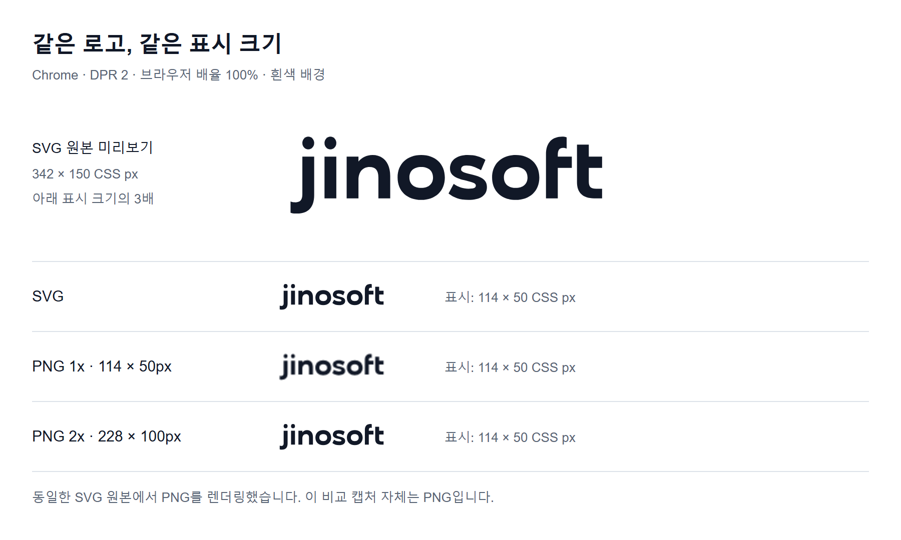

+++
title = '웹사이트 로고, SVG와 PNG 중 무엇을 써야 할까?'
date = '2026-09-30T00:00:00+09:00'
draft = false
slug = 'svg-png-website-logo-guide'
description = '웹사이트 로고에 SVG와 PNG 중 어떤 형식을 사용할지 비교한다. SVG가 작게 표시될 때 흐릿해 보이는 이유, 고해상도 PNG의 크기 설정, currentColor를 이용한 다크 모드 대응을 정리한다.'
tags = ['svg', 'png', 'web', 'css']
categories = ['IT개발']
showTableOfContents = true
+++

홈페이지 로고를 SVG로 적용한 뒤 실제 웹 화면에서 보니, 작은 글자의 가장자리가 기대만큼 또렷하지 않았다. 로고의 표시 크기와 글자 폭을 조정하면서 SVG를 유지할지 PNG로 바꿀지도 고민했다.

벡터 이미지라면 항상 선명해야 하는 것 아닐까? 같은 로고를 SVG와 PNG로 준비해 같은 표시 크기에서 비교해봤다.

**벡터로 제작된 웹 로고는 SVG를 우선 선택하면 된다. 다만 작은 크기의 가독성까지 파일 형식이 해결해 주는 것은 아니다.** PNG를 선택할 때는 원본 픽셀 수와 실제 표시 크기를 함께 확인해야 한다.

## 1. SVG 로고인데도 흐릿하게 보일 수 있을까?

SVG는 곡선과 도형을 좌표로 표현하지만, 모니터는 픽셀로 화면을 표시한다. 브라우저는 SVG의 도형을 현재 크기와 화면 배율에 맞춰 그린다. 곡선이나 대각선의 경계에서는 주변 픽셀의 색을 섞어 가장자리를 부드럽게 만드는 **안티앨리어싱**이 적용될 수 있다.

따라서 **확대해도 원본 도형이 유지되는 것**과 **작게 표시했을 때 또렷해 보이는 것**은 다르다. SVG 규격도 출력 장치와 구현에 따른 렌더링 차이를 허용한다. [W3C: SVG 렌더링 모델](https://www.w3.org/TR/SVG2/render.html#Introduction)

작은 로고의 인상에는 다음 조건이 영향을 준다.

- **표시 크기:** 작은 글자의 얇은 획이나 좁은 틈이 충분한 픽셀로 표현되는가?
- **화면 배율과 픽셀 밀도:** 같은 CSS 크기라도 실제로 사용하는 화면 픽셀 수가 다른가?
- **좌표와 변환:** 축소나 위치 이동으로 획의 경계가 픽셀 사이에 걸리는가?
- **원본 구성:** 벡터 도형인지, SVG 안에 PNG 같은 비트맵이 포함되어 있는가?

원본을 크게 열었을 때의 선명함만으로는 헤더에서 어떻게 보일지 알 수 없다. **브라우저 배율 100%에서 실제 사용 크기로 확인하는 것이 먼저다.** 소수점 좌표를 정수로 바꾸는 것만으로 해결되지도 않는다. 화면 배율과 픽셀 밀도에 따라 출력 좌표가 다시 달라지기 때문이다.

## 2. SVG와 PNG의 차이

| 항목 | SVG | PNG |
| --- | --- | --- |
| 기본 표현 | 좌표로 정의한 도형과 곡선 | 정해진 수의 픽셀 |
| 확대 | 벡터 도형을 새 크기로 렌더링 | 기존 픽셀을 확대·보간 |
| 투명 배경 | 지원 | 지원 |
| 색상 변경 | 인라인 SVG는 CSS로 제어 가능 | 보통 다른 이미지 파일이 필요 |
| 잘 맞는 용도 | 벡터 로고, 아이콘, 도형 중심 그림 | 스크린샷, 픽셀 기반 이미지 |

PNG는 무손실 압축 형식이다. 저장 과정에서 손실 압축을 하지 않는다는 의미이지, 원본보다 확대해도 세부 정보가 늘어난다는 뜻은 아니다. SVG는 도형 중심 이미지에 적합하지만, 복잡한 경로가 많으면 PNG보다 파일이 커질 수도 있다. **SVG가 항상 더 가볍다는 규칙도 없다.** [MDN: 이미지 형식 가이드](https://developer.mozilla.org/en-US/docs/Web/Media/Guides/Formats/Image_types)

또한 PNG를 SVG의 `<image>` 요소에 넣고 확장자만 `.svg`로 만들었다면, 그 안의 PNG가 벡터 도형으로 바뀌지는 않는다. 로고 원본이 벡터인지부터 확인해야 한다. [W3C: SVG의 image 요소](https://www.w3.org/TR/SVG2/embedded.html#ImageElement)

## 3. 고해상도 PNG가 더 선명할까?

PNG도 적절한 픽셀 수를 준비하면 충분히 선명하게 표시할 수 있다. 중요한 것은 **파일 크기가 아니라 이미지의 가로·세로 픽셀 수**다.

예를 들어 로고를 웹페이지에서 **160 × 40 CSS px**로 표시한다고 가정하자.

| 이미지의 픽셀 크기 | 기준으로 삼는 화면 | 설명 |
| --- | --- | --- |
| 160 × 40px | DPR 1 | CSS 크기와 같은 픽셀 수 |
| 320 × 80px | DPR 2 | 가로·세로 각각 2배 |
| 480 × 120px | DPR 3 | 가로·세로 각각 3배 |

DPR(Device Pixel Ratio)은 CSS 픽셀과 기기의 실제 픽셀 사이의 비율이다. 위 표는 크기 산정 예시이며, 브라우저 확대 등에 따라 유효 비율은 달라질 수 있다.

아래처럼 해상도별 PNG를 준비하고 `srcset`으로 제공할 수 있다. 세 파일은 **동일한 로고와 비율**로 내보내며, 표시 크기는 160 × 40으로 유지한다.

```html

```

브라우저는 화면 조건 등에 따라 적절한 이미지를 선택한다. **320 × 80 PNG를 320 × 80으로 표시하는 것이 아니라, 160 × 40 영역에 더 많은 원본 픽셀을 제공하는 방식**이다. [MDN: 반응형 이미지와 해상도 선택](https://developer.mozilla.org/en-US/docs/Web/HTML/Guides/Responsive_images)

다만 160 × 40 PNG를 단순히 확대해서 320 × 80으로 저장하면 원래 없던 세부 정보가 생기지는 않는다. 가능하면 **벡터 원본이나 충분히 큰 원본에서 각 크기로 내보내야 한다.** 큰 PNG가 SVG보다 언제나 선명하다는 뜻도 아니다. 실제 표시 크기에서 두 결과를 비교해야 한다.

### 같은 로고를 같은 크기로 비교하면? {#logo-comparison}

비교에는 실제로 제작한 로고의 벡터 원본을 사용했다. 위쪽 SVG 미리보기는 342 × 150 CSS px로, 아래쪽 세 로고는 모두 **114 × 50 CSS px**로 표시했다. PNG는 같은 SVG 원본을 각각 114 × 50px과 228 × 100px로 렌더링했다.



캡처 환경은 **Chrome, DPR 2, 브라우저 배율 100%, 흰색 배경**이다. PNG 2배 이미지는 더 크게 표시하는 것이 아니라, 같은 영역에 더 많은 픽셀을 제공한다. 이 예시의 결과를 모든 로고나 브라우저에 일반화할 수는 없다.

**위 비교 이미지 자체는 PNG다.** 이미지를 확대한다고 캡처 안의 SVG가 벡터로 다시 렌더링되지는 않는다. 아래에는 실제 SVG와 PNG 파일을 동일한 크기로 넣었으므로, 사용 중인 화면에서 직접 비교할 수 있다. 같은 배경 조건을 유지하기 위해 이 비교 영역은 다크 모드에서도 흰색이다.

<div class="logo-format-demo" role="group" aria-label="같은 크기의 SVG와 PNG 로고 비교">
  <div class="logo-format-demo-row">
    <span>SVG</span>
    
  </div>
  <div class="logo-format-demo-row">
    <span>PNG 1배 · 114×50px</span>
    
  </div>
  <div class="logo-format-demo-row">
    <span>PNG 2배 · 228×100px</span>
    
  </div>
</div>

원본을 따로 확인하려면 [SVG](logo.svg), [PNG 1배](logo-1x.png), [PNG 2배](logo-2x.png)를 열어 보면 된다. SVG의 `viewBox="0 0 128 56"`는 좌표 영역을 정의한 값이지, PNG처럼 고정된 픽셀 해상도를 뜻하지 않는다.

## 4. 용도별 선택 기준

| 용도 | 우선 검토할 형식 | 이유 |
| --- | --- | --- |
| 웹사이트의 벡터 로고 | SVG | 다양한 크기에 대응하기 쉬움 |
| 단순한 UI 아이콘 | SVG | 크기와 색상을 제어하기 쉬움 |
| 화면 캡처, 픽셀 기반 그림 | PNG | 원본 픽셀과 투명도를 보존하기 좋음 |
| SNS 공유용 대표 이미지 | PNG 또는 JPEG | 게시할 서비스의 지원 형식에 맞춤 |
| 사진 | JPEG, WebP, AVIF | 사진에 적합한 압축 형식을 검토 |

이 표는 용도별 권장 기준이다. **웹 로고는 SVG로 제공하고, 같은 벡터 원본에서 공유·업로드용 PNG를 별도로 내보내는 방식**이면 두 형식의 장점을 함께 활용할 수 있다. 공유 이미지는 서비스가 요구하는 크기와 형식을 따르고, 사진은 PNG로 고정하기보다 압축 후 화질과 용량을 비교한다. [MDN: 이미지 형식 선택](https://developer.mozilla.org/en-US/docs/Web/Media/Guides/Formats/Image_types)

## 5. 다크 모드에서 SVG 색상 바꾸기

단색 로고나 아이콘은 `currentColor`를 쓰면 CSS의 `color` 값을 따라 색상을 바꿀 수 있다. 다음은 동작을 설명하기 위한 간단한 심볼 예제다.

```html
<a class="brand" href="/" aria-label="사이트 이름 홈">
  <svg
    xmlns="http://www.w3.org/2000/svg"
    viewBox="0 0 32 32"
    width="32"
    height="32"
    aria-hidden="true">
    <circle cx="16" cy="16" r="12" fill="currentColor" />
  </svg>
</a>
```

```css
.brand {
  color: #111827;
}

.brand svg {
  display: block;
}

html.dark .brand {
  color: #f9fafb;
}
```

위 코드는 사이트가 **`<html>`에 `dark` 클래스를 붙이는 방식**으로 다크 모드를 전환한다고 가정한다. 전환 방식이 다르면 해당 선택자를 바꾸면 된다. `fill="currentColor"`는 고정된 검은색이 아니라 현재 요소의 `color`를 사용한다. [W3C: currentColor](https://www.w3.org/TR/css-color-4/#currentcolor-color)

### img로 불러온 SVG도 똑같이 동작할까?

**아니다. HTML 안에 직접 넣은 인라인 SVG와 외부 이미지로 불러온 SVG는 다르다.**

```html

```

이 방식에서는 페이지의 `.brand-image { color: ... }` 값을 바꿔도, 외부 SVG 내부의 `currentColor`로 그대로 전달되지 않는다. 페이지의 CSS가 SVG 내부 경로에 직접 적용되는 것도 아니다. HTML의 스타일을 내부 SVG 요소에 적용하려면 인라인 방식 등을 사용해야 한다. [W3C: HTML 안의 SVG 스타일 적용](https://www.w3.org/TR/SVG2/styling.html#StyleSheetsInHTMLDocuments)

따라서 **페이지의 다크 모드 상태에 맞춰 단색 로고를 바꾸려면 인라인 SVG가 편리하다.** ``를 유지하고 싶다면 밝은 배경용·어두운 배경용 파일을 따로 준비해 테마에 맞춰 선택할 수 있다. 여러 색이 들어간 로고는 모든 색을 `currentColor`로 통일하기보다 원래 브랜드 색상과 배경 대비를 확인한다.

> 인라인으로 넣는 SVG는 직접 제작했거나 신뢰할 수 있는 파일을 사용한다. 외부에서 받은 SVG를 검증 없이 HTML에 삽입하지 않는다.

## 6. 적용 전 확인할 것

- **원본:** 벡터 도형인지, SVG 안에 비트맵이 들어 있는지 확인한다.
- **실제 크기:** 원본을 크게 열어 보는 것뿐 아니라 헤더·모바일의 표시 크기로 확인한다.
- **PNG 해상도:** 표시 크기와 DPR을 고려해 원본에서 필요한 픽셀 수로 내보낸다.
- **스타일과 배경:** CSS 확대·축소, 라이트·다크 모드, 배경 대비를 확인한다.
- **글꼴 의존성:** SVG의 `<text>`로 만든 로고라면 다른 기기에서도 같은 글꼴이 적용되는지 확인한다. 고정된 형태가 필요하면 사용 권한을 확인한 뒤 글자를 경로로 변환한다.
- **접근성:** ``의 `alt`나 로고 링크의 접근 가능한 이름을 제공한다. 링크에 이름이 있다면 내부 SVG는 중복해서 읽히지 않도록 처리한다.

홈페이지와 블로그 로고에는 SVG를 유지했다. PNG로 변환하는 것보다 실제 헤더에서 읽기 좋은 크기와 글자 형태를 맞추는 것이 이번 작업의 중심이었다.

벡터 로고는 SVG를 기본으로 쓰고, PNG가 필요한 업로드에는 같은 원본에서 적절한 해상도로 내보내면 된다. 위 비교 자료도 원본을 크게 보는 것과 실제 사용 크기로 확인하는 것이 다르다는 점을 보여주기 위한 예시다.
