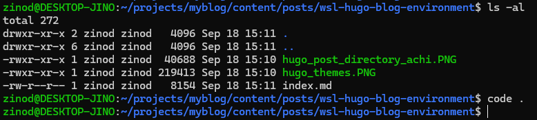
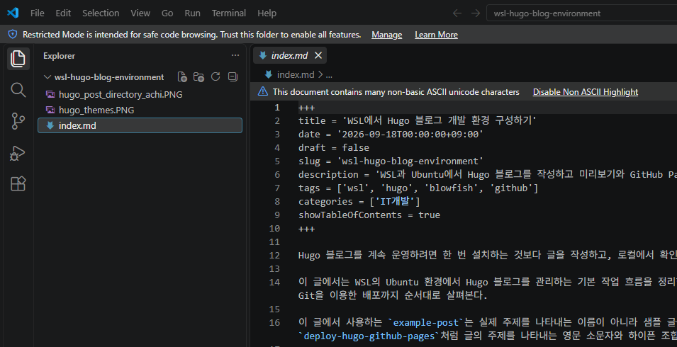
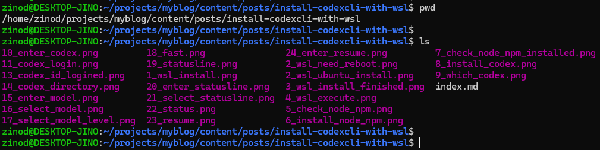
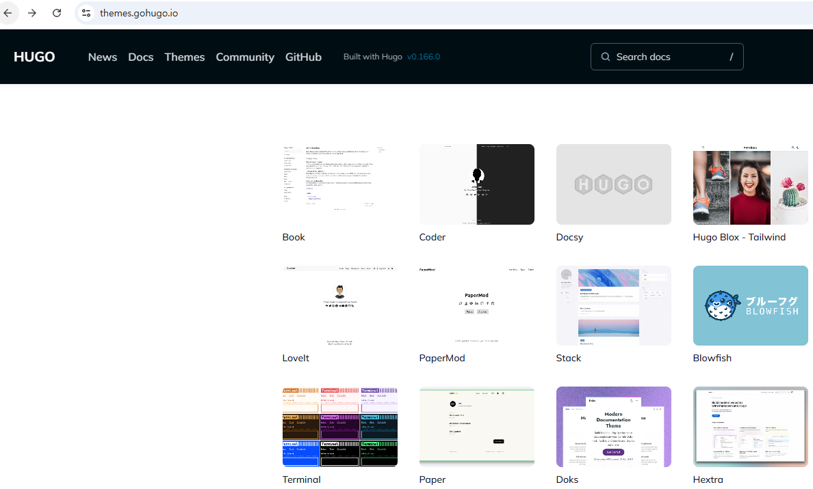
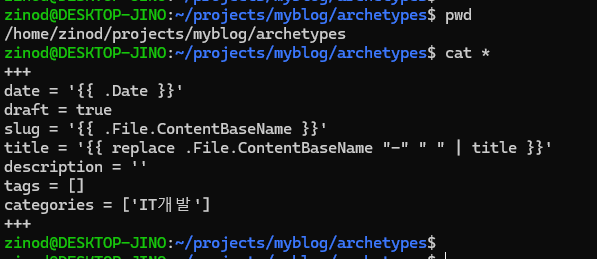
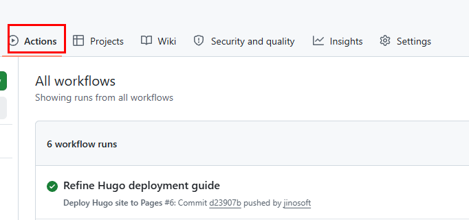

+++
title = 'WSL에서 Hugo 블로그 개발 환경 구성하기'
date = '2026-09-18T00:00:00+09:00'
draft = false
slug = 'wsl-hugo-blog-environment'
description = 'WSL과 Ubuntu에서 Hugo 블로그를 작성하고 미리보기와 GitHub Pages 배포까지 진행하는 기본 개발 환경을 정리한다.'
tags = ['wsl', 'hugo', 'blowfish', 'github']
categories = ['IT개발']
showTableOfContents = true
+++

Hugo 블로그를 계속 운영하려면 한 번 설치하는 것보다 글을 작성하고, 로컬에서 확인하고, GitHub에 배포하는 흐름을 정해두는 것이 중요하다.

이 글에서는 WSL의 Ubuntu 환경에서 Hugo 블로그를 관리하는 기본 작업 흐름을 정리한다. 디렉터리 구조와 글 작성 방법, 이미지 관리, 로컬 미리보기, Git을 이용한 배포까지 순서대로 살펴본다.

이 글에서 사용하는 `example-post`는 실제 주제를 나타내는 이름이 아니라 샘플 글을 위한 디렉터리명이다. 실제 글을 작성할 때는 `deploy-hugo-github-pages`처럼 글의 주제를 나타내는 영문 소문자와 하이픈 조합을 사용한다.

## 1. 사용 환경

이번 블로그는 다음 환경에서 관리한다.

| 항목 | 내용 |
| --- | --- |
| 운영체제 | Windows + WSL2 |
| Linux 배포판 | Ubuntu |
| 정적 사이트 생성기 | Hugo Extended 0.165.0 |
| 테마 | Blowfish |
| 저장소 | GitHub |
| 배포 | GitHub Actions + GitHub Pages |
| 기본 언어 | 한국어 |

Windows에서 명령줄 도구를 실행하더라도 실제 Hugo 작업은 WSL의 Ubuntu 셸 안에서 진행한다. `which hugo`, `which node`, `which npm`으로 실행 파일 경로를 확인하면 Windows와 WSL 환경을 혼동하는 일을 줄일 수 있다.

### Hugo Extended를 사용하는 이유

이 블로그는 Blowfish 테마와 사용자 정의 CSS를 사용하므로 Hugo Extended 버전을 설치했다. 테마가 요구하는 스타일 처리 기능과 CSS 확장을 안정적으로 사용하려면 일반 버전이 아닌 Extended 버전을 선택하는 것이 좋다.

## 2. WSL에서 프로젝트 디렉터리로 이동하기

저장소를 WSL의 Linux 홈 디렉터리 아래에 복제했다면 다음처럼 프로젝트로 이동한다.

```bash
cd ~/projects/myblog
```

저장소 상태는 다음 명령으로 확인할 수 있다.

```bash
git status
```

### VS Code로 프로젝트 열기

WSL 터미널에서 프로젝트 디렉터리로 이동한 뒤 다음 명령을 실행하면 VS Code로 현재 프로젝트를 열 수 있다.

```bash
code .
```



VS Code에 WSL 확장이 설치되어 있으면 Linux 환경의 Hugo와 Git을 그대로 사용하면서 Windows 화면에서 파일을 편집할 수 있다. VS Code의 통합 터미널도 WSL 환경으로 열려 있는지 확인한다.



처음 연 폴더는 Restricted Mode로 표시될 수 있다. 자신이 만든 프로젝트이고 파일을 신뢰할 수 있는 경우에만 Trust this folder를 선택한다. 출처가 불분명한 프로젝트라면 먼저 파일과 실행 설정을 확인한다.

프로젝트를 `/mnt/c` 아래에 둘 수도 있지만, 파일 감시와 터미널 작업을 자주 사용하는 프로젝트라면 WSL의 Linux 파일 시스템 안에 두는 편이 편리하다. 어떤 위치를 선택하든 한 프로젝트에서 경로를 일관되게 사용하는 것이 중요하다.

## 3. Hugo 프로젝트 구조

현재 블로그의 주요 디렉터리는 다음과 같다.

```text
myblog/
  archetypes/
  assets/
  config/
  content/
  layouts/
  static/
  themes/
  .github/
  hugo.toml
```

각 디렉터리의 역할은 다음과 같다.

| 경로 | 역할 |
| --- | --- |
| `content/posts` | 기술 블로그 글 |
| `content/about` | 소개 페이지 |
| `config/_default` | Hugo와 Blowfish 설정 |
| `assets/css` | 사용자 정의 CSS |
| `archetypes` | 새 글의 기본 Front Matter |
| `.github/workflows` | GitHub Actions 배포 설정 |

Hugo는 콘텐츠와 설정, 테마를 분리해서 관리한다. 글을 작성할 때는 주로 `content/posts`를 수정하고, 사이트 전체 동작을 바꿀 때는 `config/_default`를 확인한다.

## 4. 글 하나당 디렉터리 만들기

이 블로그는 글 하나당 하나의 디렉터리를 사용한다. 글 본문은 `index.md`로 저장하고, 해당 글의 캡처 이미지도 같은 디렉터리에 둔다.

```text
content/posts/example-post/
  index.md
  hugo_post_directory_achi.PNG
  hugo_themes.PNG
```



이 구조를 사용하면 글과 이미지가 함께 이동하므로 관리가 쉽다. 글을 다른 서버로 옮기거나 저장소 구조를 확인할 때도 어떤 이미지가 어느 글에 사용되는지 바로 알 수 있다.

실제 주제를 사용하는 글은 다음처럼 디렉터리 이름도 글의 slug에 맞춘다.

```text
content/posts/wsl-hugo-blog-environment/
  index.md
  screenshot-01.png
```

`example-post`는 구조를 설명하기 위한 샘플 이름이고, 실제 게시글에서는 `wsl-hugo-blog-environment`처럼 의미가 분명한 이름을 사용한다.

## 5. Hugo 테마 선택

Hugo는 다양한 테마를 사용할 수 있으며, 공식 테마 사이트에서 목록과 미리보기를 확인할 수 있다.



이 블로그는 문서형 콘텐츠와 기술 글에 잘 맞는 Blowfish 테마를 사용한다. 테마를 선택할 때는 첫 화면뿐 아니라 글 본문, 목차, 모바일 화면, 코드 블록과 검색 기능까지 함께 확인하는 것이 좋다.

## 6. 새 글 작성하기

프로젝트 루트에서 Hugo 명령으로 새 글을 만들 수 있다.

```bash
hugo new posts/example-post/index.md
```

프로젝트에 `archetypes/default.md`가 있으면 새 글에 기본 Front Matter가 적용된다. 현재 블로그의 archetype 파일은 다음과 같은 형식이다.



현재 블로그는 다음과 같은 Front Matter 형식을 사용한다.

```toml
+++
title = '글 제목'
date = '2026-09-18T00:00:00+09:00'
draft = true
slug = 'example-post'
description = '글 설명'
tags = ['hugo']
categories = ['IT개발']
+++
```

실제로 배포할 글은 본문을 완성한 뒤 `draft = false`로 변경한다. `slug`는 영문 소문자와 하이픈을 사용해 `/posts/<slug>/` URL이 안정적으로 유지되도록 한다.

## 7. 이미지 추가하기

글에 사용하는 캡처는 글 디렉터리에 저장하고 Markdown에서 파일명으로 연결한다.

```markdown

```

이미지 파일명은 영문 소문자, 숫자, 하이픈 또는 언더스코어 조합으로 관리하면 경로 문제를 줄일 수 있다. 캡처를 추가하기 전에는 Personal Access Token, API 키, 이메일 주소와 같은 민감한 정보가 보이지 않는지 확인한다.

## 8. 로컬에서 미리보기

초안까지 포함해 로컬 서버를 실행한다.

```bash
hugo server -D
```

브라우저에서 다음 주소를 연다.

```text
http://localhost:1313/
```

`-D` 옵션은 draft 상태인 글도 미리보기에 포함한다. 글을 실제로 배포할 때는 `draft = false`인지 확인해야 한다.

## 9. 배포 전 빌드 확인

GitHub에 push하기 전에 정식 빌드를 실행한다.

```bash
hugo --minify
```

빌드가 성공하면 Front Matter 문법, 이미지 경로, 테마 설정에 큰 문제가 없다는 것을 확인할 수 있다. 오류가 발생하면 오류 메시지에 표시된 파일과 줄을 먼저 확인한다.

## 10. Git으로 commit하고 배포하기

변경된 파일을 확인한 뒤 commit한다.

```bash
git status
git add .
git commit -m "Add new post"
git push origin main
```

`main` 브랜치에 push하면 GitHub Actions가 Hugo를 빌드하고 GitHub Pages에 배포한다. GitHub 저장소의 Actions 탭에서 빌드와 배포가 모두 성공했는지 확인한 뒤 실제 글 주소를 연다.



배포가 끝난 뒤에는 다음 항목을 확인한다.

- GitHub Actions의 build와 deploy 단계가 모두 성공했는지 확인
- 새 글의 실제 URL이 열리는지 확인
- 본문 이미지가 정상적으로 표시되는지 확인
- 데스크톱과 모바일 화면에서 레이아웃 확인
- 제목, 읽기 시간, 목차와 코드 블록이 의도대로 표시되는지 확인

배포가 끝난 뒤에는 다음 항목을 확인한다.

- GitHub Actions의 build와 deploy 단계가 모두 성공했는지 확인
- 새 글의 실제 URL이 열리는지 확인
- 본문 이미지가 정상적으로 표시되는지 확인
- 데스크톱과 모바일 화면에서 레이아웃 확인
- 제목, 읽기 시간, 목차와 코드 블록이 의도대로 표시되는지 확인

## 11. 반복해서 사용할 작업 흐름

새 글을 작성할 때는 다음 순서를 반복하면 된다.

```text
WSL 실행
  ↓
프로젝트 디렉터리 이동
  ↓
새 글 디렉터리와 index.md 생성
  ↓
본문과 이미지 작성
  ↓
hugo server -D로 미리보기
  ↓
hugo --minify로 빌드 확인
  ↓
git add / commit / push
  ↓
GitHub Actions와 실제 사이트 확인
```

## 자주 발생하는 문제

### Hugo 명령을 찾을 수 없는 경우

Hugo가 설치되지 않았거나 PATH에 등록되지 않은 상태일 수 있다.

```bash
which hugo
hugo version
```

### 이미지가 표시되지 않는 경우

이미지가 `index.md`와 같은 디렉터리에 있는지, Markdown의 파일명이 실제 파일명과 같은지 확인한다. Linux 환경에서는 대문자와 소문자를 구분한다.

### 초안 글이 사이트에 보이지 않는 경우

`draft = true`인 글은 기본 빌드에서 제외된다. 공개할 글은 `draft = false`로 변경한다.

### 로컬에서는 보이지만 배포 후 404인 경우

slug와 `baseURL`, permalink 설정을 확인하고 GitHub Actions가 최신 commit을 배포했는지 확인한다.

## 마무리

WSL에서 Hugo 프로젝트를 관리하면 Windows 환경을 사용하면서도 Linux 기반의 개발 도구를 일관되게 사용할 수 있다. 글별 디렉터리에 본문과 이미지를 함께 저장하고, 로컬 미리보기와 정식 빌드를 거친 뒤 push하는 흐름을 정해두면 글 작성과 배포를 반복하기 쉬워진다.
